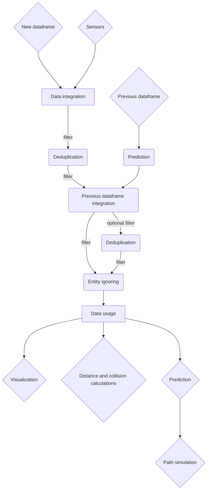

# Title of wiki page

**Summary:** This page describes an experimental intermediate map layer after perception

- [Overall map representation](#overall-map-representation)
- [Data flow](#data-flow)
- [Perception data integration](#perception-data-integration)
  - [Point handling](#point-handling)
- [Data processing and filtering](#data-processing-and-filtering)
  - [Deduplication](#deduplication)
  - [Previous dataframe integration](#previous-dataframe-integration)
  - [Entity ignoring](#entity-ignoring)
- [Data usage](#data-usage)
  - [Visualization](#visualization)
  - [Collisions](#collisions)
  - [Distance calculations](#distance-calculations)
    - [Lane distance](#lane-distance)
    - [Collision distance](#collision-distance)
  - [Prediction](#prediction)
  - [Path simulation](#path-simulation)
- [Sources](#sources)

## Overall map representation

- The map is based on the local car position and is only built using sensor data. No global positioning via radar or similar is used.
  - The map (0/0) should be the turning axis of the car. (Above rear axle?)
  - All speeds, transformations, etc. are relative to the car's speed, transformation, etc.
  - the map's y-axis is aligned with the heading of the car
- 2D top down map. The height(z) dimension is mostly useless for collision detection and path planning
- A map dataframe includes the car's speeds at the time the map was created. The heading/direction are the same as the y-axis
  The entity datatype might be reused for this
- The map consists out of entities. Entities have the following attributes:
  - Shape:
    - Rectangle: x_size and y_size
    - Circle?: diameter
  - Confidence: [0.0; 1.0] The sensor's confidence that this entity is correct and actually exists.
  - Priority: [0.0; 1.0] This entity's priority over others
  - Transform2d: Vector2 translation and rotation in radians
  - Motion (relative to the car??? todo: properly define coordinate systems and transformations). Optional. When unset algorithms will use some default to make it globally static (without the flag):
    - linear speed
    - angular speed: Rotation around the middle of the entity. Might be necessary at interceptions because the car might otherwise think entities will drive into its lane
    - heading: vector2
  - Unique id: Optional, if set will be used for [Previous dataframe integration](#previous-dataframe-integration)
  - Class: for example Car, Pedestrian, BackgroundCollision, Lanemark, (Redlight), etc...
    Classes should not be used to filter entities in the algorithms
  - Flags can be used to filter entities in the algorithms:
    - collider
    - tracked: If the entity should be tracked across individual dataframes. See [Previous dataframe integration](#previous-dataframe-integration)
    - stopmark: If the car should not drive over or around the entity
    - global_static: If the entity is globally static (NOT relative to the car). The flag can be unset when adding the entity and later calculated in [Data processing and filtering](#data-processing-and-filtering)
      If set, the speed and direction of the entity should roughly match the inverse speed and direction of the car. The map should emit a warning if this is not the case.
    - ignore: The entity should be ignored in [Data usage](#data-usage). Usually unset when adding the entity and calculated in [Entity ignoring](#entity-ignoring)
  - Only relevant for tracked entities:
    - Visibility time: How long the entity has been visible for. Never gets reset
    - Invisibility time: How long the entity has been uninterruptedly not visible. Reset when the entity is visible again
    - Visibility frame count: In how many dataframes the entity was visible. Never gets reset
    - Invisibility frame count: In how many consecutive dataframes the entity was not visible. Reset when the entity is visible again
  
## Data flow

The filters can be rearranged, and the *Data usage* can be applied at any point in the graph.

## Perception data integration

The first approach for the data integration will be to dump all sensor data into the map.
This includes some filtering to remove obvious unwanted data points and noise.

The map relies on the sensor data to be sufficiently aligned with each other. (rule of thumb: ~30 cm)

### Point handling

Points from lidar and radar sensors will be filtered by height to exclude any road points the car cannot collide with.

There should also be a filter to remove outliers / lower the confidence of outliers. This could be done by measuring the point-density around the point and to only add it if the density is high enough.

Flags for all points: collider

*global_static* is not set for any points, because we cannot know if they are static or not. Lidar points only have no motion set.

Radar points have their linear speed and direction to/from the car set.

The shape is a circle with a universal diameter.

The priority of radar points should be higher than lidar points.

Optional Upgrade: Group points into bigger cube entities via the point density. This is allowed to lead to duplicates, since they will be removed later.

## Data processing and filtering

The system uses several filtering steps to bring the map into a usable state for the algorithms in [Data usage](#data-usage)
All filters should be separate nodes that subscribe to and republish the map.

### Deduplication

Overlapping entities are identified via their transforms and bounds.

The entity with higher priority usually takes precedence and the other is merged into it or removed(simpler).
If the entity has a higher priority but an extremely low confidence, the other entity might take precedence.

In the case of merging, the entity keeps its flags, class, etc., but some attributes might be merged based on confidence (percentage wise). This includes motion and maybe even the bounds/transforms.
It is also possible to adjust the entity's confidence value based on how many other entities have been merged into it.

### Previous dataframe integration

Depends on [Prediction](#prediction).
The last frame is predicted to the current timestamp. Entities can then be checked for similarities.
Similar entities are merged based on the deduplication merging algorithm.
After that their motion is recalculated based on the two available points in time, their (*current\** and) previous motion and optionally some interpolation.

The visibility/invisibility time/count attributes also have to be updated.

*ignored* and *!tracked* entities will not be processed in this step.

After this step, another deduplication step might be necessary.

(*current\** motion might be set on a tracked entity when a radar point was merged into it.)

### Entity ignoring

Sets the *ignore* flag based on:

- the confidence of the entity
- if *tracked*: based on the amount of visibility/invisibility time/count

## Data usage

### Visualization

### Collisions

If there currently are collisions between the car and other entities.
Should report where those collisions are and with which entities.

### Distance calculations

Distance calculation might be able to use similar algorithms

#### Lane distance

#### Collision distance

### Prediction

Generate a predicted dataframe based on the current frame that is n seconds into the future

### Path simulation

## Sources
