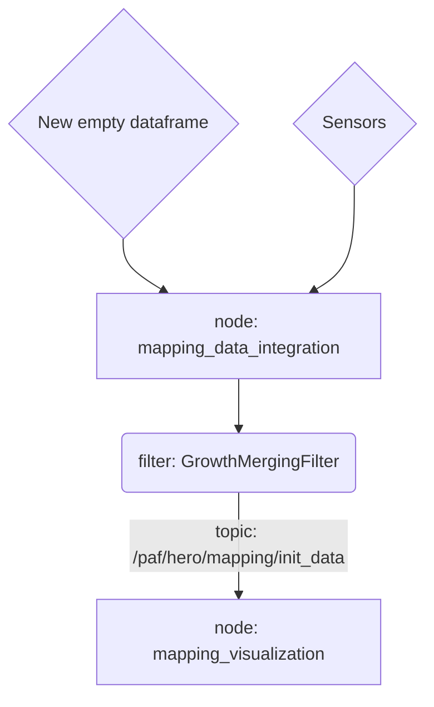

# Intermediate layer

**Summary:** The intermediate layer is a 2D top-down map for sensor fusion and entity tracking. The map can be visualized with the visualization node in the mapping_visualization package

**Important: The mapping_common module is compiled with Cython. If changes have been made to mapping_common, catkin_make needs to be executed to apply them!**
Cmake executes pip to compile and install the mapping_common module to the user's python packages.

- [Package structure](#package-structure)
- [Data flow overview](#data-flow-overview)
- [Debugging](#debugging)
- [Tests](#tests)
- [Research](#research)
- [Troubleshooting](#troubleshooting)

## Package structure

- [./src](./src/) contains the nodes that create and filter the map
- [./msg](./msg/) contains the ROS message types for transmitting the map
- [./ext_modules/mapping_common](./ext_modules/mapping_common/) contains the **python classes for working with the map**.
  ROS messages can be converted into these python classes by using `<Type>.from_ros_msg(msg)`
  - **Important: This package is compiled with Cython. If changes have been made to this package, catkin_make needs to be executed to apply them!** \
    In the leaderboard docker config, catkin_make is automatically executed on start.

The base data type is the [Map](./ext_modules/mapping_common/map.py). It consists out of [Entities](./ext_modules/mapping_common/entity.py).

These entities all have a [transform](./ext_modules/mapping_common/transform.py) and a [shape](./ext_modules//mapping_common/shape.py) and can be all kinds of colliders (car, pedestrian, etc.), lanemarkings or other localized things of interest around the hero car.

## Data flow overview

Quick overview of the data flow inside the intermediate layer

This information is kept up-to-date with the package

## Debugging

The debugger is unable to debug the mapping_common package when it is compiled.

To disable the compilation, you can replace the `False` in [./ext_modules/.debug_enabled](./ext_modules/.debug_enabled) with `True`. Rerun catkin_make after that.

## Tests

This package contains pytest based unit tests at [./tests/mapping_common](./tests/mapping_common/)

The tests can be executed without a running ros/carla instance.

Execute `catkin_make run_tests` in the catkin_ws to run them. A summary should appear there.

## Research

The original draft and class diagram for the intermediate layer can be found [here](../../doc/research/paf24/intermediate_layer/). Note that these documents are not kept up-to-date with this package.

Most of the information of the draft has been inserted into the python class documentation. Look there for up-to-date information.

## Troubleshooting

Cython compile errors or import errors *related to the @dataclass decorators* are likely caused by an outdated docker image. Make sure the docker images are up-to-date.
