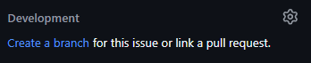

# Git Style

(Kept from previous group [paf22])

**Summary:** This page gives an overview over different types of git workflows to choose from.

---

## Author

Josef Kircher

## Date

07.11.2022

## Prerequisite

---
<!-- TOC -->
- [Git Style](#git-style)
  - [Author](#author)
  - [Date](#date)
  - [Prerequisite](#prerequisite)
  - [Git workflow](#git-workflow)
    - [Git Feature Branch](#git-feature-branch)
      - [Branch strategy](#branch-strategy)
  - [Git style](#git-style-1)
    - [Branch naming](#branch-naming)
      - [For example](#for-example)
    - [Commit messages](#commit-messages)
    - [Git commands cheat sheet](#git-commands-cheat-sheet)
  - [Sources](#sources)
<!-- TOC -->

## Git workflow

### Git Feature Branch

#### Branch strategy

---

Two types of branches:

- Main: contains production ready code
- Feature: new branches based on main for each feature

## Git style

### Branch naming

---
Feature branch: issue number-description-of-issue      (separator: '-') generated by Github automatically

#### For example

Issue #28 called "Setup dev environment"

=> `28-setup-dev-environment`

### Branch naming workflow

The following two options are available for creating a new branch:

1. **Web Interface**: You can create a new branch by clicking the "Create branch" button in the GitHub web interface.
2. **VSCode Extension**: Alternatively, use the "GitHub.vscode-pull-request-github" extension in Visual Studio Code.

#### Branch Creation Settings

The `.vscode/settings.json` file in this repository contains settings that automatically name the branch based on the issue number and the title of the issue.

#### Creating a Branch in the Web Interface

To create a branch in the web interface, follow these steps:

#### Creating a Branch in VSCode

In Visual Studio Code, use the "GitHub.vscode-pull-request-github" extension.

1. Navigate to the "Issues" tab, where you will find queries defined in the `.vscode/settings.json` file.
2. These queries allow you to access different issues.
3. Click the button "->" to create a new branch from the selected issue, check out the branch, and assign the issue to yourself.

### Commit messages

---

- proceed to [Commit Messages](./03_commit.md)

### Git commands cheat sheet

---
<https://education.github.com/git-cheat-sheet-education.pdf>

## Sources

<https://www.atlassian.com/git/tutorials/comparing-workflows/gitflow-workflow>

<https://www.atlassian.com/git/tutorials/comparing-workflows/feature-branch-workflow>

<https://www.gitkraken.com/learn/git/best-practices/git-branch-strategy>
