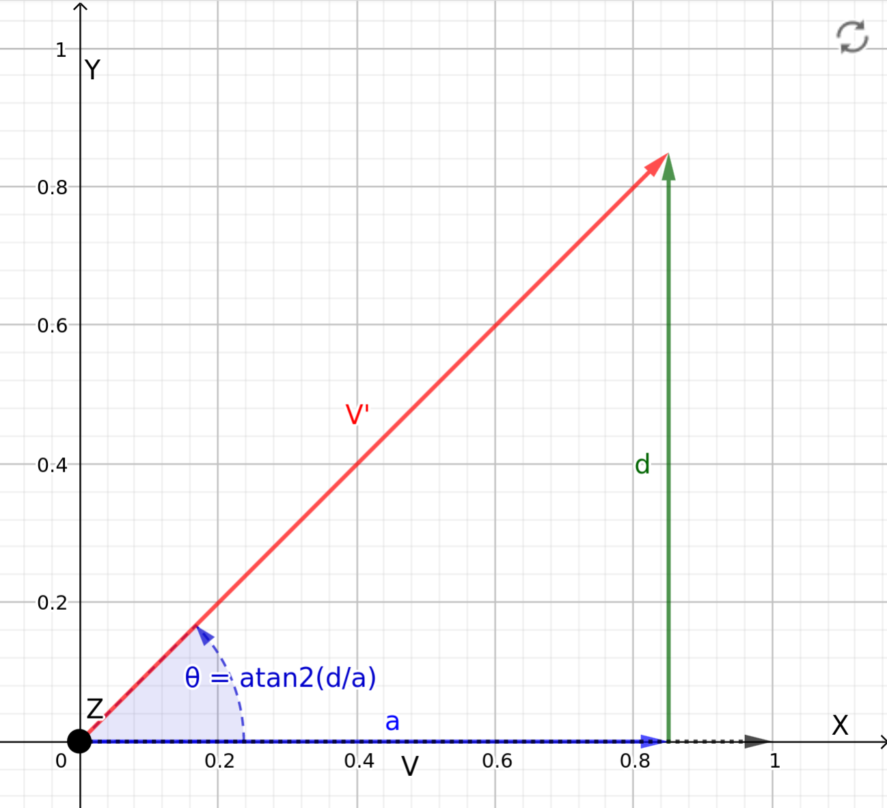

# Coordinate Transformation

**Summary:** Used for various helper functions such as quat_to_heading, that are useful in a lot of cases. **It is not yet fully documented**.

---

## Author

Robert Fischer

## Date

12.01.2024

<!-- TOC -->

- [Coordinate Transformation](#coordonate-transformation)
  - [Author](#author)
  - [Date](#date)
  - [Usage](#usage)
  - [Methods](#methods)
    - [quat_to_heading(quaternion)](#quat_to_headingquaternion)

<!-- TOC -->

## Usage

Just importing the coordinate_transformation.py file is enough to use all of its funcions.

```Python
# Example
from coordinate_transformation import quat_to_heading
```

## Methods

This class provides multiple useful methods:

### quat_to_heading(quaternion)

For the cars orientation we need the angle of the cars Heading around the **z-axis**.
We are provided with a Quaternion of the cars Rotation with respect to the Global Coordinate System.

Also the car always starts in the direction of the `x-axis`, which is what our `0 rad point` will be.

To calculate the Heading we first need to create a Rotation Matrix out of the quaternion:

`R = Rotation.from_quat(quaternion).rotation.as_matrix()`

$$
R =
\begin{bmatrix}
    a & b & c\\
    d & e & f\\
    g & h & i\\
\end{bmatrix}
$$

The original vector `V` of the car is `(1,0,0)`, since it spawns looking into the x-axis direction.

$$
V =
\begin{bmatrix}
    1\\
    0\\
    0\\
\end{bmatrix}
$$

To calculate our rotated vector `V'` we do the following:

$$
V' = R \cdot V
$$
\\
$$
\begin{bmatrix}
    a\\
    d\\
    g\\
\end{bmatrix}
=
\begin{bmatrix}
    a & b & c\\
    d & e & f\\
    g & h & i\\
\end{bmatrix}
\cdot
\begin{bmatrix}
    1\\
    0\\
    0\\
\end{bmatrix}
$$

So we end up with a vector that's rotated into the x-y plane with the new x and y coordinates being `a` and `d`:



Now all we need to do is calculate the angle $\theta$ around the z-axis which this vector creates between the x-axis and itself using the `atan` function:

$$
\theta = atan2(\frac{d}{a})
$$

To finish up we rotate the heading angle around 90 degrees, so the x-axis is our 0 rad point:

`heading = (raw_heading - (math.pi / 2)) % (2 * math.pi) - math.pi`

Now the Heading is 0 rad in the x-axis start position and `positive when rotating counter clockwise`.

```Python

    """
    Converts a quaternion to a heading of the car in radians
    :param quaternion: quaternion of the car as a list [q.x, q.y, q.z, q.w]
                       where q is the quaternion
    :return: heading of the car in radians (float)
    """
    # Create a Rotation object from the quaternion
    rotation = Rotation.from_quat(quaternion)
    # Convert the Rotation object to a matrix
    rotation_matrix = rotation.as_matrix()
    # calculate the angle around the z-axis (theta) from the matrix
    # (see ../../doc/06_perception/00_coordinate_transformation.md)
    theta = np.arctan2(rotation_matrix[1, 0], rotation_matrix[0, 0])

    raw_heading = theta

    # transform raw_heading so that:
    # ---------------------------------------------------------------
    # | 0 = x-axis | pi/2 = y-axis | pi = -x-axis | -pi/2 = -y-axis |
    # ---------------------------------------------------------------
    # The above transformation limits the heading to the range of -pi to pi
    # It also rotates the heading by 90 degrees so that the heading is in
    # the direction of the x-axis which the car starts in (heading = 0)

    # heading is positive in counter clockwise rotations
    heading = (raw_heading - (math.pi / 2)) % (2 * math.pi) - math.pi

    return heading

```
