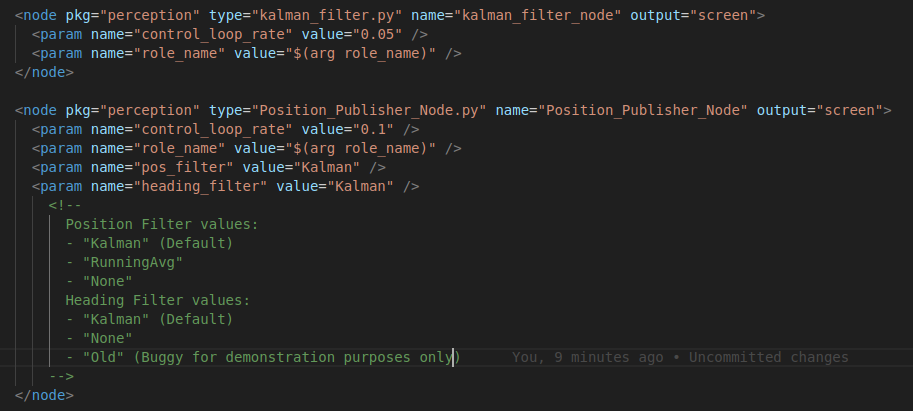
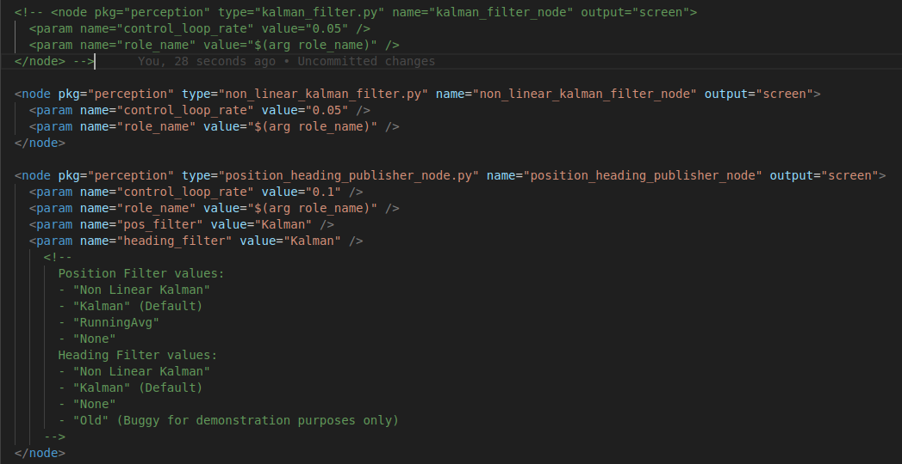

# position_heading_publisher_node

**Summary:** This node publishes the `current_pos` (Location of the car) and `current_heading` (Orientation of the car around the Z- axis) for every Node that needs to work with that. It also publishes all unfiltered Position and Heading signals for the Filter nodes to work with (such as Kalman).

---

## Author

Robert Fischer

## Date

14.01.2024

## Prerequisite

- [position\_heading\_publisher\_node](#position_heading_publisher_node)
  - [Author](#author)
  - [Date](#date)
  - [Prerequisite](#prerequisite)
  - [Usage](#usage)
  - [Modular Extension / Template](#modular-extension--template)
    - [Heading Functions](#heading-functions)
    - [Position Functions](#position-functions)
    - [Inputs](#inputs)
    - [Outputs](#outputs)

## Usage

Change the pos_filter and heading_filter parameter values of the position_heading_publisher_node in the [perception.launch](../../code/perception/launch/perception.launch) file,
to **"Kalman"**, depending on if you want to use the Kalman Filter for both the Position and the Heading.

You will also have to uncomment the kalman_filter.py node or any other filter in the [perception.launch](../../code/perception/launch/perception.launch) to start the filter node.
The only filter that is already implementet by the position_heading_publisher_node is the RunningAverage Filter, which can be turned on the same way.

You can use filters for the heading and for the location independently using the following parameter values:

**Position Filter values:**

    - "Kalman" (Default)

    - "RunningAvg"
  
    - "None"

**Heading Filter values:**

    - "Kalman" (Default)
  
    - "None"
  
    - "Old" (Buggy for demonstration purposes only)

In case of using the Kalman Filter for both, it should look like this:

_If you want to create a new Filter in the future, I suggest keeping this template intact. See next Chapter_ 😊

No further installation needed.

## Modular Extension / Template

You might get into the situation of needing a better optimized filter for either position or heading or both.
In that case you should follow the current template of the file:

For example: _Implementing a new non-linear Kalman Filter could look like this_:

- _perception.launch file_:

- _Subscribers_:

- _Heading Methods_:

- _Position Methods_:

As you can see, this file is merely for gathering and forwarding the filter values in the form of currentPos and currentHeading.

Only the RunningAvg Filter and the Old Heading Filter are implemented directly in this file.
All other filters should be built in their own class forwarding their filtered positions/ headings to the position_heading_publisher_node so it can publish the filter values that we want as the currentPos and currentHeading which the rest of the code is depending on.

### Heading Functions

**`publish_unfiltered_heading`**

This method is called when new IMU data is received.
It publishes unfiltered location data as `PoseStamped`, so other filters can use it.

If `none` is selected for the Filter, it publishes the data as the `current_pos` instead. (not recommended)

**`publish_current_heading`**

This method is called when new heading data is received. It handles all necessary updates and publishes the heading as a double value,
indicating the cars rotation around the z-axis in rad.
For more info about how the heading is calculated see [here](./00_coordinate_transformation.md).

### Position Functions

**`publish_running_avg_pos`**

This method is called when new GNSS data is received. The function calculates the average position and then publishes it as the current position.

This is only used when the `running_avg` Filter is selected.

**`publish_kalman_pos_as_current_pos`**

This method is called when new kalman filter data is received. The function publishes the kalman position as the current position.

This is only used when the `Kalman` Filter is selected

**`publish_unfiltered_gps`**

This method is called when new GNSS data is received.

It publishes unfiltered location data as `PoseStamped`, so other filters can use it.

If `none` is selected for the Filter, it publishes the data as the `current_pos` instead. (not recommended)

**`get_geoRef`**

Reads the reference values for lat and lon from the carla OpenDriveMap.
Otherwise we could not calculate the global Coordinate System

### Inputs

This node subscribes to the following topics:

- IMU:
  - `/carla/{role_name}/IMU` ([IMU](https://docs.ros.org/en/api/sensor_msgs/html/msg/Imu.html))
- GPS:
  - `/carla/{role_name}/GPS` ([NavSatFix](http://docs.ros.org/en/melodic/api/std_msgs/html/msg/String.html))
- Kalman position:
  - `/paf/" + self.role_name + "/kalman_pos` ([PoseStamped](http://docs.ros.org/en/noetic/api/geometry_msgs/html/msg/PoseStamped.html))
- Kalman Heading:
  - `/paf/" + self.role_name + "/kalman_heading` ([Float32](http://docs.ros.org/en/noetic/api/std_msgs/html/msg/Float32.html))

### Outputs

This node publishes the following topics:

- Current Heading:
  - `/paf/{role_name}/current_heading` ([Float32](http://docs.ros.org/en/noetic/api/std_msgs/html/msg/Float32.html))
- Current Position:
  - `/paf/{self.role_name}/current_pos` ([PoseStamped](http://docs.ros.org/en/noetic/api/geometry_msgs/html/msg/PoseStamped.html))
