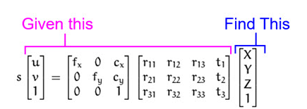
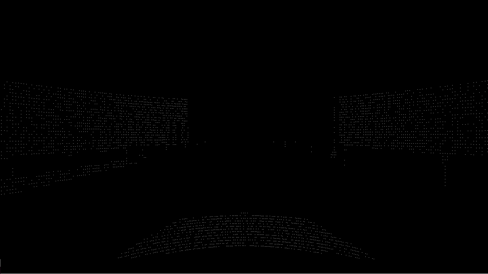
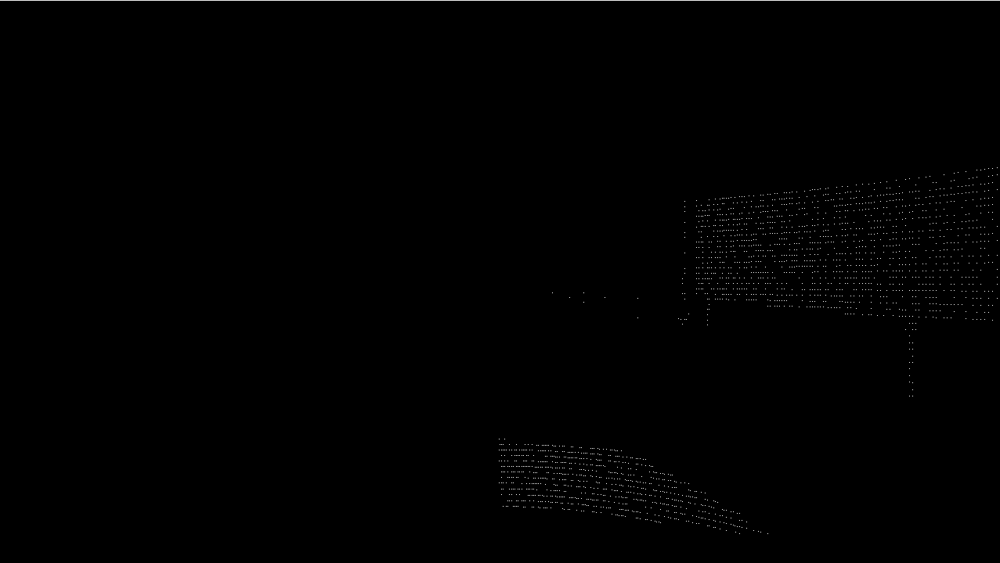

# Getting the Distance to Objects

Using the vision node and the lidar distance node we can calculate the distance of detected objects.
We can solve this problem from two directions mapping either pixel into the 3D-World or mapping 3D-LidarPoints into Pixel.

This file will will explain the mapping of 3D-Points into 2D.

## Converting 3D-Points into 2D-Camera-Space

As said before we can try this from both directions. I chose to do this starting with the LIDAR-Data.
There are two reaons for this.

**1. Resolution**
The resolution of the LIDAR-Sensor is not as high as the Camera Resolution.
This means, that not every Pixel in the Camera-Image will have a corresponding Data-Point in the LIDAR-Pointcloud.

**2. Math**
The literature for Camera-Calibration proposes a way to calculate Pixel from a 3D-World Coordinate System.
You can only partially invert this formula, since it involves calculation the invers matrix for a matrix that isnt square.

I found ways online, that seemed to solve this issue though.

### Concept

The goal is to calculate the projection of point P and find its Pixl-Coordinates (u,v) on the Image-Plain.
To do this you need a couple of thins:

1. Camera-Calibration
    1. Width
    2. Height
    3. Field-of-View
2. LIDAR-Sensor-Position
    1. Origin of 3D-World-Coordinates
3. Camera-Sensor
    1. Position
    2. Orientation

The formula for this projection proposed by the literature looks like this:

To get the camera-intrinsic matrix we need the width, height and fov of the image produced by the camera.
Luckily we cn easly get these values from the sensor configuration in (agent.py)

In our case we use the following configuration: Width: 1280, Height: 720, FOV: 100

The Intrinsic Matrix is calculated within the code using these values and a piece of code from pyLot.

Next up we need the extrinsic Camera-Matrix. We can set this Matrix to the Identity-Matrix, if both LIDAR and Camera are in the exact same position (e.g (0, 0, 0)) in the world.

### Purpose

**Why is this usefull?**

Using this projection we can reconstruct the camera image using the lidar points. The result is a 2D-Image that has the exact same Dimensions as the Camera-Output.
We can now use this Image in Combination with the Object-Detection to find the distance for every Object.

U can imageine putting both images on top of each other.

### Implementation

To reconstruct the depth image, we simply implement the above formulas using numpy. In order to get better results we had to adjust the LIDAR-Sensor Setup. Check the topic below for more details.

The resulting Image takes the distance in meters as values for its pixels. It therefore is a grayscale image.

In the next step we want to get the distance for every bounding box the object-detection found.

We want to return a list of tuple containing a class_index, min x, and min abs y of the objcet, like this:

[
    [class_id, min x, min abs y],
    [12.0, 5.6549606, -5.5982423],
    [12.0, 5.6547265, 6.57918],
    ...,
    [2.0, 1.065586, -0.60292965]
]

Since we cant be certain we will find a Lidar-Point in the depth image for every Pixel in the bounding box of the original image,
we will check for the minimum value within the bounding box in the depth image.

This makes sense, since the LIDAR doesn´t recognize points behind any object.

If there is no distance found in the depth image, we will return infinity for this bounding box.

## LIDAR-Configuration

This topic came to our attention, as we realised that the LIDAR was flickering, as you can see in the following image series.

These are the Grayscale-Depth Images reconstructed within 600 milliseconds.

We can see that we usually only see one half of the LIDAR-Points.

The simple reason for this is a lower spin rate in the LIDAR-Configuration.

By adjusting the spin rate we can achieve a fully reconstructed image. However, a higher spin rate results in a lower Resolution of LIDAR-Points.

We now use a slightly higher spin rate, that consistently produces a full depth image, but also receives only sightly less LIDAR-Points.

Doing this, we noticed, that the LIDAR-Sensor wasn´t positioned correctly. For some reason it was offset to the front left.
