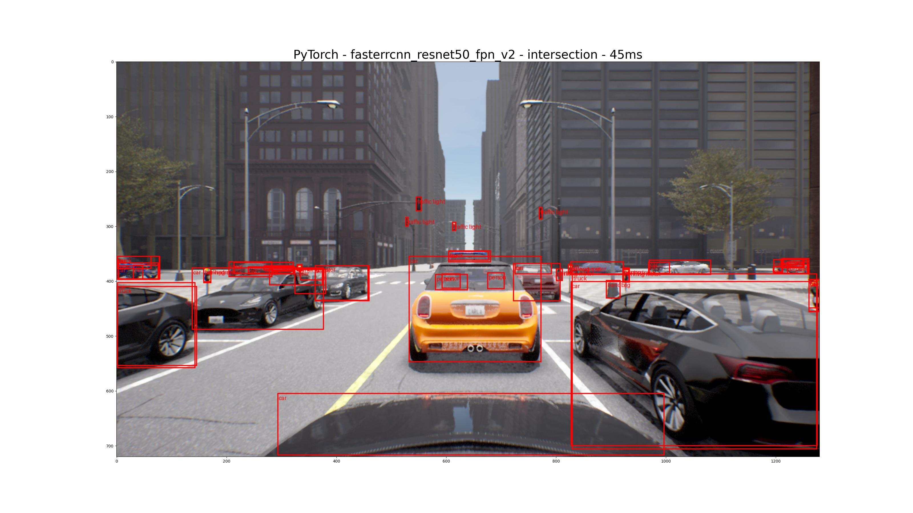
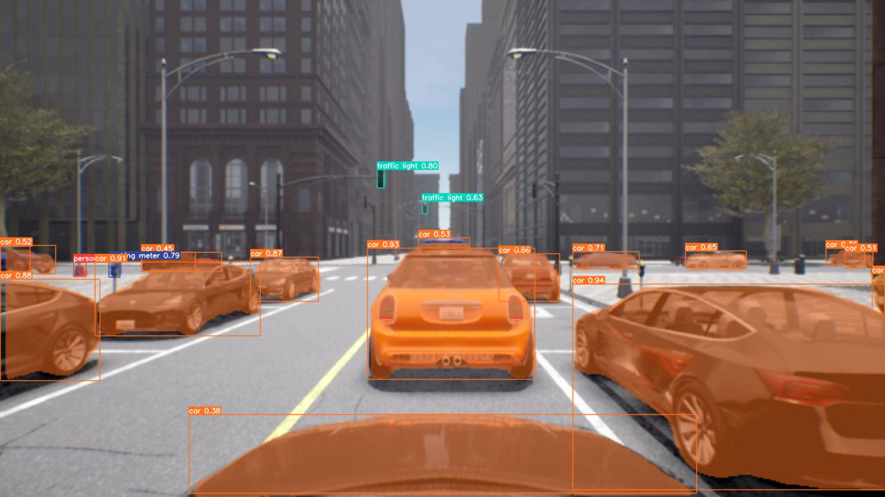
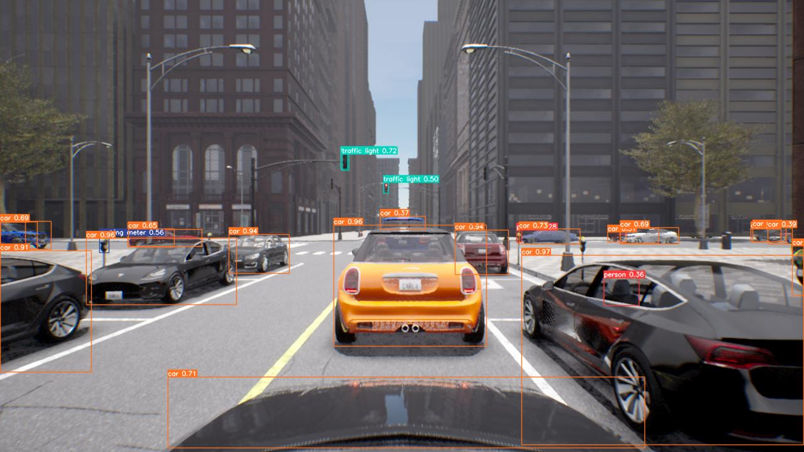

# Model Evaluation Experiment

This experiment was conducted to evaluate different kinds of object detection models for usage in the CARLA simulator.

## Installation

1. Create a virtual environment with `python -m venv venv` while being inside the project's folder.
2. Install the requirements with `pip install -r requirements.txt`
   1. If you have issues, check out the [Tensorflow-Docs](https://www.tensorflow.org/hub/installation), [PyTorch-Docs](https://pytorch.org/get-started/locally/) or [YOLO-Docs](https://docs.ultralytics.com/quickstart/) for installation
3. For the PyLot models (using Tensorflow), also run the following commands ([source](https://www.tensorflow.org/hub/tutorials/tf2_object_detection)):

```shell
git clone --depth 1 https://github.com/tensorflow/models
sudo apt install -y protobuf-compiler
cd models/research/
protoc object_detection/protos/*.proto --python_out=.
cp object_detection/packages/tf2/setup.py .
python -m pip install .
```

For the YOLO-NAS models, also run `pip install super-gradients==3.1.1`. It is recommended to run these models in a seperate venv, e.g. with `python -m venv venv_yolo` to not mix package versions

## Usage

Simply start `yolo.py`, `pt.py` or `pylot.py` to run the respective models and let it save the results.
`globals.py` only holds some global common constants.

## Results

For all models, 8 image directly captured from the CARLA RGB camera were used which depict different traffic scenarios.

*Legend for tables below*: ++, +, /, -, -- (best to worst)

### Pylot Models (Tensorflow)

The following models were evaluated (sorted descending by recognition performance):

1. faster-rcnn
2. ssd-mobilenet-v1-fpn
3. ssd-mobilenet-fpn-640
4. ssd-mobilenet-v1
5. ssdlite-mobilenet-v2

Images with boundary boxes: [Google Drive](https://drive.google.com/drive/folders/1Jk0KNf1-inO1LN8YWoX0nd796w44zp7_?usp=sharing)

#### Summary

|                       | Cyclists | Traffic lights | Cars | Noise | Speed |
|-----------------------|----------|----------------|------|-------|-------|
| faster-rcnn           | --       | --             | ++   | ++    | --    |
| ssd-mobilenet-v1-fpn  | --       | --             | +    | ++    | -     |
| ssd-mobilenet-fpn-640 | --       | --             | -    | ++    | +     |
| ssd-mobilenet-v1      | --       | --             | -    | ++    | ++    |
| ssdlite-mobilenet-v2  | --       | --             | --   | ++    | ++    |

#### Recognition

Overall, `faster-rcnn` performed the best out of these 5 Pylot models. It was able to recognize most cars reliably. The only downside was, pretty much nothing else was detected - like cyclists, traffic lights or construction sites.

`ssd-mobilenet-v1-fpn` recognized significantly less then `faster-rcnn`, but still better than the rest of the Pylot models.

The difference between `ssd-mobilenet-fpn-640` and `ssd-mobilenet-v1` isn't very noticable, both are rather mediocre.

`ssdlite-mobilenet-v2` only recognized the most obvious cars and tended to group multiple cars into one bounding box.

#### Computation speed

These values are meant to be compared between the models, not as a representative performance indicator in general.
Only the inference time was measured.

| Model                     | Time  | FPS  |
|---------------------------|-------|------|
| ssd-mobilenet-v1          | ~4ms  | 250  |
| ssdlite-mobilenet-v2      | ~6ms  | ~166 |
| ssd-mobilenet-fpn-640     | ~9ms  | ~111 |
| ssd-mobilenet-v1-fpn      | ~10ms | 100  |
| faster-rcnn               | ~26ms | ~38  |

### PyTorch Models

The following models were evaluated (sorted descending by recognition performance):

1. fasterrcnn_resnet50_fpn_v2
2. fasterrcnn_mobilenet_v3_large_320_fpn
3. retinanet_resnet50_fpn_v2

Images with boundary boxes: [Google Drive](https://drive.google.com/drive/folders/1AnTCIx351_aXWTcdGusIR4kTUOcomcy-?usp=sharing)

#### Summary

| Model                                 | Cyclists | Traffic lights | Cars | Noise | Speed |
|---------------------------------------|----------|----------------|------|-------|-------|
| fasterrcnn_resnet50_fpn_v2            | ++       | ++             | ++   | -     | --    |
| fasterrcnn_mobilenet_v3_large_320_fpn | ++       | +              | ++   | /     | ++    |
| retinanet_resnet50_fpn_v2             | ++       | ++             | ++   | --    | -     |

#### Recognition

Although, all models performed very well at recognizing all kinds of objects, especially `retinanet_resnet50_fpn_v2` showed a **lot** of noise (see images [above](#pytorch-models)).
When filtering these results for a higher minimum for detection score, these noise issues for all models could perhaps be reduced while keeping the good recogintion performance.

#### Computation speed

These values are meant to be compared between the models, not as a representative performance indicator in general.
Only the inference time was measured.

| Model                                 | Time  | FPS  |
|---------------------------------------|-------|------|
| fasterrcnn_mobilenet_v3_large_320_fpn | ~6ms  | ~166 |
| retinanet_resnet50_fpn_v2             | ~36ms | ~27  |
| fasterrcnn_resnet50_fpn_v2            | ~45ms | ~22  |

### YOLOv8

The model versions are different sizes of the same model.
The following models were evaluated (sorted descending by recognition performance):

1. yolo-rtdetr-x
2. yolo-rtdetr-l
3. yolo-nas-l
4. yolo-nas-m
5. yolo-nas-s
6. yolov8x / yolov8x-seg
7. yolov8l
8. yolov8m
9. yolov8s
10. yolov8n

Images with boundary boxes: [Google Drive](https://drive.google.com/drive/folders/1u6T0Q3kd9FqjiBWMqzlT-3-fglMqlkBB?usp=sharing)

#### Summary

| Model         | Cyclists | Traffic lights | Cars | Noise | Speed |
|---------------|----------|----------------|------|-------|-------|
| yolo-rtdetr-x | ++       | ++             | ++   | +     | -     |
| yolo-rtdetr-l | ++       | ++             | ++   | +     | -     |
| yolo-nas-l    | ++       | ++             | ++   | ++    | +     |
| yolo-nas-m    | ++       | ++             | ++   | ++    | +     |
| yolo-nas-s    | ++       | ++             | ++   | ++    | +     |
| yolov8x/-seg  | ++       | ++             | ++   | ++    | +     |
| yolov8l       | ++       | ++             | ++   | ++    | +     |
| yolov8m       | ++       | ++             | ++   | +     | ++    |
| yolov8s       | +        | +              | ++   | ++    | ++    |
| yolov8n       | +        | -              | +    | ++    | ++    |

#### Recognition

All model version performed very well. Only the smallest (`v8n`) version missed some cars. The v8s version was already visibly better, although the `v8x`, `v8l` and `v8m` versions recognized more details - like instead of just a person, they saw a person and a bicycle underneath.

The same can be said for traffic lights - `v8x`, `v8l` and `v8m` saw them from a larger distance, while `v8n` and `v8s` needed more proximity.

The `YOLO-NAS` family of models are similar to the best `v8` version but with higher confidence scores.

`RT-DETR` recognized a little more details and with higher confidence. But at the same time, they have more noise and see irrelevant objects (can be filtered though).

Throughout all versions, almost no noise (random wrong/duplicate predictions ) was present, without tweaking any values - only some noise with `v8m`.

#### Computation speed

These values are meant to be compared between the models, not as a representative performance indicator in general.
Only the inference time was measured.

| Model         | Time   | FPS  |
|---------------|--------|------|
| yolov8n       | ~2ms   | 500  |
| yolov8s       | ~2ms   | 500  |
| yolov8m       | ~3ms   | ~333 |
| yolov8l       | ~4ms   | 250  |
| yolov8x/-seg  | ~6/7ms | ~166 |
| yolo-nas-l    | ~6ms   | ~166 |
| yolo-nas-m    | ~6ms   | ~166 |
| yolo-nas-s    | ~7ms   | ~142 |
| yolo-rtdetr-l | ~13ms  | ~77  |
| yolo-rtdetr-x | ~16ms  | ~62  |

## Conclusion

Comparing all models with each other, YOLOv8 is currently by far the winner of the comparison. It has the best speed, lowest noise, most detail and reliable recognition - while also being the easiest to use and configure (compare the .py files yourself).

Since the `v8m` version is sometimes to sensitive and the `v8x` version is the largest/slowest, the `v8l` version is a good middle ground, if performance is important.

If the best detection results are the most important, the `v8x` version and `nas` family should be analyzed further with more images and situations.

For segmentation, also `sam` and `fast-sam` was tested. `Sam` needs multiple seconds for inference and is like `fast-sam` not suitable at all for Carla, as they segment the entire image and e.g. segment individual windows of a car or building.

|  |
|:--:|
| ^ *Pylot - Faster RCNN (26ms)* ^ |
|  |
| ^ *Pytorch - Faster RCNN Resnet50 FPN V2 (45ms)* ^ |
|  |
| ^ *YOLOv8x (6ms)* ^ |
|  |
| ^ *YOLOv8x-Seg (7ms)* ^ |
|  |
| ^ *YOLO-nas-l (7ms)* ^ |
|  |
| ^ *YOLO-rtdetr-x (16ms)* ^ |
