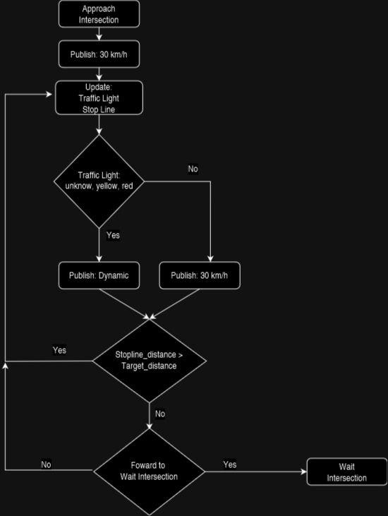
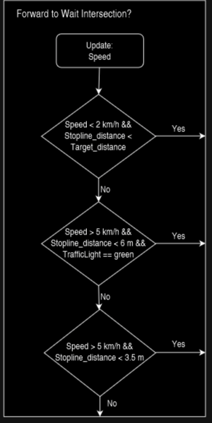
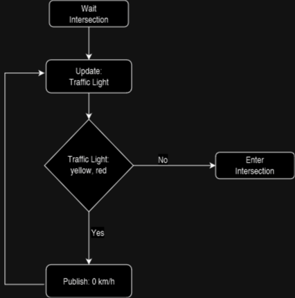
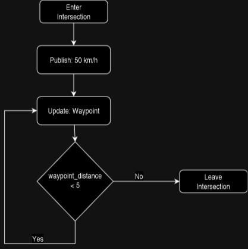

# Behaviors detailed

**Disclaimer**: The original behavior and decision tree are based on [PAF22](https://github.com/ll7/paf22)  and a previous [PAF project](https://github.com/ll7/psaf2).

**Summary:**
The behaviors are responsible for the higher level actions, like driving through an intersection or performing a lane change. This file describes the detailed process of performing the behavior.

---

## Author

Julius Miller

## Date

14.01.2023

---
<!-- TOC -->
- [Behaviors detailed](#behaviors-detailed)
  - [Author](#author)
  - [Date](#date)
  - [Intersection](#intersection)
    - [Detect Intersection](#detect-intersection)
    - [Approach Intersection](#approach-intersection)
    - [Wait Intersection](#wait-intersection)
    - [Enter Intersection](#enter-intersection)
    - [Leave Intersection](#leave-intersection)
  - [Lane Change](#lane-change)
  - [Cruise](#cruise)
<!-- TOC -->

---

## Intersection

### Detect Intersection

Subscriber: Waypoint

A Intersection is detected if the distance from the current position to the waypoint
 is less than 30 meters and the waypoint is at an intersection.

### Approach Intersection

Subscribers: Traffic Light, Waypoint (Stopline), Speed

If there is a green traffic light the car will drive towards the intersection with a speed of 30 km/h.

In every other case the car stops at the intersection and reduces dynamically the speed calculated by [motion_plannnig.py](../code/planning/src/local_planner/motion_planning.py)

The target_distance is currently 5 meters.

Conditions:

1. Describes if the car is stopped at the intersection.
2. Drive through intersection even if the traffic light turns yellow
3. Running over line

### Wait Intersection

Subscriber: Traffic Light

### Enter Intersection

Subscriber: Waypoint

New Waypoint is selected in [global_plan_distance_publisher.py](../code/perception/src/global_plan_distance_publisher.py) if the current position is closer than 2.5 meters to the waypoint or the next waypoint is closer than the currrent waypoint

### Leave Intersection

Signals behavior is over.

## Lane Change

WIP

## Cruise

Default behavior. Motion Planning uses acc speed in this case.
