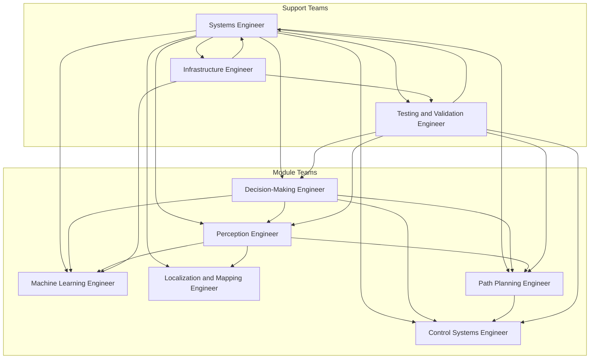

## Role overview

2-3 Students per Role

- **Systems Engineer**
  - Oversee the entire development process, ensuring smooth interaction between different subsystems (perception, planning, control, decision-making, etc.).
  - Define system-level architecture, ensuring each module (e.g., sensors, planning, control) interacts through well-defined interfaces.
  - Manage requirements (e.g. in issues) and ensure each team's outputs align with the overall system goals, including performance, reliability, and safety standards.
  - Serve as the point of contact for inter-team communication, ensuring alignment between roles such as Perception Engineers, Control Engineers, and Decision-Making Engineers.
  - Develop and enforce a systems integration strategy that covers continuous testing, validation, and verification of the autonomous driving stack.
  - Ensure proper data flow between modules using middleware (e.g., ROS).
  - Define and monitor key performance indicators (KPIs) for each subsystem, ensuring they collectively meet reliability, stability, and safety goals.
  - Provide leadership in prioritizing tasks, resource allocation, and responsibility distribution, ensuring the team meets project milestones.
  - Guide the team in prioritizing tasks and responsibilities, ensuring timely progress toward milestones.
  - Create detailed, version-controlled documentation of system design, module interactions, integration protocols, and architectural decisions, ensuring scalability and ease of future development.
  - Lead risk management efforts, identifying system-level risks and developing mitigation strategies.
  - Focus on the system’s overall functionality, making sure that all subsystems work harmoniously to create a reliable, autonomous vehicle capable of safe driving in the CARLA simulation.
- **Decision-Making Engineer**
  - Develop the vehicle’s decision-making logic for dynamic driving scenarios (e.g., merging lanes, overtaking, yielding at intersections).
  - Implement high-level decision-making algorithms (e.g., rule-based systems, behavior trees, or reinforcement learning) to choose the best action at any given time.
  - Ensure the vehicle follows traffic laws, responds to signals and signs, and interacts safely with other vehicles and pedestrians.
  - Design algorithms to handle edge cases, such as sudden obstacles, unpredictable pedestrian behavior, construction sides or vehicle breakdowns.
  - Collaborate with perception, planning, and control engineers to ensure the decision-making module aligns with the data and actions generated by other subsystems.
  - Simulate and validate decision-making in various complex driving scenarios within CARLA, such as navigating congested traffic or adverse weather conditions.
  - Ensure decision-making algorithms are interpretable and explainable to enhance debugging and safety validation.
- **Machine Learning Engineer**
  - Implement machine learning techniques (e.g., deep learning, reinforcement learning) to improve various subsystems in the autonomous driving stack.
  - Train neural networks for perception tasks (e.g., image segmentation, object detection, classification) using both simulated and real-world datasets.
  - Develop and optimize behavior cloning, imitation learning, or other algorithms to enable the vehicle to learn from human driving examples.
  - Integrate machine learning models into the perception or decision-making pipeline, ensuring smooth interaction with other system components.
  - Collaborate with Perception Engineers to fine-tune sensor fusion models using AI techniques for improved environmental understanding.
  - Analyze model performance and iteratively improve accuracy, efficiency, and real-time processing capability.
  - Monitor and manage the data pipeline for model training, ensuring data quality, labeling accuracy, and sufficient coverage of edge cases.
- **Perception Engineer**
  - Develop and improve sensor models (e.g., camera, LiDAR, radar) within the simulation, ensuring realistic sensor behavior and noise characteristics.
  - Implement state-of-the-art object detection, tracking, and sensor fusion algorithms to accurately interpret environmental data.
  - Work on the perception stack to enhance environmental understanding (e.g., detecting vehicles, pedestrians, cyclists, road signs, and obstacles).
  - Optimize sensor fusion techniques to combine data from multiple sensors for robust and reliable perception.
  - Collaborate with Machine Learning Engineers to incorporate deep learning models into the perception pipeline, improving detection accuracy and real-time performance.
  - Ensure the perception system performs reliably under diverse conditions (e.g., weather changes, lighting variations, sensor occlusion).
  - Continuously validate the perception module using test cases in CARLA, ensuring the system adapts to changing environmental conditions.
- **Localization and Mapping Engineer**
  - Improve vehicle localization by fusing GPS, IMU, vision-based techniques, and other sensor data for precise vehicle positioning.
  - Work on the integration and optimization of high-definition (HD) map usage provided by the simulator, ensuring accurate and up-to-date environmental mapping.
  - Implement SLAM (Simultaneous Localization and Mapping) algorithms to improve real-time localization in unknown environments.
  - Optimize the robustness of the localization system to handle edge cases, such as GPS signal loss, complex urban areas, and off-road scenarios.
  - Collaborate with the Systems Engineer and Perception Engineers to ensure the localization system integrates seamlessly with other modules.
  - Continuously test and validate the localization system to ensure accuracy and reliability across different environments and conditions in the CARLA simulation.
- **Path Planning Engineer**
  - Implement motion planning algorithms to generate smooth, safe, and optimal driving paths in complex environments.
  - Develop and improve path planning algorithms (e.g., A*, RRT, D*), ensuring that the vehicle can navigate through traffic, avoid obstacles, and follow traffic laws.
  - Collaborate with Decision-Making Engineers to ensure the planned paths align with high-level driving decisions.
  - Optimize planning algorithms to handle real-time changes in traffic conditions, road structure, and dynamic obstacles.
  - Validate the planned paths in various CARLA scenarios, ensuring robustness and reliability in urban, rural, and highway environments.
  - Ensure path planning algorithms balance safety, efficiency, and passenger comfort while maintaining vehicle controllability.
- **Control Systems Engineer**
  - Work on the low-level control of the vehicle, including steering, throttle, braking, and handling.
  - Implement advanced control algorithms (e.g., PID, MPC) to ensure the vehicle follows planned paths with stability and precision.
  - Tune control parameters to ensure smooth and reliable vehicle behavior under dynamic environmental conditions.
  - Collaborate with Path Planning Engineers to translate high-level paths into precise control actions.
  - Ensure the control system reacts dynamically to changes in the environment (e.g., obstacles, traffic conditions).
  - Test and validate control algorithms in CARLA, ensuring they handle edge cases like sudden maneuvers or high-speed scenarios.
- **Testing and Validation Engineer**
  - Design and execute comprehensive test cases to validate the performance, safety, and reliability of the autonomous vehicle system.
  - Develop automated testing pipelines within the CARLA environment to streamline regression testing and continuous integration.
  - Analyze the car’s performance under different driving scenarios (urban, highway, adverse weather) and provide detailed feedback to other engineers.
  - Generate detailed performance reports and feedback loops, recommending improvements to systems engineering, decision-making, and perception.
  - Suggest important next steps and priorities to the Systems Engineer based on testing outcomes and system performance.
  - Collaborate with all teams to ensure that testing covers a broad range of scenarios, including edge cases and stress tests.
- **Infrastructure Engineer**
  - Set up and maintain the development environment, including CI/CD pipelines, containerization, and code management tools.
  - Optimize the build, testing, and deployment processes to ensure efficient and rapid iteration of software components.
  - Monitor and manage cloud or local compute resources used for simulation, training, and testing (e.g., GPU clusters for machine learning).
  - Ensure seamless integration between different tools (e.g., CARLA, ROS, Jenkins) and handle infrastructure troubleshooting.
  - Develop and manage version control strategies, ensuring smooth collaboration across teams and maintaining code integrity.

