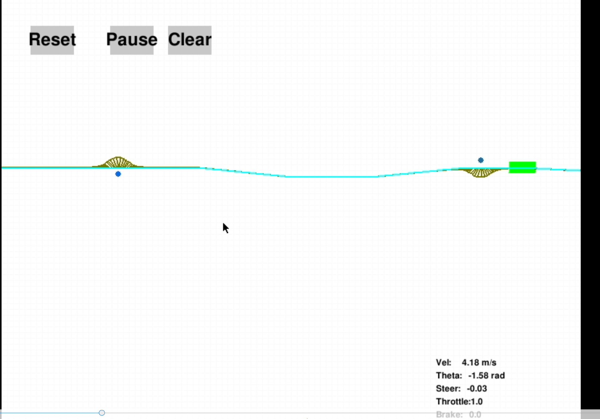
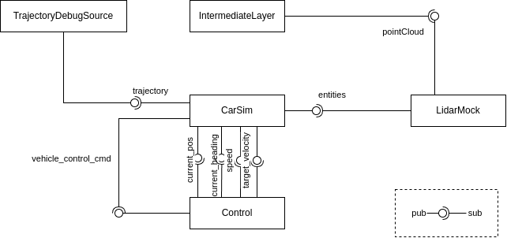
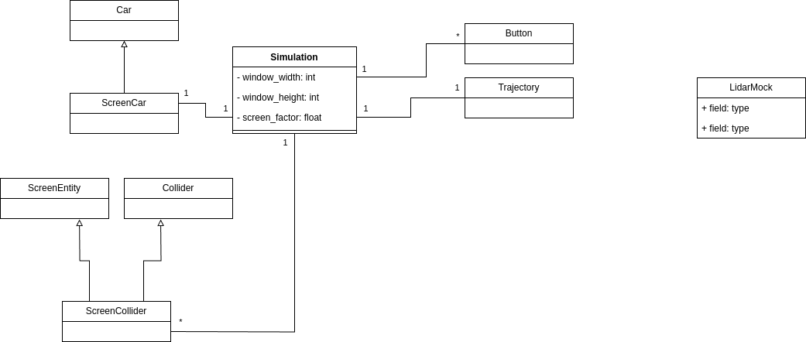

# A Testbed for the acting component

**Summary:** In our research towards local planners in the acting component we found that there are numerous kinds of local planners.
Such as TimeElasticBands, RandomTrees, DynamicWindow and many more. But also other steering controllers such as ReedsShepp-Paths or Dubin Curves.
Often there is no clear benefit in choosing one of them over the other. In PAF2025 a testbed for these Local Planners in order to compare them to one another was created.

The goal was to have a PyGame simulation of the vehicle. A global trajectory gets produced by e.g. Acting Debug.  
The Local Planner acts and then steering and throttle is calculated in control package, which is then again read by the simulation. With the lightweight nature of a performant sim in pygame load times are held to a minimum, and there is also the possibility to pause and reset the car.

Code compatibility with other systems such as control was important, however as the cars code changed maintaining the sim got progressively harder.

- [Sim architecture](#sim-architecture)
  - [Simulation](#simulation)
  - [Potential Field](#potential-field)
  - [TEB Planner](#teb-planner)

## Sim architecture

The main code for the sim can now be found inside `/doc/acting/discontinued/testbed/src/testbed`.
In this folder there are 3 Packages which we worked on.

In the following image the communication structure is visualized.
The car sim will publish the vehicles `current_pos`, `current_heading`, `Speed` and `target_velocity`.
These are the inputs for the Control component. The Control component will calculate `vehicle_control_cmd`'s. But these will not be sent to CARLA but instead back to the Simulation.
If the user places Obstacles in the simulation these will be sent out as `Entities`. The LidarMock Node converts these to a `pointCloud` (this is the most simple way to inject Entities into the Intermediate Layer).
The sim also subscribes to the `trajectory` topic, which is only for visualization purposes.
The original trajectory gets published by the `TrajectoryDebugSource` Node.
Different local_planners such as the PotentialField or TEBPlanner can then use the intermediate Layer Map and the trajectory to plan a modified Trajectory.

### Simulation

The main class (Simulation) is both a ROS-Node and a Pygame instance.
Most importantly in this simulation there is a Car Object. Which has the kinematics of the real car (steering, acceleration etc.).
In each loop the simulation steps the car and handles events such as button presses etc. This also allows obstacles to be placed.

### Potential Field

A simple local_planner based on the potential field approach. In the image above this planner acts upon the trajectory.

### TEB Planner

An early implementation on how the TEB Planner was integrated with the sim.
For further details on this local_planner read about it in `doc/acting/discontinued/teb_local_planner`.
