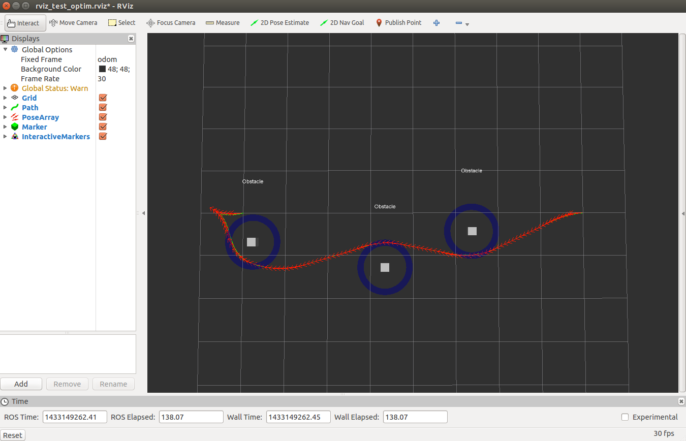

# TEB Local Planner (Timed elastic bands)

**Summary**: This page provides an overview on what the Timed elastic bands local planner is.
How it works and the way it is integrated into our code.

- [Timed elastic bands](#timed-elastic-bands)
- [Integration with the PAF project](#integration-with-the-paf-project)
  - [Ros TEB Planner](#ros-teb-planner)
  - [Interface package](#interface-package)
- [About move\_base](#about-move_base)

## Timed elastic bands

Timed elastic bands

## Integration with the PAF project

How we integrated

### [Ros TEB Planner](http://wiki.ros.org/teb_local_planner)

What and how the teb planner works

### [Interface package](https://github.com/TUC-ProAut/ros_teb_planner)

Why do we need the interface packaage

## About [move_base](http://wiki.ros.org/move_base)

move_base is a ros package providing a full navigation stack.
The planning in move_base is separated into two stages: global and local planning.
The concept behind the local planning scheme is such that it can be easily expanded with custom planners. 
[base_local_planner](http://wiki.ros.org/base_local_planner) acts a base implementation.
Several different local planners where implemented into this setup such as the [dwa_local_planner](http://wiki.ros.org/dwa_local_planner), or trajectory rollout.
But also the [teb_local_planner](http://wiki.ros.org/teb_local_planner) we are using.
An early goal was to integrate the full move_base interface into our code.
However the complete stack relies heavily on bitmapped costmaps which would be constantly changing in our situation. Also we are only interested in the local_planner which is not seperable from move_base (at least not without major efforts).
Because the teb_local_planner was already one of the preferred local_planners and a direct ros-interface ([ros_teb_planner](https://github.com/TUC-ProAut/ros_teb_planner)) was already available we decided to focus on this planner.
It is therefore not possible to exchange the teb_local_planner with any other planner easily.
For this we would need to integrate move_base.