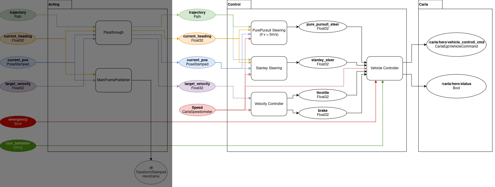

# Control: Overview and Architecture

**Summary**:
The control component applies control theory based on a local trajectory provided
by the [acting component](./../acting/README.md). It uses knowledge of the current state
of the vehicle in order to send [CarlaEgoVehicleControl](https://carla.readthedocs.io/en/0.9.8/ros_msgs/#CarlaEgoVehicleControlmsg) commands to the Simulator. This component also sends the [/carla/hero/status](https://leaderboard.carla.org/get_started/) command,
which starts the simulation.

- [Control Architecture](#control-architecture)
- [Summary of Control Components](#summary-of-control-components)
  - [Steering controllers](#steering-controllers)
    - [pure\_pursuit\_controller.py](#pure_pursuit_controllerpy)
    - [stanley\_controller.py](#stanley_controllerpy)
  - [Velocity controllers](#velocity-controllers)
    - [velocity\_controller.py](#velocity_controllerpy)
  - [vehicle\_controller.py](#vehicle_controllerpy)

## Control Architecture

> [!NOTE]
> [Click here to go to acting architecture](./../acting/architecture_documentation.md)

## Summary of Control Components

### Steering controllers

> [!TIP]
> Follow this link for the [Documentation](./steering_controllers.md) on steering controllers.

#### pure_pursuit_controller.py

- Inputs:
  - **trajectory**: Path
  - **current_pos**: PoseStamped
  - **Speed**: CarlaSpeedometer
  - **current_heading**: Float32
- Outputs:
  - **pure_pursuit_steer**: Float32
  - **pure_p_debug**: Debug

#### stanley_controller.py

- Inputs:
  - **trajectory**: Path
  - **current_pos**: PoseStamped
  - **Speed**: CarlaSpeedometer
  - **current_heading**: Float32
- Outputs:
  - **stanley_steer**: Float32
  - **stanley_debug**: StanleyDebug

### Velocity controllers

> [!TIP]
> Follow this link for the [Documentation](./velocity_controller.md) on velocity component.

#### velocity_controller.py

- Inputs:
  - **target_velocity**: Float32
  - **Speed**: CarlaSpeedometer
- Outputs:
  - **throttle**: Float32
  - **brake**: Float32

### vehicle_controller.py

> [!TIP]
> Follow this link for [Documentation](./vehicle_controller.md) on vehicle controller.

- Inputs:
  - **emergency**: Bool
  - **curr_behavior**: String
  - **Speed**: CarlaSpeedometer
  - **throttle**: Float32
  - **brake**: Float32
  - **pure_pursuit_steer**: Float32
  - **stanley_steer**: Float32
- Outputs:
  - **vehicle_control_cmd**: [CarlaEgoVehicleControl](https://carla.readthedocs.io/en/0.9.8/ros_msgs/#CarlaEgoVehicleControlmsg)
  - **status**: Bool
  - **emergency**: Bool
