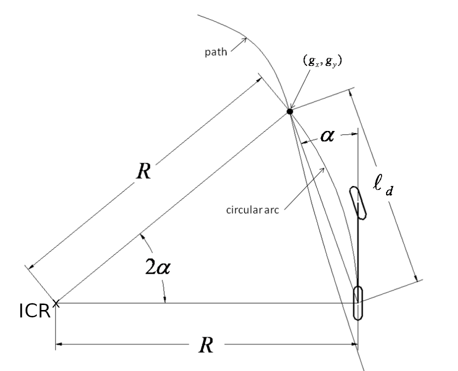

# Overview of the Steering Controllers

**Summary:** This page provides an overview of the current status of both steering controllers, the PurePursuit and the Stanley Controller.

- [General Introduction to Steering Controllers](#general-introduction-to-steering-controllers)
- [PurePursuit Controller](#purepursuit-controller)
- [Stanley Controller](#stanley-controller)

## General Introduction to Steering Controllers

Since the CARLA Vehicle is supposed to follow a given trajectory (published by Planning), our project needs a Controller to calculate steering signals from the given ```trajectory``` and the vehicle's ```current_pos``` and ```current_heading``` from the GNSS and IMU sensors (Perception!).
Currently, two different, independently running Steering Controllers are implemented: The [PurePursuit Controller](#purepursuit-controller), and the [Stanley Controller](#stanley-controller), both being introduced in the following chapters:

**IMPORTANT:** The CARLA ```vehicle_control_cmd``` only allows you to use a ```steer``` value with an allowed range from 0-1 (!) to control the steering.

## PurePursuit Controller

The [PurePursuit Controller's](../../code/control/src/pure_pursuit_controller.py) main feature to determine a steering-output is the so-called **look-ahead-distance d_la** (l_d in Image).
For more indepth information about the PurePursuit Controller, click [this link](https://de.mathworks.com/help/nav/ug/pure-pursuit-controller.html) and [this link](https://thomasfermi.github.io/Algorithms-for-Automated-Driving/Control/PurePursuit.html).

At every moment it checks a point of the trajectory in front of the vehicle with a distance of **$d_{la}$** and determines a steering-angle so that the vehicle will aim straight to this point of the trajectory.



This **look-ahead-distance $d_{la}$**  is velocity-dependent, as at higher velocities, the controller should look further ahead onto the trajectory.

$$ d_{la} = k_{ld} \cdot v $$

$$ \delta = arctan({2 \cdot L_{vehicle} \cdot sin(\alpha) \over d_{la}})$$

To tune the PurePursuit Controller, you can tune the factor of this velocity-dependence **$k_{ld}$**.
Also, for an unknown reason, we needed to add an amplification to the output-steering signal before publishing aswell **$k_{pub}$**, which highly optimized the steering performance in the dev-launch:


**NOTE:** The **look-ahead-distance $d_{la}$** should be highly optimally tuned already for optimal sensor data and on the dev-launch!
In the Leaderboard-Launch this sadly does not work the same, so it requires different tuning and needs to be optimized/fixed.

## Stanley Controller

The [Stanley Controller's](../../code/control/src/stanley_controller.py ) main features to determine a steering-output is the so-called **cross-track-error** (e_fa in Image) and the **trajectory-heading** (theta_e in Image).
For more indepth information about the Stanley Controller, click [this link](https://medium.com/roboquest/understanding-geometric-path-tracking-algorithms-stanley-controller-25da17bcc219) and [this link](https://ai.stanford.edu/~gabeh/papers/hoffmann_stanley_control07.pdf).


At every moment it checks the closest point of the trajectory to itself and determines a two steering-angles:

- from checking the closest trajectory-point (and its neighbouring points) it calculates a **trajectory-heading $\theta_e$** as the optimal steering for this point on the trajectory.
- from getting the vector from the current position to the closest trajectory-point it calculates the **cross-track-error $e_{fa}$** with which it calculates a steering-angle to drive back onto the trajectory.

$$ \theta_e = \theta - \theta_p$$

$$ \delta = \theta_e - arctan({k_{ce} \cdot e_{fa} \over v})$$

To tune the Stanley Controller, you tune the factor **$k_{ce}$**, which amplifies (or diminishes) how strong the **cross-track-error**-calculated steering-angle will "flow" into the output steering-angle.


As for the PurePursuit Controller, sadly the achieved good tuning in the Dev-Launch was by far too strong for the Leaderboard-Launch, which is why we needed to Hotfix the Steering in the last week to Tune Stanley alot "weaker". We do not exactly know, why the two launches are this different.
(Dev-Launch and Leaderboard-Launch differentiate in synchronicity, Dev-Launch is synchronous, Leaderboard-Launch is asynchronous?)

**NOTE:** In Dev-Launch, the Stanley Controller never surpassed PurePursuit in steering performance, so it was originally planned to simplify Acting and throw out the Stanley Controller.
Since this, for an unknown reason, did not apply to the Leaderboard-Launch, where Stanley performs ALOT better, you will have to look into this again.
