# Meeting 03 on 2024-10-28

**summary**: 2024-10-28 Time Boxing, Issues and PRs, Sprint Review Presentation, Group Size Decision, Sprint Planning Guidelines, Sprint Planning

- [1. Time Boxing](#1-time-boxing)
- [2. Issues and PRs](#2-issues-and-prs)
- [3. Sprint Review Presentation](#3-sprint-review-presentation)
- [4. Group Size Decision](#4-group-size-decision)
  - [4.1. Pro Large Group](#41-pro-large-group)
  - [4.2. Contra Large Group](#42-contra-large-group)
  - [4.3. Discussion](#43-discussion)
  - [4.4. Decision](#44-decision)
- [5. Sprint Planning Guidelines](#5-sprint-planning-guidelines)
- [6. Add Students to the Repository](#6-add-students-to-the-repository)
- [7. Sprint Planning](#7-sprint-planning)

## 1. Time Boxing

```mermaid
gantt
title Time Boxing 2024-10-28
dateFormat HH:mm
axisFormat %H-%M
tickInterval 10minute
%% a comment
%% docs https://mermaid.js.org/syntax/gantt.html

Issues and PRs: i, 14:00, 30m
Sprint Review Presentation: srp, after i, 20m
Group Size Decision: gsd, after srp, 20m
Sprint Planning Guidelines: spg, after gsd, 20m
Sprint Planning: sp, after spg, 100m
```

## 2. Issues and PRs

- How do you create issues for the discussed work packages?
- How do you create branches for the issues?
- How do you submit the corresponding PRs?
- How do I review PRs?

- [Project Management](../../development/project_management.md)
- [Git Workflow](../../development/git_workflow.md)
- [Review Guideline](../../development/review_guideline.md)

## 3. Sprint Review Presentation

- [Sprint Review Presentation](../../development/sprint_review_presentation.md)

## 4. Group Size Decision

< 19 Students

- **Smaller Groups**: Members may have more direct control over tasks, but it might require more individual effort and responsibility.
- **Larger Groups**: Allows for more specialization, but requires a higher level of coordination and clear communication strategies to prevent mismanagement.

### 4.1. Pro Large Group

- Addresses a challenging project more effectively
- Simulates real-world team dynamics
- Supports task distribution among more members
- Allows deeper project insights through collaboration
- Greater resilience to student dropouts
- Simpler repository workflow

### 4.2. Contra Large Group

- Increased coordination efforts
- Varied levels of participation may affect progress
- Difficulties in fair individual grading
- Potential for communication breakdowns
- Less individual responsibility per task

### 4.3. Discussion

- Participants can voice concerns or suggestions prior to voting to ensure an informed decision.

### 4.4. Decision

- Should the decision be made by majority vote?

## 5. Sprint Planning Guidelines

- [Sprint Planning Guidelines](../../development/sprint_planning_guidelines.md)
- Discuss Daily Stand-up

## 6. Add Students to the Repository

- Add students to the repository to ensure they have access to the project.
- Retrieve GitHub usernames from the students and add them to the repository.

## 7. Sprint Planning

...
