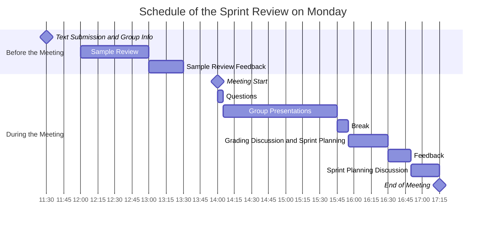

# Sprint Review Meeting PAF24

**Summary**: This document outlines the process for our sprint review meetings.

- [1. Timeline and Submission Guidelines](#1-timeline-and-submission-guidelines)
  - [1.1. Pre-Meeting Agenda](#11-pre-meeting-agenda)
  - [1.2. Meeting Agenda](#12-meeting-agenda)
- [2. Key Updates](#2-key-updates)
- [3. Sprint Review Schedule](#3-sprint-review-schedule)
- [4. Rationale for These Changes](#4-rationale-for-these-changes)
- [5. Pre-Meeting Checklist](#5-pre-meeting-checklist)

## 1. Timeline and Submission Guidelines

- **Team Configuration**: Work in teams of any size.

### 1.1. Pre-Meeting Agenda

- **Summary Submission**: By **Monday at 11:30 AM** (before the meeting), submit a summary of your work on Digicampus.
  - A template can be found here: [Summary of Work Template](./sprint_summary_template.md).
  - Upload your document to DigiCampus at [this link](https://digicampus.uni-augsburg.de/dispatch.php/course/files?cid=5b0c38206c78cc03880bc2e71997220f).
  - Inform us of your group composition and presentation order for our note-taking.
- **12:00 - 13:30**: Sample Review
  - Selected students will be reviewed individually, receiving an individual grade separate from the group grade.
  - A review guideline will be provided in the future.
- **By 13:30**: Sample Review Feedback
  - Feedback will be given based on the sample review, allowing you to address any points during your sprint presentation.

### 1.2. Meeting Agenda

- **14:00 - 15:45**: Sprint Presentations
  - Presenting as a group is recommended for time efficiency.
  - Not all members need to present; teams can decide on their approach.
- **15:45**: Grading Discussion and Sprint Planning Refinement
- **16:30**: Grade Announcement and Feedback
- **16:50**: Discussion of Your Plan for the Upcoming Sprint

## 2. Key Updates

- The general overview presentation is now removed or partially integrated into the Systems Engineers’ presentation.
- Grades are assigned based on the group presentation; however, individuals who undergo a sample review may receive a different grade.
- Presentation time is allocated at **5 minutes per student**:
  - Example: A team of three has a total of 15 minutes and may allocate time as they see fit.
  - A unified grade will be given unless individual assessment is warranted.
- Timeboxing will be strictly enforced: only content shared within the allotted time will be evaluated. Presentations will be stopped at the time limit.
- The sprint review presentation guideline was updated in [#452](https://github.com/una-auxme/paf/issues/452).
  - The [sprint_review_presentation.md](../../development/sprint_review_presentation.md) is updated.

## 3. Sprint Review Schedule

## 4. Rationale for These Changes

- To enable individual assessment where feasible.
- To avoid excessive time requirements, as individual reviews would take approximately 15–20 minutes per student.
- To keep the meetings on schedule.
- To track overall project progress.
- Allow us to provide constructive feedback.
- Group presentations should allow for a deeper focus on content.

## 5. Pre-Meeting Checklist

- [ ] Submit your "Summary of Work" by 11:30 AM (individual).
- [ ] Provide group composition details.
  - [ ] Identify team members.
- [ ] By 1:30 PM, check if you received individual feedback.
  - [ ] Consider how to incorporate feedback into your presentation.
