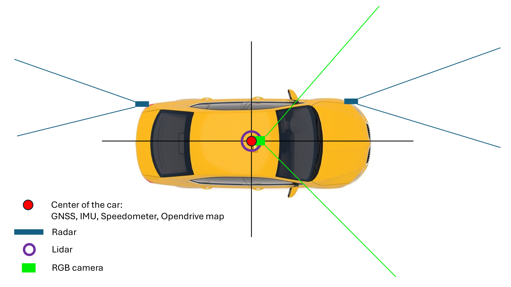

# PAF - Technical Introduction (Meeting 2)

**Date:** October 20, 2025  
**Topic:** Technical Framework Introduction and Architecture Overview

- [Overview](#overview)
- [Getting Started](#getting-started)
- [Architecture](#architecture)
- [Sensor Systems](#sensor-systems)
- [Core Components](#core-components)
- [Debugging and Visualization](#debugging-and-visualization)
- [Documentation Resources](#documentation-resources)
- [Next Steps](#next-steps)
- [Questions?](#questions)

---

## Overview

The **Praktikum Autonomes Fahren (PAF)** is a self-driving car project at the University of Augsburg that develops an autonomous agent for the [CARLA simulator](https://carla.org/). The project uses [ROS 2 (Jazzy)](https://docs.ros.org/en/jazzy/index.html) as its communication framework and aims to contribute to the [CARLA Autonomous Driving Challenge](https://leaderboard.carla.org/).

### Key Technologies

- **Simulator:** [CARLA 0.9.16](https://carla.readthedocs.io/)
- **Framework:** [ROS 2 Jazzy](https://docs.ros.org/en/jazzy/index.html)
- **Leaderboard:** [CARLA Leaderboard 2.1](https://leaderboard.carla.org/)
- **Containerization:** Docker with NVIDIA GPU support

---

## Getting Started

### Prerequisites

Documented in [Installation Guide](../../../doc/general/installation.md) and [Setup Script](../../../pc_setup_admin.sh).

Before starting the framework, ensure you have:
- NVIDIA GPU (>= RTX 3080 recommended, 10GB VRAM or more)
- NVIDIA driver version 550 or newer
- Docker with NVIDIA GPU support ([nvidia-docker](https://docs.nvidia.com/datacenter/cloud-native/container-toolkit/install-guide.html))
- Minimum 16GB RAM
- Minimum 100GB free disk space

### Starting the Framework

Follow these steps to launch the PAF framework:

1. **Open VS Code** in the project directory
2. **Install recommended extensions** (e.g., Python, Docker, Remote - Containers)
3. **Start the development environment:**
    - Right click on `build/docker-compose.dev.cuda.yml` and select "Compose Up"
    - Necessary for `.env` variables.
4. **Launch the Leaderboard** (in development mode):
   - Documented in terminal.
5. **Launch the Agent** (in development mode):
   - documented in terminal.

## Architecture

The PAF agent architecture is described in [Architecture Documentation](../../general/architecture_current.md). Take a look at the mermaid diagram.

---

## Sensor Systems

The vehicle agent uses multiple sensors provided by CARLA:

### Available Sensors

- **RGB Cameras** - Front, rear, and side-facing cameras
- **LiDAR** - 360° point cloud data
- **Radar** - Forward-facing radar for distance and velocity
- **GNSS** - GPS position data
- **IMU** - Inertial measurement unit

For more details on CARLA sensors, see: [CARLA Sensor Documentation](https://carla.readthedocs.io/en/latest/ref_sensors/)

The specifics for the carla challenge can be found in <https://leaderboard.carla.org/evaluation_v2_1/#map-track>.
We use the qualifying sensor setup!

---

## Core Components

### 1. Localization

**Purpose:** Determine the precise position and orientation of the vehicle.

**Key Component:**
- **Extended Kalman Filter (EKF)** - Fuses GNSS, IMU, and odometry data for accurate state estimation

**Documentation:** [Extended Kalman Filter](../../../doc/localization/extended_kalman_filter.md)

**Nodes:**
- `ekf_state_publisher.py` - Main EKF implementation
- `position_heading_publisher_node.py` - Publishes position and heading data

---

### 2. Perception

**Purpose:** Process sensor data to understand the environment.

**Key Nodes:**

#### Radar Node
- Provides **clustered points with velocity** information
- Essential for overtaking, turning, and dynamic object tracking
- **File:** `code/perception/perception/radar_node.py`

#### Lidar Node
- Delivers **clustered points with bounding boxes**
- Provides 3D obstacle detection
- **File:** `code/perception/perception/lidar_distance.py`

#### Vision Node
- Processes **camera data**
- Associates objects with LiDAR points (with optional filtering)
- Separate traffic light detection
- **File:** `code/perception/perception/vision_node.py`

#### Traffic Light Node
- Dedicated traffic light detection and classification
- **File:** `code/perception/traffic_light_detection/traffic_light_node.py`

#### Lane Detection
- Detects lane markings from camera images
- **File:** `code/perception/perception/Lanedetection_node.py`

**Documentation:** [Perception Overview](../../../doc/perception/README.md)

---

### 3. Mapping

**Purpose:** Central hub for environmental information - acts as an abstraction layer between Perception and Planning.

Similar to systems used in production vehicles (e.g., Tesla), the mapping component:
- Integrates data from all perception nodes
- Maintains a unified world model
- Provides a clean interface for the planning layer

**Key Nodes:**
- `mapping_data_integration.py` - Integrates perception data
- `visualization.py` - Visualizes the map data

**Location:** `code/mapping/`

**Documentation:** [Mapping Documentation](../../../doc/mapping)

---

### 4. Planning

**Purpose:** Determine the vehicle's trajectory and behavior.

**Components:**

#### Global Planning
- Computes a **global trajectory** from the map and waypoints
- Takes the route and generates a path through the environment
- **File:** `code/planning/planning/global_planner_node.py`
- **Documentation:** [Global Planner](../../../doc/planning/Global_Planner.md)

#### Motion Planning
- Performs **local trajectory modifications** (e.g., for overtaking, obstacle avoidance)
- Adjusts the global plan based on dynamic obstacles
- **File:** `code/planning/planning/motion_planning.py`
- **Documentation:** [Motion Planning](../../../doc/planning/motion_planning.md)

#### ACC (Adaptive Cruise Control)
- Determines **current target velocity** based on:
  - Speed limits
  - Lead vehicle distance and speed
  - Road curvature
- **File:** `code/planning/planning/ACC.py`
- **Documentation:** [ACC](../../../doc/planning/ACC.md)

#### Behavior Tree
- Determines the **current driving behavior** (e.g., lane following, overtaking, stopping)
- State machine for high-level decision making

**Documentation:** [Behavior Tree](../../../doc/planning/Behavior_tree.md)

---

### 5. Control

**Purpose:** Convert planned trajectories into vehicle control commands.

**Components:**

#### Pure Pursuit Controller
- Computes **steering angle** to follow the planned trajectory
- Geometric path tracking algorithm
- **File:** `code/control/control/pure_pursuit_controller.py`
- **Documentation:** [Steering Controllers](../../../doc/control/steering_controllers.md)

#### Velocity Controller
- Computes **throttle and brake** commands to achieve target velocity
- PID-based speed control
- **File:** `code/control/control/velocity_controller.py`
- **Documentation:** [Velocity Controller](../../../doc/control/velocity_controller.md)

#### Vehicle Controller
- **Interface to CARLA** - sends control commands to the simulator
- Converts ROS messages to CARLA control commands
- **File:** `code/control/control/vehicle_controller.py`
- **Documentation:** [Vehicle Controller](../../../doc/control/vehicle_controller.md)

---

## Debugging and Visualization

### Visualization Tools

#### rqt
- **ROS Qt GUI toolkit** for inspecting topics, services, and parameters
- Launch with: `rqt`
- Use cases:
  - Monitor topic data in real-time
  - Visualize messages
  - Plot numeric data over time
  - Inspect the node graph

[ROS 2 rqt Documentation](https://docs.ros.org/en/jazzy/Concepts/Intermediate/About-RQt.html)

#### RViz2
- **3D visualization tool** for ROS 2
- Visualize sensor data, trajectories, and the vehicle
- Configuration file: `rviz2.rviz` (in project root)
- Launch with: `rviz2`

[ROS 2 RViz Documentation](https://github.com/ros2/rviz)

### Debugging

#### Using rqt for Debugging
- **Echo topics** to see message contents
- **Inspect message frequency** to detect missing publications
- **Check service calls** and responses

#### Async Debugging
The project supports asynchronous debugging for Python nodes:
- Use VS Code's built-in debugger
- Attach to running ROS 2 nodes
- Set breakpoints and inspect variables

**Documentation:** [Debugging Guide](../../../doc/development/debugging.md)

---

## Documentation Resources

### Finding Documentation for ROS 2 Components

#### Example: Understanding `declare_parameter()`

1. **Look at the code** (e.g., [vehicle_controller.py#L67](https://github.com/una-auxme/paf/blob/d6242d6bd5a3acba49f9c94a2e6f4842461e65d7/code/control/control/vehicle_controller.py#L67))
2. **Identify it as a Node method** → Part of `rclpy`
3. **Search for "rclpy"** → Find the [GitHub repository](https://github.com/ros2/rclpy)
4. **Switch to the "jazzy" branch** (our ROS 2 version)
5. **Search for "declare_parameter"** → Found in `node.py`
6. **Follow the chain:**
   - Click on `Parameter` class
   - Find `get_parameter_value()`
   - Continue exploring as needed

#### Understanding Message Types

**Example: `ParameterDescriptor`**
1. **Check imports:** `from rcl_interfaces.msg import ParameterDescriptor`
2. **Search "rcl_interfaces.msg"** → Find the [GitHub repository](https://github.com/ros2/rcl_interfaces)
3. **Switch to "jazzy" branch**
4. **Browse message definitions** in the `msg/` folder

### Key Documentation Links

#### ROS 2
- [ROS 2 Jazzy Documentation](https://docs.ros.org/en/jazzy/index.html)
- [ROS 2 Tutorials](https://docs.ros.org/en/jazzy/Tutorials.html)
- [rclpy API Documentation](https://docs.ros2.org/jazzy/api/rclpy/)

#### CARLA
- [CARLA Documentation](https://carla.readthedocs.io/)
- [CARLA Python API](https://carla.readthedocs.io/en/latest/python_api/)
- [CARLA ROS Bridge](https://carla.readthedocs.io/projects/ros-bridge/en/latest/)
- [CARLA Sensors Reference](https://carla.readthedocs.io/en/latest/ref_sensors/)

#### CARLA Leaderboard
- [CARLA Leaderboard](https://leaderboard.carla.org/)
- [Leaderboard Documentation](https://leaderboard.carla.org/get_started/)

#### Project-Specific
- [PAF General Documentation](../../../doc/general/README.md)
- [PAF Development Guide](../../../doc/development/README.md)
- [Installation Guide](../../../doc/general/installation.md)
- [Execution Guide](../../../doc/general/execution.md)

---

## Next Steps

After this introduction, you should:

1. **Set up your development environment** - Follow the [installation guide](../../../doc/general/installation.md)
2. **Run the framework** - Try the steps in [Getting Started](#getting-started)
3. **Explore the codebase** - Start with components that interest you
4. **Read component documentation** - Deep dive into specific modules
5. **Join development** - Follow the [contribution guidelines](../../../doc/development)

---

## Questions?

If you have questions:
- Check the [documentation](../../../doc)
- Look at previous [dev talks](../../../doc/dev_talks)
- Ask the maintainers: @JulianTrommer and @ll7

Good luck with your autonomous driving journey! 🚗🤖
