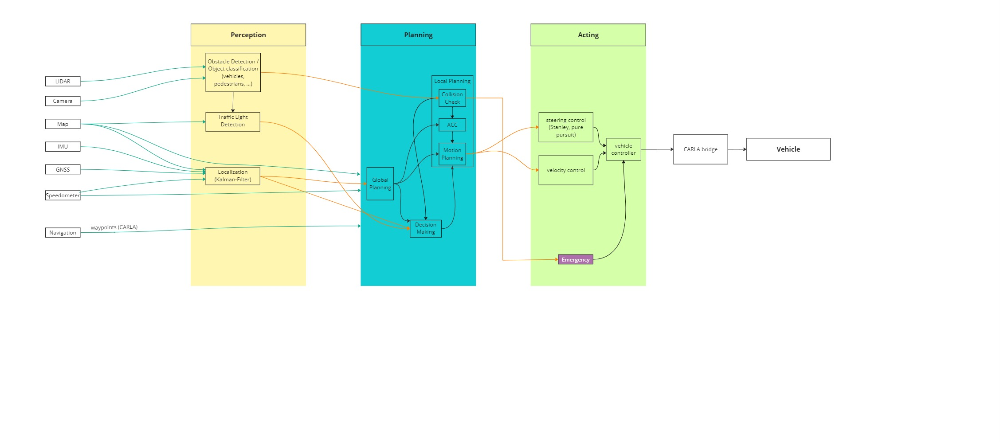
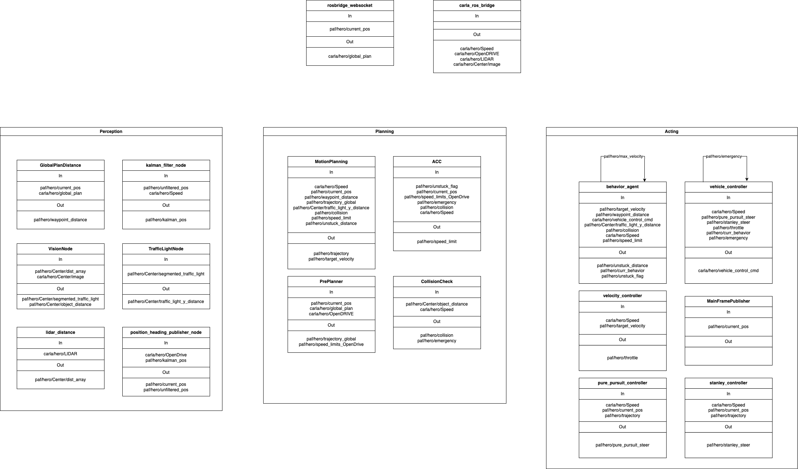

# Planned architecture of vehicle agent

**Summary:** This page gives an overview over the planned general architecture of the vehicle agent.
The document contains an overview over all [nodes](#overview) and [topics](#topics).

- [Overview](#overview)
- [Perception](#perception)
  - [Vision Node](#vision-node)
  - [Traffic Light Detection](#traffic-light-detection)
  - [Position Heading Node](#position-heading-node)
  - [Distance to Objects](#distance-to-objects)
  - [Localization](#localization)
- [Planning](#planning)
  - [Global Planning](#global-planning)
  - [Decision Making](#decision-making)
  - [Local Planning](#local-planning)
    - [Collision Check](#collision-check)
    - [ACC](#acc)
    - [Motion Planning](#motion-planning)
- [Acting](#acting)
  - [Path following with Steering Controllers](#path-following-with-steering-controllers)
  - [Velocity control](#velocity-control)
  - [Vehicle controller](#vehicle-controller)
- [Visualization](#visualization)

## Overview

The vehicle agent is split into three major components: [Perception](#Perception), [Planning](#Planning)
and [Acting](#Acting).
A separate node is responsible for the [visualization](#Visualization).
The topics published by the Carla bridge can be
found [here](https://carla.readthedocs.io/projects/ros-bridge/en/latest/ros_sensors/).\
The messages necessary to control the vehicle via the Carla bridge can be
found [here](https://carla.readthedocs.io/en/0.9.8/ros_msgs/#CarlaEgoVehicleControlmsg).\

The miro-board can be found [here](https://miro.com/welcomeonboard/a1F0d1dya2FneWNtbVk4cTBDU1NiN3RiZUIxdGhHNzJBdk5aS3N4VmdBM0R5c2Z1VXZIUUN4SkkwNHpuWlk2ZXwzNDU4NzY0NTMwNjYwNzAyODIzfDI=?share_link_id=785020837509).



## Perception

The perception is responsible for the efficient conversion of raw sensor and map data into a useful
environment representation that can be used by the [Planning](#Planning) for further processing.

Further information regarding the perception can be found [here](../perception/README.md).
Research for the perception can be found [here](../research/perception/README.md).

### Vision Node

Evaluates sensor data to detect and classify objects around the ego vehicle.
Other road users and objects blocking the vehicle's path are recognized.
The node classifies objects into static and dynamic objects.
In the case of dynamic objects, an attempt is made to recognize the direction and speed of movement.

Subscriptions:

- ```lidar``` ([sensor_msgs/PointCloud2](https://docs.ros.org/en/api/sensor_msgs/html/msg/PointCloud2.html))
- ```rgb_camera``` ([sensor_msgs/Image](https://docs.ros.org/en/api/sensor_msgs/html/msg/Image.html))
- ````gnss```` ([sensor_msgs/NavSatFix](https://carla.readthedocs.io/projects/ros-bridge/en/latest/ros_sensors/))
- ```map``` ([std_msgs/String](https://docs.ros.org/en/api/std_msgs/html/msg/String.html))
- ```radar``` ([sensor_msgs/PointCloud2](https://docs.ros.org/en/api/sensor_msgs/html/msg/PointCloud2.html)) SOON TO COME

Publishes:

- ```obstacles``` (Custom msg:
  obstacle ([vision_msgs/Detection3DArray Message](http://docs.ros.org/en/api/vision_msgs/html/msg/Detection3DArray.html))
  and its classification ([std_msgs/String Message](http://docs.ros.org/en/noetic/api/std_msgs/html/msg/String.html)))
- ```segmented_image``` ([sensor_msgs/Image](https://docs.ros.org/en/api/sensor_msgs/html/msg/Image.html))
  - /paf/hero/Center/segmented_image
  - /paf/hero/Back/segmented_image
  - /paf/hero/Left/segmented_image
  - /paf/hero/Right/segmented_image
- ```segmented_traffic_light``` ([sensor_msgs/Image](https://docs.ros.org/en/api/sensor_msgs/html/msg/Image.html))
- ```object_distance``` ([sensor_msgs/Float32MultiArray](https://docs.ros.org/en/noetic/api/std_msgs/html/msg/Float32MultiArray.html))
  - /paf/hero/Center/object_distance
  - /paf/hero/Back/object_distance
  - /paf/hero/Left/object_distance
  - /paf/hero/Right/object_distance

### Traffic Light Detection

Recognizes traffic lights and what they are showing at the moment.
In particular traffic lights that are relevant for the correct traffic behavior of the ego vehicle,
are recognized early and reliably.

Subscriptions:

- ```map``` ([std_msgs/String](https://docs.ros.org/en/api/std_msgs/html/msg/String.html))
- ```rgb_camera``` ([sensor_msgs/Image](https://docs.ros.org/en/api/sensor_msgs/html/msg/Image.html))
- ```lidar``` ([sensor_msgs/PointCloud2](https://docs.ros.org/en/api/sensor_msgs/html/msg/PointCloud2.html))
- ```gnss``` ([sensor_msgs/NavSatFix](https://carla.readthedocs.io/projects/ros-bridge/en/latest/ros_sensors/))

Publishes:

- ```traffic_lights``` (Custom msg:
  state ([std_msgs/UInt8 Message](https://docs.ros.org/en/api/std_msgs/html/msg/UInt8.html])),
  position ([geometry_msgs/Pose Message](http://docs.ros.org/en/noetic/api/geometry_msgs/html/msg/Pose.html)),
  distance_to_stop_line ([std_msgs/Float64 Message](http://docs.ros.org/en/api/std_msgs/html/msg/Float64.html)))

### Position Heading Node

There are currently no planned improvements of the Position Heading Node.

### Distance to Objects

There are currently no planned improvements for Distance to Objects.

### Localization

Provides corrected accurate position, direction and speed of the ego vehicle

Subscriptions:

- ```map``` ([std_msgs/String](https://docs.ros.org/en/api/std_msgs/html/msg/String.html))
- ```imu``` ([sensor_msgs/Imu Message](https://docs.ros.org/en/api/sensor_msgs/html/msg/Imu.html))
- ```speedometer``` ([std_msgs/Float32](https://docs.ros.org/en/api/std_msgs/html/msg/Float32.html))
- ```gnss``` ([sensor_msgs/NavSatFix](https://carla.readthedocs.io/projects/ros-bridge/en/latest/ros_sensors/))

Publishes:

- ```ego_position``` ([nav_msgs/Odometry Message](http://docs.ros.org/en/noetic/api/nav_msgs/html/msg/Odometry.html))

## Planning

The planning uses the data from the [Perception](#Perception) to find a path on which the ego vehicle can safely reach
its destination. It also detects situations and reacts accordingly in traffic. It publishes signals such as a trajecotry or a target
speed to acting.

Further information regarding the planning can be found [here](../planning/README.md).
Research for the planning can be found [here](../research/planning/README.md).

### [Global Planning](../planning/Global_Planner.md)

Uses information from the map and the path specified by CARLA to find a first concrete path to the next intermediate
point.

Subscriptions:

- ```map``` ([std_msgs/String](https://docs.ros.org/en/api/std_msgs/html/msg/String.html))
- ```navigation``` (waypoints and high-level route description)
- ```odometry``` ([nav_msgs/Odometry](https://docs.ros.org/en/api/nav_msgs/html/msg/Odometry.html))

Publishes:

- ```provisional_path``` ([nav_msgs/Path Message](http://docs.ros.org/en/noetic/api/nav_msgs/html/msg/Path.html))

### [Decision Making](../planning/Behavior_tree.md)

Decides which speed is the right one to pass through a certain situation and
also checks if an overtake is necessary.
Everything is based on the data from the Perception [Perception](#Perception).

Subscriptions:

- ```Speed``` ([carla_msgs/Speedometer](https://docs.ros.org/en/api/std_msgs/html/msg/Float32.html))
- ```collision``` ([std_msgs/Float32MultiArray](https://docs.ros.org/en/api/std_msgs/html/msg/Float32MultiArray.html))
- ```overtake_success``` ([std_msgs/Float32](https://docs.ros.org/en/api/std_msgs/html/msg/Float32.html))
- ```oncoming``` ([std_msgs/Float32](https://docs.ros.org/en/api/std_msgs/html/msg/Float32.html))
- ```target_velocity``` ([std_msgs/Float32](https://docs.ros.org/en/api/std_msgs/html/msg/Float32.html))
- all data from [Perception](#Perception)

Publishes:

- ```curr_behavior``` ([std_msgs/String](https://docs.ros.org/en/api/std_msgs/html/msg/String.html))

### [Local Planning](../planning/Local_Planning.md)

It consists of three components:

- Collision Check: Checks for collisions based on objects recieved from [Perception](#perception)
- ACC: Generates a new speed based on a possible collision recieved from Collision Check and speedlimits recieved from [Global Planner](#global-planning)
- Motion Planning: Decides the target speed and modifies trajectory if signal recieved from [Decision Making](#decision-making)

#### [Collision Check](../planning//Collision_Check.md)

Subscriptions:

- ```Speed``` ([carla_msgs/Speedometer](https://docs.ros.org/en/api/std_msgs/html/msg/Float32.html))
- ```unstuck_flag``` ([std_msgs/Bool](https://docs.ros.org/en/api/std_msgs/html/msg/Bool.html))
- ```unstuck_distance``` ([std_msgs/Float32](https://docs.ros.org/en/api/std_msgs/html/msg/Float32.html))
- ```speed_limits_OpenDrive``` ([std_msgs/Float32MultiArray](https://docs.ros.org/en/api/std_msgs/html/msg/Float32MultiArray.html))
- ```collision``` ([std_msgs/Float32MultiArray](https://docs.ros.org/en/api/std_msgs/html/msg/Float32MultiArray.html))
- ```trajectory_global``` ([nav_msgs/Path Message](http://docs.ros.org/en/noetic/api/nav_msgs/html/msg/Path.html))

Publishes:

- ```acc_velocity``` ([std_msgs/Float32](https://docs.ros.org/en/api/std_msgs/html/msg/Float32.html))
- ```current_wp``` ([std_msgs/Float32](https://docs.ros.org/en/api/std_msgs/html/msg/Float32.html))
- ```speed_limit``` ([std_msgs/Float32](https://docs.ros.org/en/api/std_msgs/html/msg/Float32.html))

#### [ACC](../planning/ACC.md)

Subscriptions:

- ```Speed``` ([carla_msgs/Speedometer](https://docs.ros.org/en/api/std_msgs/html/msg/Float32.html))
- ```objects``` ([std_msgs/Float32MultiArray](https://docs.ros.org/en/api/std_msgs/html/msg/Float32MultiArray.html))

Publishes:

- ```emergency``` ([std_msgs/Bool](https://docs.ros.org/en/api/std_msgs/html/msg/Bool.html))
- ```collision``` ([std_msgs/Float32MultiArray](https://docs.ros.org/en/api/std_msgs/html/msg/Float32MultiArray.html))
- ```oncoming``` ([std_msgs/Float32](https://docs.ros.org/en/api/std_msgs/html/msg/Float32.html))

#### [Motion Planning](../planning/motion_planning.md)

Subscriptions:

- ```Spawn_car``` ([std_msgs/Float32](https://docs.ros.org/en/api/std_msgs/html/msg/Float32.html))
- ```speed_limit``` ([std_msgs/Float32](https://docs.ros.org/en/api/std_msgs/html/msg/Float32.html))
- ```Speed``` ([carla_msgs/Speedometer](https://docs.ros.org/en/api/std_msgs/html/msg/Float32.html))
- ```current_heading``` ([std_msgs/Float32](https://docs.ros.org/en/api/std_msgs/html/msg/Float32.html))
- ```trajectory_global``` ([nav_msgs/Path Message](http://docs.ros.org/en/noetic/api/nav_msgs/html/msg/Path.html))
- ```current_pos``` ([geometry_msgs/PoseStamped](http://docs.ros.org/en/noetic/api/geometry_msgs/html/msg/PoseStamped.html))
- ```curr_behavior``` ([std_msgs/String](https://docs.ros.org/en/api/std_msgs/html/msg/String.html))
- ```unchecked_emergency``` ([std_msgs/Bool](https://docs.ros.org/en/api/std_msgs/html/msg/Bool.html))
- ```acc_velocity``` ([std_msgs/Float32](https://docs.ros.org/en/api/std_msgs/html/msg/Float32.html))
- ```waypoint_distance``` ([perception/Waypoint](../../code/perception/msg/Waypoint.msg))
- ```lane_change_distance``` ([perception/LanecChange](../../code/perception/msg/LaneChange.msg))
- ```collision``` ([std_msgs/Float32MultiArray](https://docs.ros.org/en/api/std_msgs/html/msg/Float32MultiArray.html))
- ```traffic_light_y_distance``` ([std_msgs/Int16](https://docs.ros.org/en/api/std_msgs/html/msg/Int16.html))
- ```unstuck_distance``` ([std_msgs/Float32](https://docs.ros.org/en/api/std_msgs/html/msg/Float32.html))
- ```current_wp``` ([std_msgs/Float32](https://docs.ros.org/en/api/std_msgs/html/msg/Float32.html))

Publishes:

- ```trajectory``` ([nav_msgs/Path Message](http://docs.ros.org/en/noetic/api/nav_msgs/html/msg/Path.html))
- ```target_velocity``` ([std_msgs/Float32](https://docs.ros.org/en/api/std_msgs/html/msg/Float32.html))
- ```overtake_success``` ([std_msgs/Float32](https://docs.ros.org/en/api/std_msgs/html/msg/Float32.html))

## Acting

The job of this component is to take the planned trajectory and target-velocities from the [Planning](#Planning) component and convert them into steering and throttle/brake controls for the CARLA-vehicle.

All information regarding research done about acting can be found [here](../research/acting/README.md).

Indepth information about the currently implemented acting Components can be found [HERE](../acting/README.md)!

### Path following with Steering Controllers

Calculates steering angles that keep the ego vehicle on the path given by
the [Local path planning](#Local-path-planning).

Subscriptions:

- ```trajectory``` ([nav_msgs/Path Message](http://docs.ros.org/en/noetic/api/nav_msgs/html/msg/Path.html))
- ```current_position``` [std_msgs/Float64 Message](http://docs.ros.org/en/api/std_msgs/html/msg/Float64.html])
- ```current_heading``` [std_msgs/Float64 Message](http://docs.ros.org/en/api/std_msgs/html/msg/Float64.html])
- ```current_velocity```[std_msgs/Float64 Message](http://docs.ros.org/en/api/std_msgs/html/msg/Float64.html])

Publishes:

- ```steering_angle``` for ```vehicle_control_cmd``` ([CarlaEgoVehicleControl.msg](https://carla.readthedocs.io/en/0.9.8/ros_msgs/#CarlaEgoVehicleControlmsg))

For further indepth information about the currently implemented Steering Controllers click [HERE](../acting/steering_controllers.md)

### Velocity control

Calculates acceleration values to drive the target-velocity given by the [Local path planning](#Local-path-planning).

Subscriptions:

- ```target_velocity``` ([std_msgs/Float64 Message](http://docs.ros.org/en/api/std_msgs/html/msg/Float64.html]))
- ```current_velocity```[std_msgs/Float64 Message](http://docs.ros.org/en/api/std_msgs/html/msg/Float64.html])

Publishes:

- ```throttle```
- ```brake```
- ```reverse```
for ```vehicle_control_cmd``` ([CarlaEgoVehicleControl.msg](https://carla.readthedocs.io/en/0.9.8/ros_msgs/#CarlaEgoVehicleControlmsg))

For further indepth information about the currently implemented Velocity Controller click [HERE](../acting/velocity_controller.md)

### Vehicle controller

Decides which steering controller to use and assembles [CarlaEgoVehicleControl.msg](https://carla.readthedocs.io/en/0.9.8/ros_msgs/#CarlaEgoVehicleControlmsg).

Subscriptions:

- ```throttle```
- ```brake```
- ```reverse```
- ```steering_angle```
- ```emergency```
- ```current_behavior``` (to detect unstuck-routine)

Publishes:

- ```vehicle_control_cmd``` ([CarlaEgoVehicleControl.msg](https://carla.readthedocs.io/en/0.9.8/ros_msgs/#CarlaEgoVehicleControlmsg))

For further indepth information about the currently implemented Vehicle Controller click [HERE](../acting/vehicle_controller.md)

## Visualization

Visualizes outputs of certain nodes to provide a basis for debugging.

Subscriptions:

- all data that's needed
