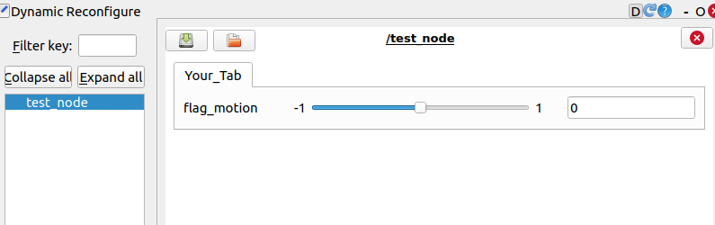

# Dynamic Reconfigure

**Summary:** Dynamic Reconfigure is a powerful tool which allows to dynamically adjust parameters of ROS-Nodes during runtime.

- [How to integrate into your Node](#how-to-integrate-into-your-node)
  - [Dynamic Reconfigure Server, Config and Callback](#dynamic-reconfigure-server-config-and-callback)
    - [The Config File](#the-config-file)
    - [The CMake List file](#the-cmake-list-file)
    - [Your Node](#your-node)
  - [Declaring Parameters from other sources](#declaring-parameters-from-other-sources)
- [Adjust Parameters in RQT](#adjust-parameters-in-rqt)

Read more about dynamic reconfigure: [DynamicReconfigure](https://wiki.ros.org/dynamic_reconfigure/Tutorials/HowToWriteYourFirstCfgFile/catkin)

## How to integrate into your Node

In order to integrate Dynamic-Reconfigure with your Node the following steps need to be made.

### Dynamic Reconfigure Server, Config and Callback

For Dynamic-Reconfigure at least three files have to be adjusted. These are:

 1. A `.cfg` file
 2. The `CMakeList` file
 3. Your `Python-Node` file

#### The Config File

At first a `.cfg` file needs to be created in a `config` folder in your ROS package.
The following shows a minimal version of such file.

```python
#!/usr/bin/env python
PACKAGE = "mapping_visualization"
from dynamic_reconfigure.parameter_generator_catkin import *
gen = ParameterGenerator()
tab_inputs = gen.add_group("Your Tab", type="tab")
tab_inputs.add("flag_motion", int_t, 0, "Filter for motion.", 0, -1, 1)
exit(gen.generate(PACKAGE, "mapping_visualization", "MappingVisualization"))
```

The first lines stay the same regardless of your project. Only the `PACKAGE` variable needs to be adjusted.
After this a tab group is generated, which allows for the dynamic reconfigure page to have multiple tabs in order to organize different aspects of your node.

Then the two most important lines:

```python
tab_inputs.add("flag_motion", int_t, 0, "Filter for motion.", 0, -1, 1)
```

A Parameter is added with the name `flag_motion`. This needs to conform with the ROS parameter naming conventions. Then the type is specified `int_t`. The `0` after this is not relevant for most purposes. After this a tooltip is added which gets displayed in RQT when hovering over the parameter.
The last three parameters are `Default value`, `Minimum value`and `Maxmimum value`. Which limit the slider.

For the last line naming is very important. Especially the last CamelCase parameter will determine the Name in the File to import.

```python
exit(gen.generate(PACKAGE, "mapping_visualization", "MappingVisualization"))
```

#### The CMake List file

In the `CmakeList` file of your package the following additions need to be made.

```cmake
find_package(catkin REQUIRED COMPONENTS
    dynamic_reconfigure
)

generate_dynamic_reconfigure_options(
  config/mapping_visualization.cfg
)
```

1. Add `dynamic_reconfigure` to the find_package section of the file.
2. Add your `.cfg` file to the `generate_dynamic_reconfigure_options` section. (You might need to create this section by your own.)

> [!NOTE] 
> `catkin_make` needs to be executed in order to generate the config.
> (For PAF leaderboard-launch this happens automatically)

#### Your Node

Lastly you want to use the config in your Python-Node file. For this the following imports need to be made. The name of your config corresponds to the naming conventions in your `.cfg` file.

```python
from mapping_visualization.cfg import MappingVisualizationConfig
from dynamic_reconfigure.server import Server
```

Then in your node constructor (`__init__(...)`) you need to add the following line:

```python
Server(MappingVisualizationConfig, self.dynamic_reconfigure_callback)
```

The callback method receives the config set in RQT. You also need to return the config.
This way you could reject certain changes.

```python
def dynamic_reconfigure_callback(self, config: "MappingVisualizationConfig", level):
    self.flag_motion = self.value_map.get(config["flag_motion"])
  return config
```

### Declaring Parameters from other sources

With the method described above the default value of in the config is used are actually used.
Sometimes however parameter defaults might want to be set in the `.launch` file or by a `.yaml`.

In the `.launch` file parameters can be declared like this (Inside a node tag):

```xml
<param name="flag_motion" value="0" />
```

Or a `.yaml` file can be created in the config folder.

```yaml
flag_motion: 0
```

Then in the `.launch` file the `.yaml` needs to be loaded (inside a node tag):

```xml
<rosparam file="$(find mappin_visualization)/config/your_yaml.yaml" command="load" />
```

> [!WARNING]
> When parameters are declared this way the default value in the `.cfg` file will not get used.

## Adjust Parameters in RQT

The following image shows the parameters for the `test_node` node, which was configured as described above. The RQT-Plugin can be found under `Plugins->Configuration->DynamicReconfigure`.


