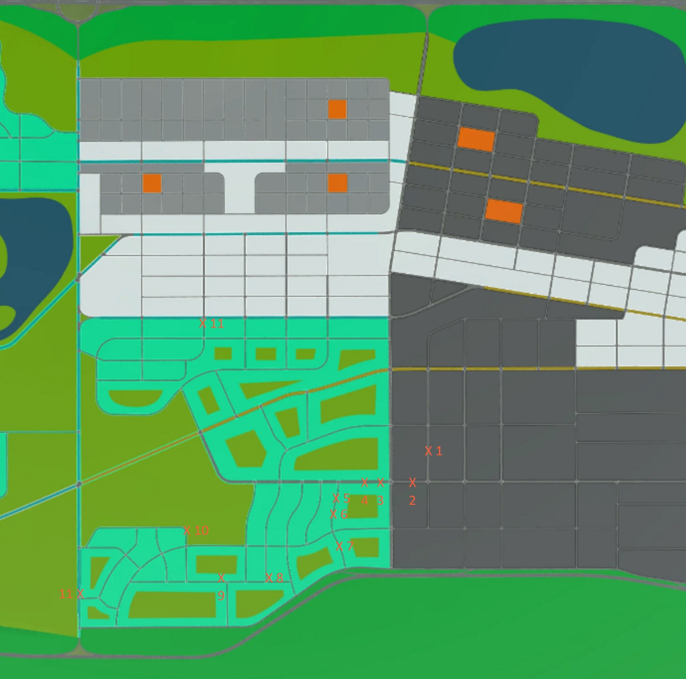

# How to load checkpoints

**Summary:** This page provides instructions on how to load a specific route into the Carla simulator to avoid having to wait for a specific event to occur.

- [Instruction](#instruction)
- [Scenario Map](#scenario-map)

## Instruction

1. Go to the [launch_leaderboard.dev.sh](/code/leaderboard_launcher/scripts/launch_leaderboard.dev.sh) file in the build directory.
2. Replace the standard leaderboard route. (--routes="${INTERNAL_WORKSPACE_DIR}/leaderboard/data/routes_devtest.xml" ln:6)
   with the route you want to start e.g. --routes="/workspace/code/routes/routes_highway.xml". Do not change the order of the commands
   or else the leaderboard wont start up.
4. Now Compose up the [docker-compose.dev.cuda.yml](/build/docker-compose.dev.cuda.yml) file.

## Scenario Map

The map shows the start points of the routes.

| Checkpoint |                 Name                  | continues test route |
| ---------: | :-----------------------------------: | :------------------: |
|         1. |         routes_open_door.xml          |         True         |
|         2. |      routes_firetruck_crash.xml       |         True         |
|         3. |          routes_bicycle.xml           |        False         |
|         4. |  routes_intersection_pedestrian.xml   |         True         |
|         5. |        routes_car_in_lane.xml         |         True         |
|         6. | routes_pedestrian_behind_bus_stop.xml |         True         |
|         7. |     routes_construction_sign.xml      |         True         |
|         8. |   routes_stop_sign_pedestrian_cross   |         True         |
|         9. |     routes_construction_sign2.xml     |         True         |
|        10. |           routes_curve.xml            |        False         |
|        11. |          routes_highway.xml           |        False         |
|        12. |        routes_curve_right.xml         |        False         |
