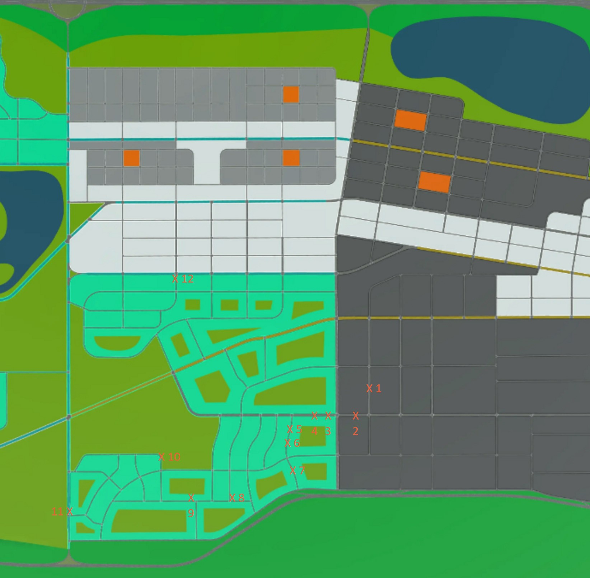

# How to load checkpoints

**Summary:** This page provides instructions on how to load specific scenarios in the Carla simulator to avoid having to wait for a specific event to occur.

## Instruction

1. Go to the agent_service.yaml file in the build directory.
2. Comment out the standard leaderboard route if it is in. ('''- ROUTE=/opt/leaderboard/data/routes_devtest.xml''' ln:32)
3. Comment in your specific scenario you want. The specific scenarios start at line 34.
4. Now Compose up the docker-compose.leaderboard.yaml file.

## Scenario Map

|Checkpoint|Name| continues test route|
|---------:|:--:|:-------------------:|
|1.|routes_open_door.xml| True|
|2.|routes_firetruck_crash.xml| True|
|3.|routes_bicycle.xml| False|
|4.|routes_intersection_pedestrian.xml| True|
|5.|routes_car_in_lane.xml|True|
|6.|routes_pedestrian_behind_bus_stop.xml| True|
|7.|routes_construction_sign.xml| True|
|8.|routes_stop_sign_pedestrian_cross| True|
|9.|routes_construction_sign2.xml| True|
|10.|routes_curve.xml| False|
|11.|routes_highway.xml| False|
|12.|routes_curve_right.xml| False|
