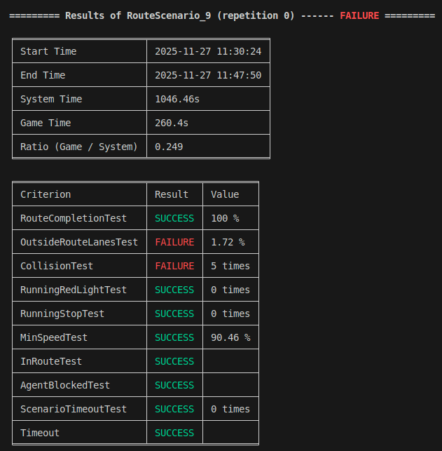

# Local Automatic Test

**Summary:** The page explains how to start the local automated test and what the output looks like. Additionally, it describes how to add a new scenario to the automated test. In an optimal case the test should not need longer than 30 min with 11 routes.

- [Time](#time)
- [Required files](#required-files)
- [Create new test scenario](#create-new-test-scenario)
- [Start Test](#start-test)
- [Output](#output)

## Time

The test shouldn't take longer than 2 minutes per route (with 3 waypoints). So the test with 11 routes (as of 06.02.25) shouldn't take longer than 22 minutes. In the event that the agent gets stuck, the test may take longer because Carla needs a certain amount of time until it aborts the simulation

## Required files

- code/routes/test.xml
- code/test/run_test.py
- code/test/index_dict.py
- code/leaderboard_launcher/scripts/launch_leaderboard.test.sh
## Definitions

**route**: A predefined way the agent has to take.

**scenario**: A predefined event the agent has to overcome that is triggered by a certain waypoint in the route.

## Create new test route with scenario

For creating a new route, the following must be considered:

1. Create a new route in code/routes/test.xml. The routes always need a unique ID number that increments sequentially. To create a new route, refer to the documentation in [create_new_route.md](/doc/general/create_new_route.md)
2. Create a separate .xml and copy the route you created into the file, so that it can be loaded later as a checkpoint. Name the route after the scenario that will be triggered.
3. Add the route to the map in the file doc/general/[load_checkpoints](/doc/general/load_checkpoints.md).
4. Add route to the list in code/test/index_dict.py. The structure of the list is as follows: ID number, scenario name, time allowed to complete the route.

## Start Test

To start a test, simply run leaderboard.test in the build/docker-compose.dev.cuda.yml container

## Output

