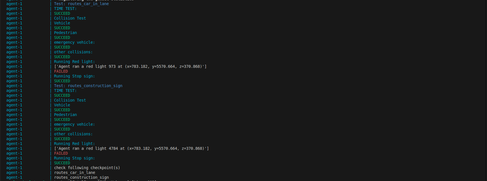

# Automatic Test

**Summary:** The page explains how to start the automated test and what the output looks like. Additionally, it describes how to add a new scenario to the automated test.

- [Required files](#required-files)
- [Create new test scenario](#create-new-test-scenario)
- [Start Test](#start-test)
- [Output](#output)

## Required files

- build/agent_service_test.yaml
- build/docker-compose.test.yaml
- code/routes/test.xml
- code/test/run_test.py
- code/test/index_dict.py

## Create new test scenario

For creating a new scenario, the following must be considered:

1. Create a new route in code/routes/test.xml. The routes always need a unique ID number that increments sequentially. To create a new scenario, refer to the documentation in create_new_checkpoint.md
2. Create a separate .xml file that exactly reflects this scenario so that it can later be loaded as a checkpoint.
3. Add the scenario to the map in the file doc/general/load_checkpoints.
4. Add scenario to the list in code/test/index_dict.py. The structure of the list is as follows: ID number, scenario name, time allowed to complete the scenario.

## Start Test

To start a test, simply run the file build/docker-compose.test.yaml with compose up.
Make sure that test.xml is set as the ROUTE variable in build/agent_service_test.yaml.

## Output

Blue: Name of the executed test scenario.

Cyan: Name of the executed test

- If passed, SUCCEED appears in green text below.

- If failed, the error cause is displayed first, followed by FAILED in red text.

At the end, a suggestion is given for which scenarios to review to understand where the errors occurred.
