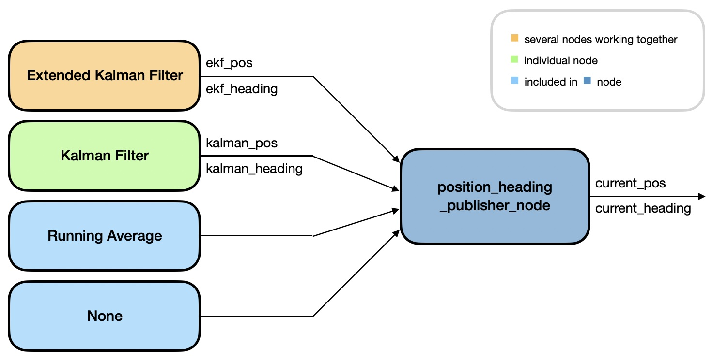

# Documentation of Localization

**Summary:** Localization is the process of determining the **position** and **orientation** (also called **heading**) of the vehicle within a reference frame.
This data is used by Planning and Acting to keep the car on the correct path.
This file provides an overview of the different nodes working together to localize the vehicle.

- [Overview](#overview)
- [Available filters](#available-filters)
  - [Choosing a filter](#choosing-a-filter)
- [The position_heading_publisher_node](#the-position_heading_publisher_node)
- [The coordinate_transformation node](#the-coordinate_transformation-node)
- [Adding a new filter](#adding-a-new-filter)
- [Evaluating filters](#evaluating-filters)

## Overview

The following image visualizes the localization process.

The raw position data provided by the GPS sensor is not accurate enough for our purposes.
The goal of filtering data is the elimination / reduction of noise.

Therefore, different filters can be used to estimate the position more precisely.
The heading of the car is measured using an IMU sensor and can be filtered as well.
The position and heading is often refered to as the **state** of the vehicle.

## Available filters

> [!IMPORTANT]

Currently the state of the car is estimated using an [Extended Kalman Filter (EKF)](./extended_kalman_filter.md).
Several nodes work together to make this possible.
A detailed explanation is provided in the corresponding [.md file](./extended_kalman_filter.md)

Aside from the EKF a [(linear) Kalman Filter](./kalman_filter.md) can be used to estimate the position and heading of the vehicle.
More details are provided in the correlating [.md file](./kalman_filter.md)

An even simpler approach is calculating the current state using a **Running Average** which means that the average of the last few measurements is used as the current estimate.

If you do not want to use a filter and simply make use of the raw sensor data then the **None** "filter" can be selected.

### Choosing a filter

The filter to be used is chosen in the [localization.launch](https://github.com/una-auxme/paf/blob/main/code/localization/launch/localization.launch) file.
You only need to set the `filter` argument accordingly, like shown in the following image.

## The position_heading_publisher_node

The [position_heading_publisher_node](./position_heading_publisher_node.md) node is responsible for forwarding the position and heading estimate of the chosen filter as the current position and heading.

This makes it possible for multiple filter nodes to be running and only the data produced by one filter is published as the current position / heading. Otherwise different filters would publish to the same topic (e.g. current_pos) which is not desirable.

Like mentioned above, the currently chosen filter is the EKF.
Even though the Kalman Filter could be running with this setup, we chose to not start it, if it is not the chosen filter, because it was quite computationally intensive.

However, our modular design makes it very easy to switch between different filters.

## The coordinate_transformation node

The [coordinate_transformation](./coordinate_transformation) module provides useful helper functions such as `quat_to_heading` which transforms a given quaternion into the heading of the car.

This module is used for example by the [position_heading_publisher_node](./position_heading_publisher_node) or the [kalman_filter](./kalman_filter) node.
Both nodes use the module for its `quat_to_heading` function and its `CoordinateTransformer` class.

The `CoordinateTransformer` is also used by the [gps_transform](../../code/localization/src/gps_transform.py) node in order to transform from GNSS data to the x/y/z space.

Please note, that the module is not fully documented yet, but the currently most important helper functions `quat_to_heading` and `geodetic_to_enu` are.

## Adding a new filter

To use a new filter two files need to be updated:

- First make sure that in the [localization.launch](https://github.com/una-auxme/paf/blob/main/code/localization/launch/localization.launch) file:
  - the `filter` argument is set to the name of your new filter
  - you add a `group` that checks if the `filter` argument is set to the name of your new filter
  (_note_: the groups make it possible to save computational power by only starting the node(s), that are needed to estimate the state of the vehicle with the chosen filter)
  - the node of the filter you want to use is included inside your new `group`

- Then the according subscribers (for position and heading, respectively) need to be added in the init function of the [position_heading_publisher_node.py](https://github.com/una-auxme/paf/blob/main/code/localization/src/position_heading_publisher_node.py#L107-L161) file.
(You might need to implement additional callback functions if you have different Message Types than currently used.)

## Evaluating filters

You can compare different filters by saving data and creating plots displaying this data.
The files implementing this functionality and their usage are described in detail in [evaluation.md](./evaluation.md)
