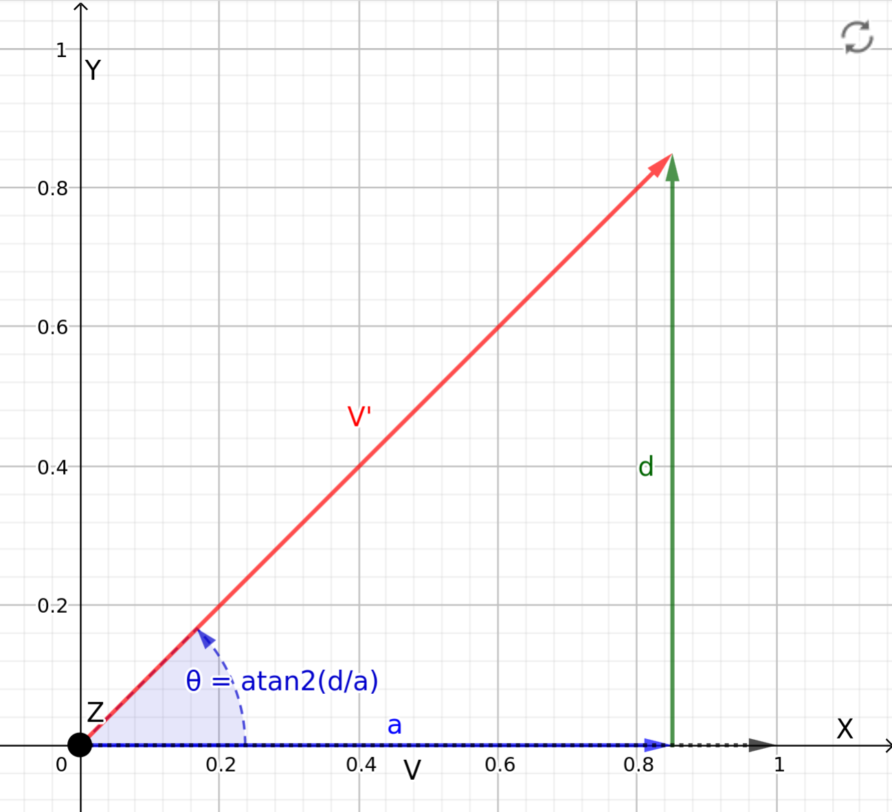

# Coordinate Transformation

**Summary:** Used for various helper functions such as `quat_to_heading`, that can be useful in various cases.

**Disclaimer:** It is not yet fully documented.
Only the `quat_to_heading` and `geodetic_to_enu` (`gnss_to_xyz`) functions are, because these are the only functions currently used.

- [Usage](#usage)
- [Overview of the code](#overview-of-the-code)
  - [The quat_to_heading function](#the-quat_to_heading-function)
  - [The geodetic_to_enu (gnss_to_xyz) function](#the-geodetic_to_enu-gnss_to_xyz-function)
  - [Other available functions](#other-available-functions)

## Usage

Just importing the coordinate_transformation.py file is enough to use all of its functions.

```Python
# Example
from coordinate_transformation import quat_to_heading
```

## Overview of the code

This file provides multiple useful functions.
However, `quat_to_heading` and `geodetic_to_enu` (`gnss_to_xyz`) are the only ones currently used.
A list of all other available but unused functions is provided below.

### The [quat_to_heading](https://github.com/una-auxme/paf/blob/main/code/localization/src/coordinate_transformation.py#L120-L143) function

We are often interested in the heading of the car, which is the cars rotation / angle around the z-axis.
The IMU sensor measures the cars orientation as a quaternion with respect to the Global Coordinate System.

To calculate the heading, the quaternion needs to be transformed into a rotation matrix:

$$
R =
\begin{bmatrix}
    a & b & c\\
    d & e & f\\
    g & h & i\\
\end{bmatrix}
$$

It is important to note, that the point which we consider `0 rad` is aligned with the x-axis.
Therefore, if the car is not deflected, its position can be described with the following unit vector:

$$
V =
\begin{bmatrix}
    1\\
    0\\
    0\\
\end{bmatrix}
$$

To calculate a rotated vector `V'`, the following calculation is performed:

$$
V' = R \cdot V
$$

$$
\begin{bmatrix}
    a\\
    d\\
    g\\
\end{bmatrix}
\quad = \quad
\begin{bmatrix}
    a & b & c\\
    d & e & f\\
    g & h & i\\
\end{bmatrix}
\cdot
\begin{bmatrix}
    1\\
    0\\
    0\\
\end{bmatrix}
$$

The result is a vector, that is rotated in the x-y-plane with the new x and y coordinates being `a` and `d`:



Now the angle $\theta$ around the z-axis, which correlates to the heading, can be calculated using the `atan2` function:

$$
\theta = atan2(\frac{d}{a})
$$

However, Carla does not use a right-handed coordinate system like it is normally used in mathematics and in the image above.
It uses a left-handed coordinate system instead.
To incorporate that into the calculation, $\theta$ simply needs to be negated to get the correct heading.

$$
\text{heading} = - \theta
$$

### The [geodetic_to_enu](https://github.com/una-auxme/paf/blob/092a3a467eeec492fd722d1f6d0efbb20e0131a2/code/localization/src/coordinate_transformation.py#L42-L71) ([gnss_to_xyz](https://github.com/una-auxme/paf/blob/092a3a467eeec492fd722d1f6d0efbb20e0131a2/code/localization/src/coordinate_transformation.py#L38-L39)) function

This method is used by the [gps_transform](../../code/localization/src/gps_transform.py) node.
The Carla GNSS-Sensor provides a latitude, longitude and altitude measurement.
With the `geodetic_to_enu` / `gnss_to_xyz` method this can be transformed to the x/y/z space which is used in all other systems of our vehicle.

The `CoordinateTransformer` class is built in a way that makes it possible to provide a reference latitude and longitude (which lat, lon equals (0,0) in x-y space).
This reference is provided in the OpenDrive Map received from Carla at startup.
In the current scenarios this reference is always (0,0).
If newer versions / scenarios change this reference, adjustments might need to be made.

### Other available functions

- ecef_to_enu
- geodetic_to_ecef
