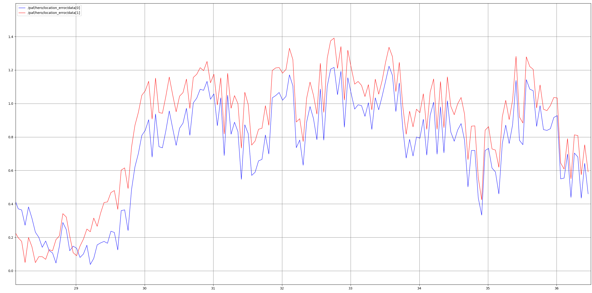

# Evaluating filters

## position_heading_filter_debug_node

The [position_heading_filter_debug_node](./position_heading_filter_debug_node.md) node is another useful node but it does not actively localize the vehicle.
Instead it makes it possible to compare and tune different filters and the [viz.py](../../code/perception/src/experiments/Position_Heading_Datasets/viz.py) file is the recommended way to visualizes the results.

This node processes the data provided by the IMU and GNSS so the errors between the is-state and the measured state can be seen.
To get the is-state the Carla API is used to get the real position and heading of the car.
Comparing the real position / heading with the position / heading estimated by a filter (e.g. Kalman Filter) the performance of a filter can be evaluated and the parameters used by the filter can be tuned.

The recommended way to look at the results is using the mathplotlib plots provided by the [viz.py](../../code/perception/src/experiments/Position_Heading_Datasets/viz.py) file even though they can also be shown via rqt_plots.

Because the node uses the Carla API and therefore uses the ground truth it should only be used for combaring and tuning filters and not for any other purposes.
It might be best to remove this node before submitting to the official leaderboard because otherwise the project could get disqualified.

For more details on the node see [position_heading_filter_debug_node](./position_heading_filter_debug_node.md) and [viz.py](../../code/perception/src/experiments/Position_Heading_Datasets/viz.py).

**Summary:** [position_heading_filter_debug_node.py](../../code/perception/src/position_heading_filter_debug_node.py):

The position_heading_filter_debug_node node is responsible for collecting sensor data from the IMU and GNSS and process the data in such a way, that it shows the errors between the real is-state and the measured state.
The data can be looked at in rqt_plots or (better) in mathplotlib plots pre-made by the [viz.py](../../code/perception/src/experiments/Position_Heading_Datasets/viz.py) file.

!!THIS NODE USES THE CARLA API!!

Using the Carla API could disqualify us from the leaderboard when submitting onto the official leaderboard.
Uncomment (maybe even remove) this file when submitting to the official leaderboard.
This file is only for debugging!

- [position\_heading\_filter\_debug\_node.py](#position_heading_filter_debug_nodepy)
  - [Getting started](#getting-started)
  - [Description](#description)
    - [Inputs](#inputs)
    - [Outputs](#outputs)
  - [Visualization](#visualization)

## Getting started

Uncomment the position_heading_filter_debug_node.py node in the [perception.launch](../../code/perception/launch/perception.launch) to start the node.
You can also uncomment the rqt_plots that seem useful to you, or create your own ones from the data published.

If you are trying to implement a new position/ heading filter and want to tune it using this node, you will have to do the following things:

1. Create a new Filter Node class (if not already done) AND publish a paf/hero/filter_name_pos AND/OR filter_name_heading
2. Change the topic of the test_filter_subscribers to your topic (currently kalman)


If you want to save the debug in csv files for better debugging you should uncomment
that part in the main loop of the file:


---

## Description

Running the node provides you with ideal position and heading topics that can be used to debug your sensor filters by giving you ideal values you should aim for.

It also provides you with helpful data saving methods for plotting your data (with regards to ideal values) by using the [viz.py](../../code/perception/src/experiments/Position_Heading_Datasets/viz.py) file, which is a lot more customizable and nicer to use than rqt plots.
If you want to know more about how to use that, you can go on to [Visualization](#visualization)

An Example of rqt plot Output can be seen here:


The file is using a main loop with a fixed refresh rate, that can be changed in the perception launch file.
In this loop it does the following things:

1. Refresh the Ideal Position and Heading (using the Carla API)
2. Update & Publish the Position & Heading Debug Values (see [Outputs](#outputs) for more info)
3. Save the debug data in CSV files in the corresponding folder in code/perception/experiments

    (can be outcommented if only working with rqt graphs is enough for you)

If activated it automatically saves the csv data in numerically ordered "data_##.csv" format.

The CSV files columns are formatted in the following style:

**X csv file example:**
| Time | Unfiltered | Ideal(Carla) | Current | Test Filter | Unfiltered Error | Current Error | Test Filter Error |
| ---- | ---------- | ------------ | ------- | ----------- | ---------------- | ------------- | ----------------- |
| 0.1  | 10.0       | 10.1         | 10.2    | 10.3        | 0.1              | 0.2           | 0.3               |
| 0.2  | 20.0       | 20.1         | 20.2    | 20.3        | 0.1              | 0.2           | 0.3               |

**Y csv file example:**
| Time | Unfiltered | Ideal (Carla) | Current | Test Filter | Unfiltered Error | Current Error | Test Filter Error |
| ---- | ------------ | --------------- | --------- | ------------- | ------------------ | --------------- | -------------------- |
| 0.1  | 10.0         | 10.1            | 10.2      | 10.3          | 0.1                | 0.2             | 0.3                  |
| 0.2  | 20.0         | 20.1            | 20.2      | 20.3          | 0.1                | 0.2             | 0.3                  |

**heading csv file example:**
| Time | Unfiltered | Ideal(Carla) | Current | Test Filter | Unfiltered Error | Current Error | Test Filter Error |
| ---- | ---------- | ------------ | ------- | ----------- | ---------------- | ------------- | ----------------- |
| 0.1  | 10.0       | 10.1         | 10.2    | 10.3        | 0.1              | 0.2           | 0.3               |
| 0.2  | 20.0       | 20.1         | 20.2    | 20.3        | 0.1              | 0.2           | 0.3               |

### Inputs

This node subscribes to the following needed topics:

- current agent position:
  - `/paf/{role_name}/current_pos` ([PoseStamped](http://docs.ros.org/en/noetic/api/geometry_msgs/html/msg/PoseStamped.html))
- current agent heading:
  - `/paf/{role_name}/current_heading` ([Float32](https://docs.ros.org/en/api/std_msgs/html/msg/Float32.html))
- [Carla_API Position](https://carla.readthedocs.io/en/latest/python_api/)
  - `get_location`
- [Carla_API Heading](https://carla.readthedocs.io/en/latest/python_api/)
  - `get_transform().rotation.yaw`
- test filter position:
  - `/paf/{role_name}/test_filter_name_pos` ([PoseStamped](http://docs.ros.org/en/noetic/api/geometry_msgs/html/msg/PoseStamped.html))
- test filter heading:
  - `/paf/{role_name}/test_filter_name_heading` ([Float32](https://docs.ros.org/en/api/std_msgs/html/msg/Float32.html))
- unfiltered position:
  - `/paf/{role_name}/unfiltered_pos` ([PoseStamped](http://docs.ros.org/en/noetic/api/geometry_msgs/html/msg/PoseStamped.html))
- unfiltered heading:
  - `/paf/{role_name}/unfiltered_heading` ([Float32](https://docs.ros.org/en/api/std_msgs/html/msg/Float32.html))
  
### Outputs

This node publishes the following topics:

- Carla Position:
  - `/paf/{self.role_name}/carla_current_pos` ([PoseStamped](http://docs.ros.org/en/noetic/api/geometry_msgs/html/msg/PoseStamped.html))
- Carla Heading:
  - `/paf/{role_name}/carla_current_heading` ([Float32](https://docs.ros.org/en/api/std_msgs/html/msg/Float32.html))
- Position Debug:
  - `/paf/{self.role_name}/position_debug` ([Float32MultiArray](http://docs.ros.org/en/melodic/api/std_msgs/html/msg/Float32MultiArray.html))
  - The Data is ordered in the following way:

```Python
        """
        unfiltered_pos.x in debug.data[0]
        unfiltered_pos.y in debug.data[1]
        carla_current_pos.x in debug.data[2]
        carla_current_pos.y in debug.data[3]
        current_pos.x in debug.data[4]
        current_pos.y in debug.data[5]
        test_filter_pos.x in debug.data[6]
        test_filter_pos.y in debug.data[7]

        carla_current_pos.x - unfiltered_pos.x in debug.data[8]
        carla_current_pos.y - unfiltered_pos.y in debug.data[9]
        sqrt[(carla_current_pos - unfiltered_pos)^2] in debug.data[10]

        carla_current_pos.x - current_pos.x in debug.data[11]
        carla_current_pos.y - current_pos.y in debug.data[12]
        sqrt[(carla_current_pos - current_pos)^2] in debug.data[13]

        carla_current_pos.x - test_filter_pos.x in debug.data[14]
        carla_current_pos.y - test_filter_pos.y in debug.data[15]
        sqrt[(carla_current_pos - test_filter_pos)^2] in debug.data[16]
        """
```

- Heading Debug:
  - `/paf/{self.role_name}/heading_debug` ([Float32](http://docs.ros.org/en/noetic/api/geometry_msgs/html/msg/PoseStamped.html))
  - The Data is ordered in the following way:

```Python
        """
        unfiltered_heading in debug.data[0]
        carla_current_heading in debug.data[1]
        current_heading in debug.data[2]
        test_filter_heading in debug.data[3]
        carla_current_heading - unfiltered_heading in debug.data[4]
        carla_current_heading - current_heading in debug.data[5]
        carla_current_heading - test_filter_heading in debug.data[6]
        """
```

## Visualization

The visualisation of the saved csv data is a really useful tool for debugging and tuning filters.

It can be used to debug X data, Y data and Heading (h) data.

To be able to save data in csv files you just need to uncomment the saving methods in the main loop as stated in the [Getting Started](#getting-started) chapter.

To use the [viz.py](../../code/perception/src/experiments/Position_Heading_Datasets/viz.py) file you will have to:

1. Configure the main method to your likings inside the viz.py: 
2. Open up an attached shell
3. Navigate to the code/perception/src/experiments/Position_Heading folder using ```cd```
4. run the viz.py using ```python viz.py```

With this file you can plot:

- Notched Box Graphs
  - For X, Y and Headings
  - using MAE, MSE error types
- CEP Graphs
  - For Position Errors
- X,Y Point Coordinate Graph
- Time Graphs:
  - for X, Y and Heading

All of which compare the test filter, with the ideal filter and currently running filter.

You can also find the "best tuned" file using the ```plot_best_tuned_file_by_type``` method within a specified file range that you want to compare each file with. This can be useful if you try to tune your filter
doing multiple runs and of course saving multiple files.

The deciding factor for a best tuned file is the lowest IQR or the lowest MSE (Degault) which can also be set as an argument.

To use this method you have to change the ```FILE_START``` and
```FILE_END``` values to the range of data you want to compare.

Of course you can add more plots and other methods to this visualization file if needed.

