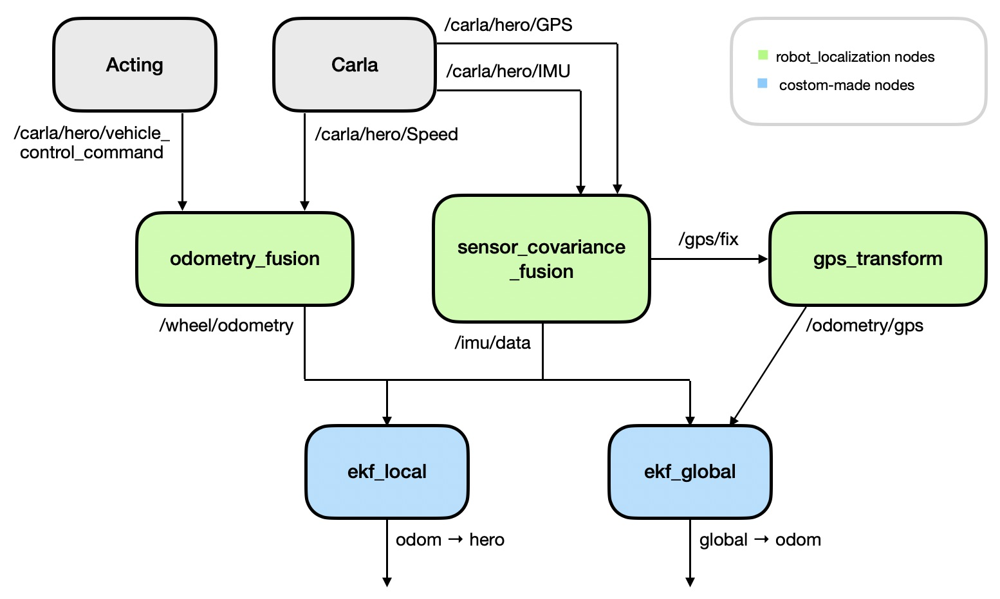
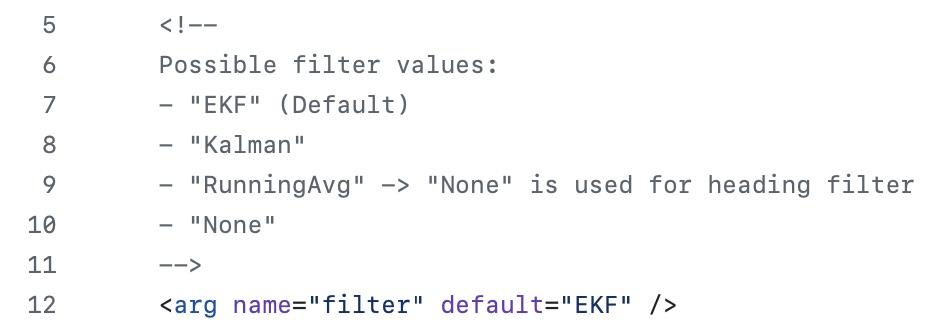
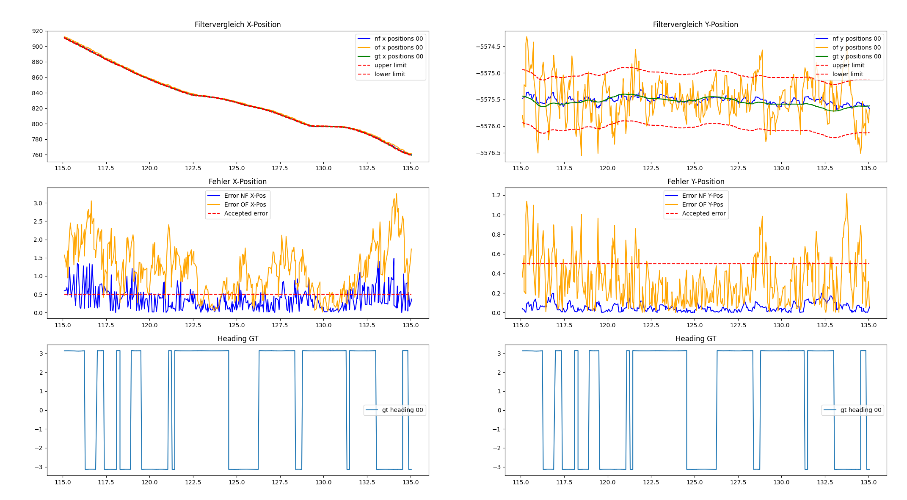

# The Extended Kalman Filter

> [!IMPORTANT]
> This is the currently used filter for localizing the vehicle.

**Summary:**
The state of the vehicle (position and heading) can be estimated using an Extended Kalman Filter.
The robot_localization package provides an implementation of this filter which fuses IMU, GPS, as well as Odometry data (computed using the speed of the car and its steering angle) to compute an accurate state estimation.

- [robot\_localization](#robot_localization)
- [Architecture](#architecture)
  - [Odometry Model](#odometry-model)
- [Summary of components](#summary-of-components)
  - [localization.launch](#localizationlaunch)
  - [sensor\_covariance\_fusion.py](#sensor_covariance_fusionpy)
  - [odometry\_fusion.py](#odometry_fusionpy)
  - [gps\_transform.py](#gps_transformpy)
  - [current\_state\_publisher.py](#current_state_publisherpy)
- [Configuration files](#configuration-files)
  - [ekf\_config.yaml](#ekf_configyaml)
  - [odometry\_covariances.yaml](#odometry_covariancesyaml)
  - [sensor\_covariances.yaml](#sensor_covariancesyaml)
- [Performance](#performance)
- [Possible improvements](#possible-improvements)
  - [Unscented Kalman Filter](#unscented-kalman-filter)
  - [Incorporate data provided by image processing](#incorporate-data-provided-by-image-processing)
  - [Covariance tuning](#covariance-tuning)
- [Theory on Extended Kalman Filters](#theory-on-extended-kalman-filters)
  - [1. Prediction](#1-prediction)
  - [2. Correction](#2-correction)

## robot_localization

The [robot_localization](http://docs.ros.org/en/noetic/api/robot_localization/html/index.html) package ([GitHub](https://github.com/cra-ros-pkg/robot_localization))
is a ROS-package providing [state_estimation_nodes](https://github.com/cra-ros-pkg/robot_localization/blob/ros2/doc/state_estimation_nodes.rst)
such as an Extended Kalman Filter (EKF) or an Unscented Kalman Filter (UKF).
As the UKF is quite computationally intensive, we decided to use an EKF as it works very well and doesn't take up too many resources.
Because inputs can be defined and added easily, we decided on using this as a framework for our localization algorithm.

## Architecture

Our architecture is derived from the one suggested in the [robot_localization's GitHub](https://github.com/cra-ros-pkg/robot_localization/blob/ros2/doc/integrating_gps.rst) when GPS data is included in the state estimation computation.

An overview of all nodes working together to estimate the vehicle's state using an EKF can be seen in the following image.

There are two EKF Nodes running:

The first node (ekf_local) fuses Odometry data with IMU data in order to track the cars position relative to the odom frame.
The odom frame itself is irrelevant to us, but this implementation follows not only the suggestion provided in the robot_localization package, but also conforms with [REP 105](https://www.ros.org/reps/rep-0105.html).

The second node (ekf_global) fuses the GPS data with  IMU data in order to calculate the global position.
This node publishes the global to odom frame.

The frames are attached as follows:

global $\rightarrow$ odom $\rightarrow$ hero

When comparing this to [REP 105](https://www.ros.org/reps/rep-0105.html) this correlates to:

map $\rightarrow$ odom $\rightarrow$ base_link

### Odometry Model

The odometry model used in the [odometry_fusion](#odometry_fusionpy) node is a very simplistic **"Einspurmodell"**, better known as a **non-holonomic robot model**.
The formulas are described below.
From the calculated data only the angular velocity ($\omega$) and the linear velocities ($\mathbf{v}$) are provided to the EKFs.

$$
R = \frac{L}{\tan(\theta)}
$$

$$
\omega = \frac{v}{R} \cdot dt
$$

$$
\mathbf{v} =
\begin{bmatrix}
v_x \\
v_y
\end{bmatrix}
=
v
\begin{bmatrix}
\cos(\theta) \\
\sin(\theta)
\end{bmatrix}
$$

where:  
- \( $v$ \) is the speed (from Carla Speedometer)
- \( $\theta$\) is the steering angle (from Control package)
- \( $L$ \) is the wheelbase of the vehicle (from Vehicle Information)
- \( $R$ \) is the turning radius

## Summary of components

There are several files in the localization package needed to estimate the state by an EKF.
In the following the most relevant files are described briefly.

### [localization.launch](../../code/localization/launch/localization.launch)

Currently, the EKF is the default filter.
The filter to be used is chosen in the [localization.launch](../../code/localization/launch/localization.launch) file by setting the `filter` argument accordingly.

With this setting, the launch file launches all appropriate nodes.
Apart from our custom-made nodes (see below), the two EKF nodes from the robot_localization package described in the Section [Architecture](#architecture) are started.

### [sensor_covariance_fusion.py](../../code/localization/src/sensor_covariance_fusion.py)

The IMU and GPS data is provided by Carla without covariance.
However, the EKF nodes rely on the covariances beeing part of the message.
Therefore, this node catches the IMU and GPS messages, adds the appropriate covariances and republishes them.

### [odometry_fusion.py](../../code/localization/src/odometry_fusion.py)

This node calculates an Odometry message from the current speed and the current steering angle of the vehicle.
It then publishes this message together with appropriate covariances.
The odometry model used in this project is described [above](#odometry-model).

### [gps_transform.py](../../code/localization/src/gps_transform.py)

The gps_transform node is a substitute for the [navsat_transform_node](https://docs.ros.org/en/noetic/api/robot_localization/html/integrating_gps.html#using-navsat-transform-node) provided in the robot_localization package.
This needed to be custom-made because the navsat_transform_node converts GPS data into UTM-coordinates.
However, Carla assumes WGS coordinates.

### [current_state_publisher.py](../../code/localization/src/current_state_publisher.py)

As most of the current PAF implementation relies not on the tf-data but on custom messages (namely current_position and current_heading) this node listens to the tf-graph and converts it to this data.

## Configuration files

### [ekf_config.yaml](../../code/localization/config/ekf_config.yaml)

With this .yaml file the EKF nodes can be configured.
The first section configures the local EKF, the second one the global EKF.

### [odometry_covariances.yaml](../../code/localization/config/odometry_covariances.yaml)

This file defines the covariance matrices for the Odometry data.

### [sensor_covariances.yaml](../../code/localization/config/sensor_covariances.yaml)

This file contains the covariance matrices for GPS and IMU data.
The covariances were determined by trial and error, and were not determined by sophisticated sensor / noise analysis.

## Performance

The EKF performs quite well for our purposes.
A comparison of the formerly used (linear) Kalman Filter and the Extended Kalman Filter can be seen in the following image.

The data shown in the image was collected while driving straight ahead.
The orange line is the output of the Kalman Filter whereas the blue line is the estimation of the EKF.
The green line shows the ground truth data.
The dotted red lines represent the maximum allowed error we wanted to allow: 0.5 meters.

It can be seen, that the estimation of the x- and y-position is a lot more accurate and respects the allowed error better.

## Possible improvements

Below there are some ideas on how the localization of the vehicle and in particular the EKF could be further improved.

### Unscented Kalman Filter

Currently an Extended Kalman Filter (EKF) is used to estimate the state of the vehicle.
It is likely that even better performance could be achieved by using an Unscented Kalman Filter (UKF).
The robot_localization package does provide an implementation however right now we chose not to use it as it would need more computational power and the EKF works well enough.

### Incorporate data provided by image processing

The localization of the vehicle could further be improved by combining the current estimate of the position with data generated by image processing.
Using information provided by Perception / the Intermediate Layer it is possible to calculate the distance to detected objects (for details see [distance_to_objects.md](../perception/distance_to_objects.md)).

Objects such as signals (traffic signs, traffic lights, ...) have a specified position in the OpenDrive Map.
For details see: (_Disclaimer_: the second source belongs to a previous version of OpenDrive but is probably still applicable)

- [source_1](https://www.asam.net/standards/detail/opendrive/) and
- [source_2](https://www.asam.net/index.php?eID=dumpFile&t=f&f=4422&token=e590561f3c39aa2260e5442e29e93f6693d1cccd#top-016f925e-bfe2-481d-b603-da4524d7491f) (menu point "12. Signals")

The knowledge of the map could be combined with the calculated distance to a detected object. For a better understanding look at the following example:

The car is driving on "road1". This road is 100 meters long and there is a traffic light in the middle of it.
If the program detects a traffic light next to the road with a distance of 20 meters, this suggests that the vehicle is 30 meters down "road 1".
That information could be used to refine the position estimation of the vehicle.

### Covariance tuning

As mentioned [above](#sensor_covariancesyaml) the covariances were not determined analytically, but by trial and error.
Because the sensor noise in Carla is known, theoretically, the covariances could be tuned more appropriately.
In the provided [.yaml](../../code/localization/config/sensor_covariances.yaml) file the standard deviations (`std-dev`) of the sensors are listed as well as a link to the source of these values.

## Theory on Extended Kalman Filters

If you are not familiar with Kalman Filters, you should first get to know the theory on [linear Kalman Filters](kalman_filter.md#theory-on-linear-kalman-filters).

The Extended Kalman Filter (EKF) is a non-linear filter.
However the basic steps of a linear Kalman Filter are still maintained even though the formulas are slightly different.

The state $x$ and its covariance matrix $P$ (the uncertainty of the state) are estimated.

In the [robot_localization](https://docs.ros.org/en/noetic/api/robot_localization/html/index.html) package the state vector is 15-dimensional:

$$
x =
\begin{bmatrix}
  x \\
  y \\
  z \\
  \text{roll} \\
  \text{pitch} \\
  \text{yaw} \\
  \dot{x} \\
  \dot{y} \\
  \dot{z} \\
  \dot{\text{roll}} \\
  \dot{\text{pitch}} \\
  \dot{\text{yaw}} \\
  \ddot{x} \\
  \ddot{y} \\
  \ddot{z} \\
\end{bmatrix}
$$

After an initialization (of $x^+(0)$ and $P^+(0)$ ) the algorithm consists of two steps which are repeated over and over:

### 1. Prediction

$x^-(k) = f_D(x^+(k-1))$

$P^-(k) = A(k-1) P^+(k-1)A^T(k-1) + Q(k-1)$ with $A(k-1) = \frac{\delta f_D}{\delta x} \vert_{x^+(k-1)}$

$f_D$ is a non-linear function.
The matrix $Q$ is the process noise covariance matrix.
The matrix $A$ is the state transition matrix.
Its formula might look a bit intimidating but it is just a Jacobi matrix:

$$
A =
\begin{bmatrix}
    \frac{\delta f_1}{\delta x} & \frac{\delta f_1}{\delta y} & \frac{\delta f_1}{\delta v} & ... & \frac{\delta f_1}{\delta \dot{\varphi}} \\
    ... & ... & ... & ... & ... \\
    \frac{\delta f_6}{\delta x} & \frac{\delta f_6}{\delta y} & \frac{\delta f_6}{\delta v} & ... & \frac{\delta f_6}{\delta \dot{\varphi}} \\
\end{bmatrix}
$$

### 2. Correction

$K(k) = P^-(k)C^T(k) [R(k) + C(k)P^-(k)C^T(k)]^{-1}$ with $C(k) = \frac{\delta g}{\delta x} \vert_{x^-(k)}$

$x^+(k) = x^-(k) + K(k) [y(k) - g(x^-(k))]$

$P^+(k) = [I - K(k)C(k)]P^-(k) [I - K(k)C(k)]^T + K(k)R(k)K^T(k)$

The matrix $K$ is known as the Kalman gain.
The matrix $C$ the observation matrix.
The vector $y$ consists of the measurements.
The function $g$ describes the state-to-measurement transformation.
The matrix $R$ is the covariance matrix of the (measurement) noise.
