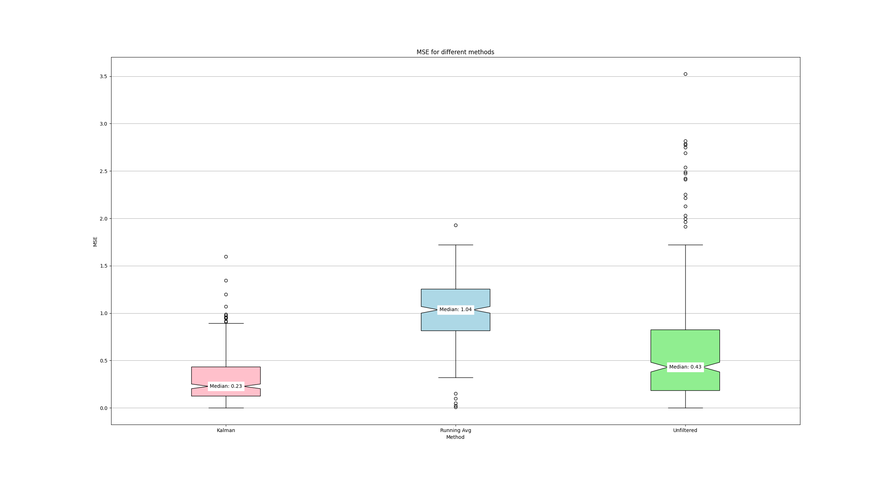
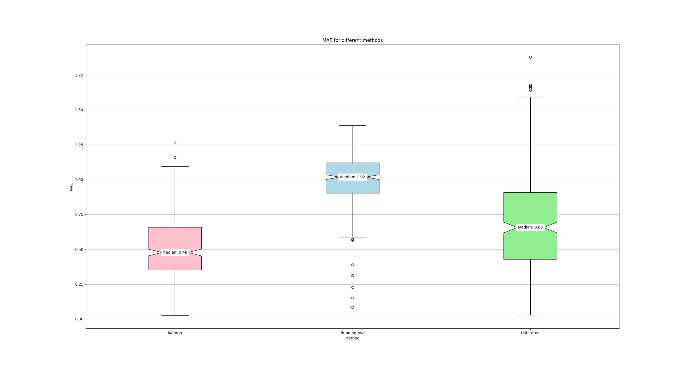
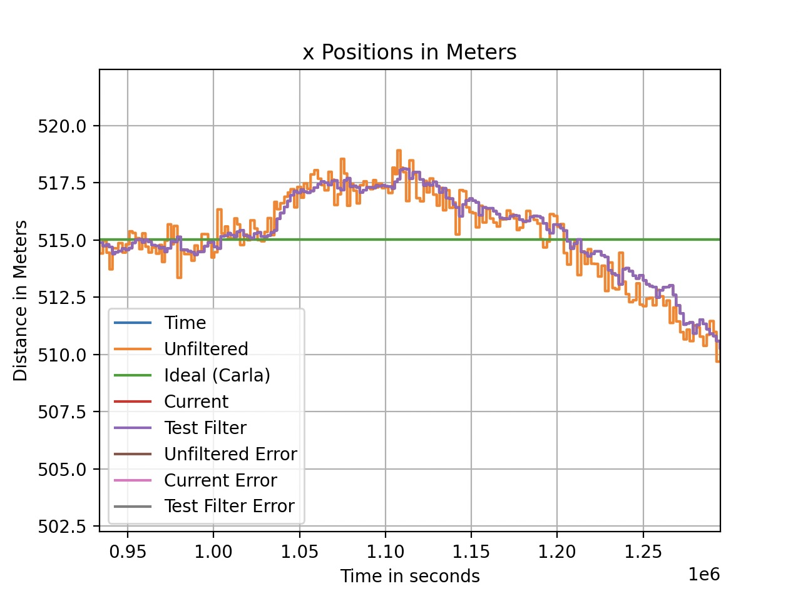
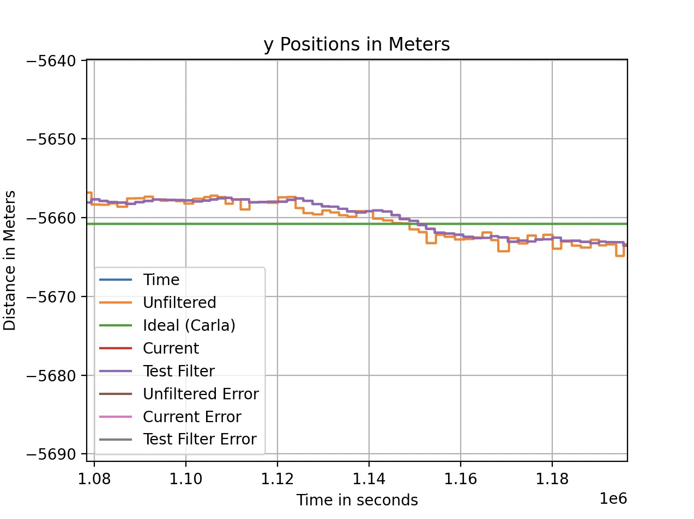
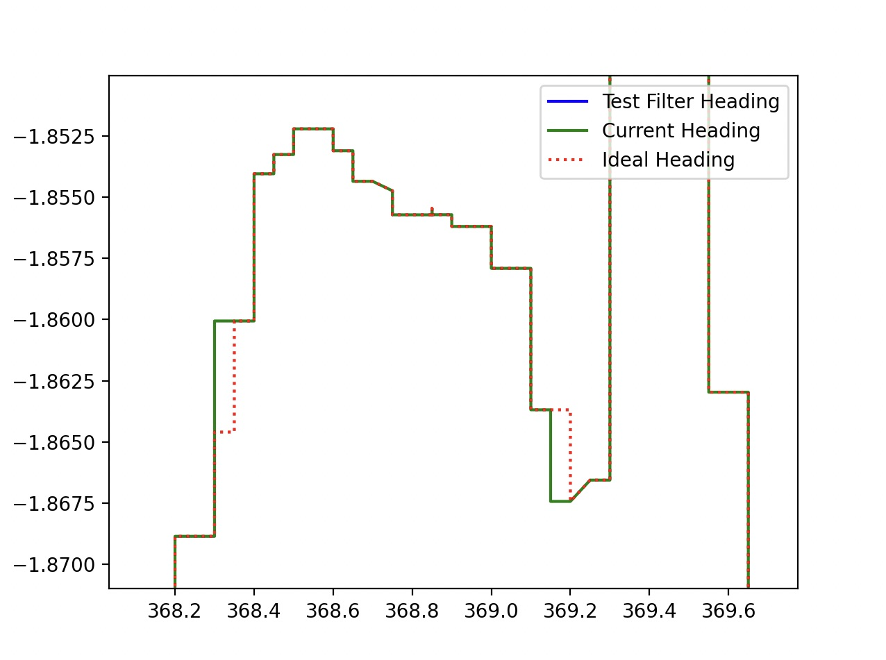

# Kalman Filter

**Summary:** The [kalman_filter](../../code/localization/src/kalman_filter.py) node can be used to estimate the state (position and heading) of the vehicle by using an IMU and GPS sensor together with the Carla Speedometer.

As of now it is working with a 2D x-y-transition model, which is why the current z-position is calculated with a rolling average.
(That means, that the average of the last few measurements is used as a position estimation.
The z-coordinate did not need more accuracy for our purposes.)

Please note, that this node implements a linear Kalman Filter and NOT an Extended Kalman Filter (EKF) or any other non-linear variant of the Kalman Filter.
For more information on the currently used EKF please refer to the [corresponding documentation](extended_kalman_filter.md).

- [Getting started](#getting-started)
- [Inputs](#inputs)
- [Outputs](#outputs)
- [Performance](#performance)
  - [Error graphs](#error-graphs)
  - [Plots showing the states](#plots-showing-the-states)
  - [Possible improvements](#possible-improvements)
- [Theory on linear Kalman Filters](#theory-on-linear-kalman-filters)
  - [1. Prediction](#1-prediction)
  - [2. Correction](#2-correction)
  - [Extending the model](#extending-the-model)

## Getting started

To use the Kalman filter node for the state estimation, the `filter` argument in the [localization.launch](../../code/localization/launch/localization.launch) file needs to be changed from "EKF" to "Kalman".
In the following image the relevant code lines can be seen.

## Inputs

This node subscribes to the following  topics:

- `/paf/hero/unfiltered_pos` ([PoseStamped](http://docs.ros.org/en/noetic/api/geometry_msgs/html/msg/PoseStamped.html)) &rarr; for position data
- `/carla/hero/Speed` (CarlaSpeedometer) &rarr; for velocity data
- `/carla/hero/IMU` ([IMU](https://docs.ros.org/en/api/sensor_msgs/html/msg/Imu.html)) &rarr; for orientation and angular velocity data
- `/carla/hero/OpenDRIVE` ([String](https://docs.ros.org/en/noetic/api/std_msgs/html/msg/String.html))
- `/carla/hero/GPS` ([NavSatFix](https://docs.ros.org/en/noetic/api/sensor_msgs/html/msg/NavSatFix.html)) &rarr; _disclaimer_: all functionality of the callback function to this topic is currenly commented out, because the already preprocessed unfiltered_pos data is used for the position estimation

## Outputs

This node publishes the following topics:

- `/paf/hero/kalman_heading` ([Float32](http://docs.ros.org/en/noetic/api/std_msgs/html/msg/Float32.html))
- `/paf/hero/kalman_pos` ([PoseStamped](http://docs.ros.org/en/noetic/api/geometry_msgs/html/msg/PoseStamped.html))

## Performance

To assess the performance of a filter we can look at the errors of its estimation
as well as plots, that show how well the states, that we are interested in (x/y-position and heading), are being estimated.

### Error graphs

The following two images show the MSE / MAE Boxed Graph of the position error with respect to the ideal position (ground truth).

Lower values in the data mean smaller error values.

Smaller boxes mean the data is closer together and less spread.

The Kalman Filter was tuned to create the smallest MSE possible, which gives more weight to larger errors.

The MAE on the other hand shows a 1:1 representation in terms of distance from the ideal to the predicted position.

When you see this data, you might think, that the unfiltered data seems to be just as good if not even better than the previous Rolling Average Filter (RAF).

This is not the case, since the RAF has a way smaller spread of datapoints, making the position estimation way smoother than without a filter, even though the error is large.

The Kalman Filter on the other hand makes it possible for the data to be way below the 1 meter error mark (with 0.48 m as its error median).
Also, the data is within a reasonable range.

### Plots showing the states

At first, these images might suggest, that the filter works quite well.
However, if we look at the following three plots, that show not the errors, but the x- and y-position as well as the heading, we see that the Kalman Filter is not accurate enough for our purposes.

The first picture shows the **x position** of the car.
The green line represents the true position (ground truth) while the orange line depicts the raw / unfiltered data from the sensor.
The purple line shows the result of the test filter which in this case is the Kalman filter.
It can be seen that the filter follows the measurements too much which results in huge errors (almost 5 meters in the example image).

The second picture shows the **y position** of the car.
The colors are the same as above.
The filter follows the measurements too much again.
Huge errors can also be noticed here (almost 5 meters in the example picture).

The last picture shows the **heading** of the car.
The dotted red line represents the true heading of the car while the current heading (the green line) is the data produced by the Kalman filter.
It can be seen that the filtered data is really close to the true heading so the Kalman Filter can estimate the heading quite well.

### Possible improvements

Please note, that the Kalman Filter was tuned with simple movements, like driving in circles, straight or standing still,
because there were no other possible movements at the time this filter was written.
The Kalman Filter performs well in these conditions.

But when it comes to more complex movements (like driving the leaderboard route) it performs a little worse. Maybe tuning the filter in these scenarios could improve the performance a little bit.

However, an even better performance can be achieved by using a non-linear filter like the Extended Kalman Filter (EKF).
For a comparison between the Kalman Filter and the EKF, please refer to the [documentation of the EKF](extended_kalman_filter.md#performance).

## Theory on linear Kalman Filters

A Kalman Filter is used to estimate the state of a system. In this case we are interested in the position and heading of the vehicle.
The filter uses discrete time intervals which means that the state is estimated for time steps like $k = 1$, $k = 2$, $k = 3$ and so on. (The letter $k$ is used to make the distinction to the continuous time $t$.)
In the following the time difference between these steps is called $\Delta t$.

For simpler calculations we assume that the car only drives in a plane, so the position only consists of the x- and y-coordinates.
(_Note_: The published position has x/y/z coordinates. To accomodate that, the z-position is calculated using a rolling average.
That means, that the average of the last few measurements is used as a position estimation.)

We also want to know the rotation of the vehicle in the x-y-plane, so the rotation around the z-axis.
This is also known as yaw, but in the following we will call it the heading.

You could think that the state vector should therefore only consist of three components: the x-position, the y-position and the heading.
But to calculate these entries we need some other variables (like the velocity) which are also included in the state vector.

The filter, that was used up until now, is a (linear) [Kalman Filter](kalman_filter.md). The state vector looks like this:

$$
\vec{x}_{state} =
\begin{bmatrix}
  x\\
  y\\
  v_x\\
  v_y\\
  \varphi\\
  \dot{\varphi}\\
\end{bmatrix}
$$

The meaning of the symbols used in the vector and their calculation is explained in the following table:

$$
\begin{array}{ c l l }
  \text{symbol} & \text{description} & \text{calculation} \\
  x & \text{x-position} & x + v_x \cdot \Delta t \\
  y & \text{y-position} & y + v_y \cdot \Delta t \\
  v_x & \text{velocity in x-direction} & v_x \text{ (const.)}\\
  v_y & \text{velocity in y-direction} & v_y \text{ (const.)}\\
  \varphi & \text{heading / rotation around z-axis} & \varphi +  \dot{\varphi} \cdot \Delta t \\
  \dot{\varphi} & \text{angular velocity around z-axis} & \dot{\varphi} \text{ (const.)}\\
\end{array}
$$

After an initialization (of $x^+(0)$ and $P^+(0)$ ) the algorithm for the Kalman Filter consists of two steps which get repeated over and over:

### 1. Prediction

The state $x$ and its covariance matrix $P$ (the uncertainty of the state) are estimated. The formulas can be seen below (assuming there are no external inputs).

$x^-(k) = A(k-1) x^+(k-1)$

$P^-(k) = A(k-1) P^+(k-1)A^T(k-1) + Q(k-1)$

The matrix $A$ is state transition matrix.
It describes, how the system operates by itself.
So given the state vector and the calculation formulas for the entries the matrix would look like this:

$$
A =
\begin{bmatrix}
    1 & 0 & \Delta t & 0 & 0 & 0 \\
    0 & 1 & 0 & \Delta t& 0 & 0 \\
    0 & 0 & 1 & 0 & 0 & 0\\
    0 & 0 & 0 & 1 & 0 & 0 \\
    0 & 0 & 0 & 0 & 1 & \Delta t \\
    0 & 0 & 0 & 0 & 0 & 1 \\
\end{bmatrix}
$$

The matrix $Q$ is the process noise covariance matrix. This means that it represents how much you trust your model.
The entries in the matrix are set by you and can be adjusted.

If the entries in the matrix are big, this means that there's a lot of uncertainty of the states of the model. As a consequence you trust the measurements more.

If the entries in the matrix are small, this means that you trust the states in the model. As a consequence you trust the model more and the measurements less.

### 2. Correction

The estimated state gets compared to the measured values. The state and its covariance matrix are corrected according to the error. The formulas are as follows (assuming there are no external inputs).

$K(k) = P^-(k)C^T(k) [R(k) + C(k)P^-(k)C^T(k)]^{-1}$

$x^+(k) = x^-(k) + K(k) [y(k) - C(k)x^-(k)]$

$P^+(k) = [I - K(k)C(k)]P^-(k) [I - K(k)C(k)]^T + K(k)R(k)K^T(k)$

The matrix $K$ is known as the Kalman gain.

The matrix $C$ is the observation matrix. It defines how the state vector is transformed to obtain the predicted measurement​. This ends up being an identity matrix (just like the matrix $I$).

The matrix $R$ is the covariance matrix of the (measurement) noise. Its entries are often estimated and derived from the data sheet of the sensors.

The vector $y$ consists of the measurements.

Below is a list of additional sources to help understand the topic better:

- [Visally Explained Kalman Filters](https://www.youtube.com/watch?v=IFeCIbljreY&ab_channel=VisuallyExplained)
- [Understand & Code Kalman Filters](https://www.youtube.com/watch?v=TEKPcyBwEH8&ab_channel=CppMonk)
- Stackoverflow and other useful sites:
[1](https://stackoverflow.com/questions/47210512/using-pykalman-on-raw-acceleration-data-to-calculate-position),
[2](https://robotics.stackexchange.com/questions/11178/kalman-filter-gps-imu),
[3](https://stackoverflow.com/questions/66167733/getting-3d-position-coordinates-from-an-imu-sensor-on-python),
[4](https://github.com/Janudis/Extended-Kalman-Filter-GPS_IMU)

### Extending the model

Let's look closer at the calculation of the velocity in the x- and y- direction.
It is currently assumed that we can measure the velocity in the respective directions independently.

In truth the CARLA Speedometer (the sensor responsible for the velocity measurements) only outputs the velocity ($v$) of the vehicle.
That means that $v_x$ and $v_y$ need to be calculated in the following manner:

$v_x = v \cdot cos(\varphi)$

$v_y = v \cdot sin(\varphi)$

This actually creates a problem, because we need to use non-linear functions.
Furthermore, the velocities are dependent on the heading angle $\varphi$ which is also an entry in the state vector.

As a result the matrix $A$ can not be used like before anymore.
Instead, we need to linearize the current mean and its covariance.
This means, that we will replace the current matrix $A$ with a Jacobian matrix.

The filter is now non-linear and is called an **Extended Kalman Filter (EKF)**.
However the basic steps of a Kalman Filter are still maintained, even though the formulas are slightly different.
For more information on EKFs, please refer to the [corresponding documentation](extended_kalman_filter.md).
