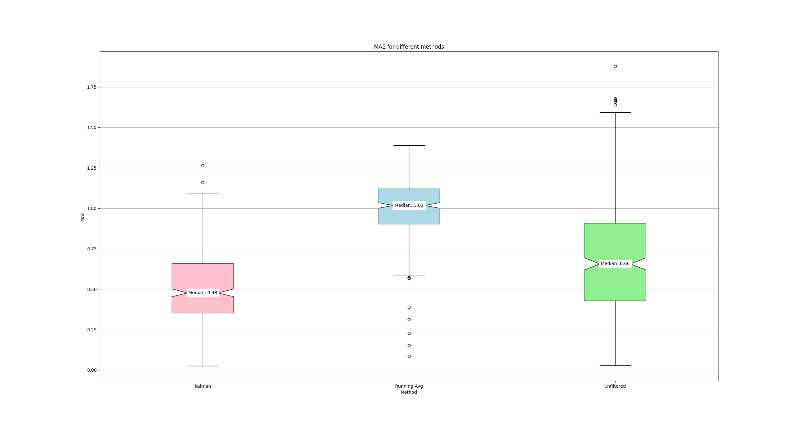

# Kalman Filter

**Summary:** [kalman_filter.py](../../code/perception/src/kalman_filter.py):

The Kalman Filter node is responsible for filtering the location and heading data, by using an IMU and GNSS sensor together with the carla speedometer.

As of now it is working with a 2D x-y-Transition model, which is why the current z-pos is calculated with a rolling average. (The z-coordinate did not need more accuracy for our purposes)

This implements the STANDARD Kalman Filter and NOT the Extended Kalman Filter or any other non-linear variant of the Kalman Filter.

- [Kalman Filter](#kalman-filter)
  - [Getting started](#getting-started)
  - [Description](#description)
    - [1. Predict](#1-predict)
    - [2. Update](#2-update)
    - [3. Publish Data](#3-publish-data)
    - [Also Important](#also-important)
    - [Inputs](#inputs)
    - [Outputs](#outputs)
  - [Performance](#performance)

## Getting started

Uncomment the kalman_filter.py node in the [perception.launch](../../code/perception/launch/perception.launch) to start the node.

Also change the pos_filter and heading_filter parameter values of the position_heading_publisher_node in the [perception.launch](../../code/perception/launch/perception.launch) file,
to **"Kalman"**, depending on if you want to use the Filter for both the Position and the Heading.

In the case of using the Filter for both, it should look like this:


No further installation needed.

---

## Description

Sources to understand the topic better:

[Visally Explained Kalman Filters](https://www.youtube.com/watch?v=IFeCIbljreY&ab_channel=VisuallyExplained)

[Understand & Code Kalman Filters](https://www.youtube.com/watch?v=TEKPcyBwEH8&ab_channel=CppMonk)

Stackoverflow and other useful sites:

[1](https://stackoverflow.com/questions/47210512/using-pykalman-on-raw-acceleration-data-to-calculate-position),
[2](https://robotics.stackexchange.com/questions/11178/kalman-filter-gps-imu),
[3](https://stackoverflow.com/questions/66167733/getting-3d-position-coordinates-from-an-imu-sensor-on-python),
[4](https://github.com/Janudis/Extended-Kalman-Filter-GPS_IMU)

This script implements a Kalman Filter.

It is a recursive algorithm used to estimate the state of a system that can be modeled with **linear** equations.

This Kalman Filter uses the location provided by a GNSS sensor (by using the unfiltered_ provided by the [position_heading_publisher_node](../../code/perception/src/position_heading_publisher_node.py))
the orientation and angular velocity provided by the IMU sensor and the current speed in the headed direction by the Carla Speedometer.

The noise values, which the filter was tuned with are derived from the official [LeaderBoard 2.0 Github repository](https://github.com/carla-simulator/leaderboard/blob/leaderboard-2.0/leaderboard/autoagents/agent_wrapper.py):

The Noise for the GPS Sensor is defined as:

- "noise_alt_stddev": 0.000005
- "noise_lat_stddev": 0.000005
- "noise_lon_stddev": 0.000005

The Noise for the IMU Sensor is defined as:

- "noise_accel_stddev_x": 0.001
- "noise_accel_stddev_y": 0.001
- "noise_accel_stddev_z": 0.015

As of now it is working with a 2D x-y-Transition model, which is why the current z-pos is calculated with a [rolling average](#also-important).

```Python

The state vector X is defined as:
            [initial_x],
            [initial_y],
            [v_x],
            [v_y],
            [yaw],
            [omega_z]

The state transition matrix A is defined as:
    '''
        # [x                ...             ]
        # [y                ...             ]
        # [v_x              ...             ]
        # [x_y              ...             ]
        # [yaw              ...             ]
        # [omega_z          ...             ]
        x = x + v_x * dt
        y = y + v_y * dt
        v_x = v_x
        v_y = v_y
        yaw = yaw + omega_z * dt
        omega_z = omega_z
    '''
    A = np.array([[1, 0, self.dt, 0, 0, 0],
                    [0, 1, 0, self.dt, 0, 0],
                    [0, 0, 1, 0, 0, self.dt],
                    [0, 0, 0, 1, 0, 0],
                    [0, 0, 0, 0, 1, 0],
                    [0, 0, 0, 0, 0, 1]])

The measurement matrix H is defined as:
    '''
        1. GPS: x, y
        2. Velocity: v_x, v_y
        3. IMU: yaw, omega_z
        -> 6 measurements for a state vector of 6
    '''
    self.H = np.array([[1, 0, 0, 0, 0, 0],    # x
                        [0, 1, 0, 0, 0, 0],   # y
                        [0, 0, 1, 0, 0, 0],   # v_x
                        [0, 0, 0, 1, 0, 0],   # v_y
                        [0, 0, 0, 0, 1, 0],   # yaw
                        [0, 0, 0, 0, 0, 1]])  # omega_z

The process covariance matrix Q is defined as:
    self.Q = np.diag([0.0001, 0.0001, 0.00001, 0.00001, 0.000001, 0.00001])

The measurement covariance matrix R is defined as:
    self.R = np.diag([0.0007, 0.0007, 0, 0, 0, 0])

```

Then 3 Steps are run in the frequency of the `control_loop_rate`:

### 1. Predict

```Python

    # Predict the next state and covariance matrix, pretending the last
    # velocity state estimate stayed constant
    self.x_pred = self.A @ self.x_est 
    self.P_pred = self.A @ self.P_est @ self.A.T + self.Q

```

### 2. Update

```Python

    # Measurementvector z
    z = np.concatenate((self.z_gps, self.z_v, self.z_imu))
    # Measurement residual y
    y = z - self.H @ self.x_pred
    # Residual covariance S
    S = self.H @ self.P_pred @ self.H.T + self.R
    # Kalman gain K
    self.K = self.P_pred @ self.H.T @ np.linalg.inv(S)
    # State estimate x_est
    self.x_est = self.x_pred + self.K @ y
    # State covariance estimate P_est
    # (Joseph form of the covariance update equation)
    self.P_est = (np.eye(6) - self.K @ self.H) @ self.P_pred

```

### 3. Publish Data

```Python

    # Publish the kalman-data:
    self.publish_kalman_heading()
    self.publish_kalman_location()

```

### Also Important

The way that the xyz Position is created, only x and y are measured for the kalman filter, while the z component is filtered by a rolling average.

```Python

  GPS_RUNNING_AVG_ARGS: int = 10

  self.avg_z = np.zeros((GPS_RUNNING_AVG_ARGS, 1))
  .
  .
  .
    # update GPS Measurements:
    self.z_gps[0, 0] = current_pos.pose.position.x
    self.z_gps[1, 0] = current_pos.pose.position.y

    z = current_pos.pose.position.z

    self.avg_z = np.roll(self.avg_z, -1, axis=0)
    self.avg_z[-1] = np.matrix([z])
    avg_z = np.mean(self.avg_z, axis=0)

    self.latitude = avg_z

```

The Kalman Location as well as the Kalman Heading are then subscribed to by the position_heading_publisher_node and republished as **current_heading** and **current_pos**

### Inputs

This node subscribes to the following  topics:

- IMU:
  - `/carla/{role_name}/IMU` ([IMU](https://docs.ros.org/en/api/sensor_msgs/html/msg/Imu.html))
- GPS:
  - `/carla/{role_name}/GPS` ([NavSatFix](http://docs.ros.org/en/melodic/api/std_msgs/html/msg/String.html))
- unfiltered agent position:
  - `/paf/" + self.role_name + "/unfiltered_pos` ([PoseStamped](http://docs.ros.org/en/noetic/api/geometry_msgs/html/msg/PoseStamped.html))
- Carla Speed:
  - `/carla/" + self.role_name + "/Speed` CarlaSpeedometer

### Outputs

This node publishes the following topics:

- Kalman Heading:
  - `/paf/{role_name}/kalman_heading` ([Float32](http://docs.ros.org/en/noetic/api/std_msgs/html/msg/Float32.html))
- Kalman Position:
  - `/paf/{self.role_name}/kalman_pos` ([PoseStamped](http://docs.ros.org/en/noetic/api/geometry_msgs/html/msg/PoseStamped.html))

### Published / subscribed topics

Therefore the published topics are:

- `kalman_pos` (filtered position of the vehicle)
- `kalman_heading` (filtered heading of the vehicle)

The variables to be estimated are put together in the state vector. It consists of the following elements:

- `x` (position on the x-axis)
- `y` (position on the y-axis)
- `v_x` (velocity in the x-direction)
- `v_y` (velocity in the y-direction)
- `yaw` (orientation, rotation around z-axis)
- `omega_z` (angular velocity)

The z-position is currently not estimated by the Kalman Filter and is calculated using the rolling average.

The x-/y-position is measured by the GNSS sensor. The measurement is provided by the unfiltered_pos topic.

The velocity in x-/y-direction can be derived from the speed measured by the Carla Speedometer in combination with the current orientation.

To get the orientation and angular velocity of the vehicle the data provided by the IMU (Inertial Measurement Unit) sensor is used.

## Performance

In the following graphs you will see the MSE/ MAE Boxed Graph of Location Error with respect to ideal Location.

Lower values in the data mean smaller error values.

Smaller boxes mean the data is closer together and less spread.

The Kalman Filter was tuned to create the smallest MSE possible, which gives more weight to larger errors which we want to minimise.

The MAE on the other hand shows a 1:1 representation in terms of distance from the ideal to the predicted location.




As you see this data you might think the unfiltered data seems to be just as good if not even better than the previous rolling average filter (RAF).

This is not the case, since the RAF has a way smaller spread of datapoints, making the location data way smoother (Though with a large error) than without a filter.

The Kalman Filter on the other hand makes it possible for the data to be way below the 1 m error mark (with 0.48 m as its error median)
and contain the data within a reasonable range.

Keep in mind, that this Filter was tuned with simple movements which the Kalman Filter thrives in (driving in circles, straight, standing still), because there were no other possible movements at the time this filter was written.

When it comes to more complex movements (driving the leaderboard route) it performs a little worse. Maybe tuning the filter with these scenarios could improve the filter by a little bit.

The most improvement could probably only be achieved by implementing more complex NON LINEAR Kalman Filters (Extended; Unscented; etc.) or other non linear Filters that come to mind.
