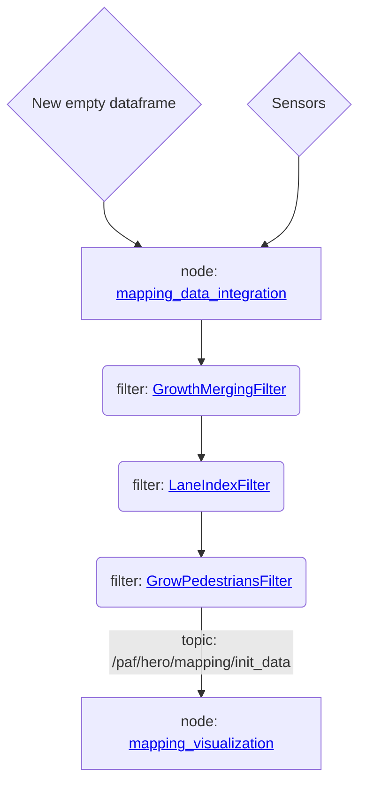

# Mapping package / Intermediate Layer

**Summary:** The **Intermediate Layer** creates a 2D top-down [**Map**](/doc/mapping/generated/mapping_common/map.md#map) containing [Entities](/doc/mapping/generated/mapping_common/entity.md#entity).

- [General overview](#general-overview)
  - [Visualization](#visualization)
- [Package structure](#package-structure)
- [Data flow overview](#data-flow-overview)
- [Tests](#tests)
- [Research](#research)
- [mapping\_common Cython installation](#mapping_common-cython-installation)
- [Debugging](#debugging)
- [Auto-generated documentation](#auto-generated-documentation)
- [Troubleshooting](#troubleshooting)

## General overview

The **Intermediate Layer** receives most sensor information (everything except traffic light) from [perception](/doc/README.md#perception)

- puts it into a unified data format: [Map](/doc/mapping/generated/mapping_common/map.md#map)
- applies [postprocessing filters](/doc/mapping/generated/mapping_common/filter.md)
- and then forwards it to [planning](/doc/README.md#planning)/[acting](/doc/README.md#acting)

The base data type is the [Map](/doc/mapping/generated/mapping_common/map.md#map). It consists out of [Entities](/doc/mapping/generated/mapping_common/entity.md#entity).
These entities all have a [transform](/doc/mapping/generated/mapping_common/transform.md#transform2d) and a [shape](/doc/mapping/generated/mapping_common/shape.md#shape2d) and can be all kinds of colliders (car, pedestrian, etc.), lanemarkings or other localized things of interest around the hero car.

The [**MappingDataIntegrationNode**](/doc/mapping/generated/nodes.md#mappingdataintegrationnode) collects all sensor information and publishes the resulting map to `/paf/hero/mapping/init_data`

The [mapping](/code/mapping/config/mapping.cfg) and [mapping_visualization](/code/mapping_visualization/config/mapping_visualization.cfg) packages support dynamic reconfigure for managing sensor input and filter parameters

### Visualization

The [visualization node](/code/mapping_visualization/src/visualization.py) in the [mapping_visualization](/code/mapping_visualization/) package converts the map into a ROS MarkerArray.

The MarkerArray is published to `/paf/hero/mapping/marker_array` and can be visualized and looked at in RViz.

## Package structure

- [./ext_modules/mapping_common](/code/mapping/ext_modules/mapping_common/) contains the **python classes for working with the intermediate layer**.
  - This library can be used across the project. Just `from mapping_common import ...`
  - **[Get an overview of all available functions in the API documentation](/doc/mapping/generated/mapping_common/index.md)**
  - This module is compiled with [Cython](https://cython.readthedocs.io/en/latest/). If changes have been made to this package, catkin_make needs to be executed to apply them! \
    This step is automatically executed when using the [docker-compose.leaderboard.yaml](/build/docker-compose.leaderboard.yaml).
- [./src](/code/mapping/src/) contains the nodes that create and filter the map
  - The main node is the [**MappingDataIntegrationNode**](/doc/mapping/generated/nodes.md#mappingdataintegrationnode). It collects sensor data and then builds a map from it
  - **[API documentation](/doc/mapping/generated/nodes.md)**
- [./msg](/code/mapping/msg/) contains the ROS message types for transmitting the map
  - ROS messages can be converted into [mapping_common](/doc/mapping/generated/mapping_common/index.md) python objects by using `<Type>.from_ros_msg(msg)`
  - The message types should only used for transmitting data over ROS, not for any calculations.

## Data flow overview

Quick overview of the data flow inside the intermediate layer.

The links inside the diagram currently only work inside Vs Code.

## Tests

This package contains pytest based unit tests at [./tests/mapping_common](/code/mapping/tests/mapping_common/)

The tests can be executed without a running ros/carla instance.

Enter the dev container and execute `catkin_make run_tests` in the catkin_ws to run them. A summary should appear in the console.

## Research

The original draft and class diagram for the intermediate layer can be found [here](/doc/research/paf24/intermediate_layer/). Note that these documents are not kept up-to-date with this package.

Most of the information of the draft has been inserted into the python class documentation. Look there for up-to-date information.

## mapping_common Cython installation

**Important: The mapping_common module is compiled with [Cython](https://cython.readthedocs.io/en/latest/). If changes have been made to mapping_common, catkin_make needs to be executed to apply them!**
This step is automatically executed when using the [docker-compose.leaderboard.yaml](/build/docker-compose.leaderboard.yaml).

Cmake executes [cmake_setup.py](/code/mapping/ext_modules/cmake_setup.py) to compile and install the mapping_common module.

The integration of the setup command into catkin_make can be found [here](/code/mapping/CMakeLists.txt#L100).

## Debugging

The [debugger](/doc/development/debugging.md) is unable to debug the mapping_common package when it is compiled.

To disable the compilation, you can replace the `False` in [./ext_modules/.debug_enabled](/code/mapping/ext_modules/.debug_enabled) with `True`.

## Auto-generated documentation

The markdown files in the [./generated](/doc/mapping/generated/) folder are generated with `pydoc-markdown`.

To regenerate them, run the [docker-compose.docs.yaml](/build/docker-compose.docs.yaml).

## Troubleshooting

Cython compile errors or import errors *related to the @dataclass decorators* are likely caused by an outdated docker image. Make sure the docker images are up-to-date.

