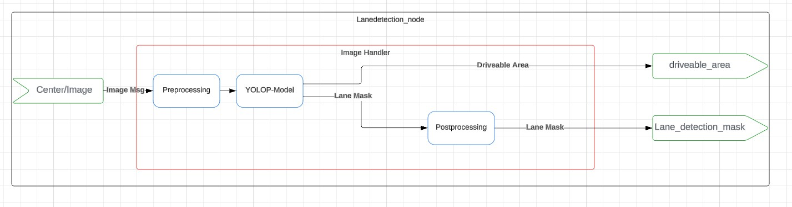

# Overview of the Lanedetection Node

This Document gives a brief overview over the Lanedetection Node.  
The Lanedetection Node is responsible for detecting the Lane markings and driveable Area in a given Image and publishing the results.

---

## Table of Contents

1. [Lanedetection Node System Diagram](#lanedetection-node-system-diagram)
2. [Inputs](#inputs)
3. [Processing Steps](#processing-steps)
4. [Outputs](#outputs)
5. [Similar Topics](#further-links)

---

## Lanedetection Node System Diagram

  
(link to lucid chart: [lucid chart](https://lucid.app/lucidchart/34e9aa95-5fb3-4d83-b53f-6d6a3f4748c2/edit?viewport_loc=5190%2C-3952%2C1690%2C703%2C0_0&invitationId=inv_83e27eed-e730-4607-836b-0e863cd2b511))

## Inputs

1. **Center/Image**  
   - **Type**: Image Message (ImageMsg)  
   - **Description**: Provides the center camera image.  

---

## **Processing Steps**

 1. **Image Handler**

    - **Preprocessing**  
        - *Description*: Preprocesses the camera image for the model.  
    - **YOLOP-Model**  
        - *Function*: Utilizes the YOLOP model to generate **Driveable Area** and **Lane Mask**.  
        - **Outputs**:  
            - Driveable Area  
            - Lane Mask
    - **Postprocessing**
        - *Function*: Refines the Lane Mask for better visualization and integration with Lidar data.
        - *Output*: Lane Mask

---

## Outputs

1. **driveable_area**  
   - **Type**: Image Message (ImageMsg)  
   - **Description**: Provides a Mask with 0 = not driveable and 1 = driveable.  

2. **Lane_detection_mask**  
   - **Type**: Image Message (ImageMsg)
   - **Description**: Contains the mask for all detected lane markings. (0 = pixel is not part of lanemark, 1 = pixel is part of lanemark)

---

## Similar Topics

The Lane_detection_mask is used in the Lane_position Node to create Entities for the intermediate layer. If you are interested in the creation of Lanemarking-Entities [click here](lane_position.md)
