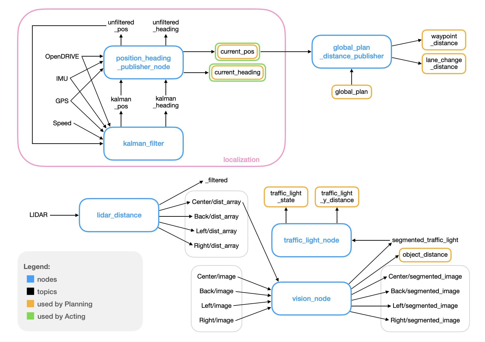

# Documentation of Perception

This folder contains documentation of the perception components.

In the following diagram you can see all the nodes and topics used in the perception, to show how they work together.

## Object Detection / Distance and Segmentation

- [Vision Node](./vision_node.md)
  - The Vision Node provides an adaptive interface that is able to perform object detection and image segmentation on multiple cameras at the same time
  (even though only one camera perceiving the front of the car is active at the moment).
- [Distance to Objects](./distance_to_objects.md)
- [Traffic Light Detection](./traffic_light_detection.md)
- [Dataset Generator](./dataset_generator.md)
- [Dataset Structure](./dataset_structure.md)

## Localization

An overview over the different nodes working together to localize the vehicle is provided in the [localization](./localization.md) file.

- [Kalman Filter](./kalman_filter.md)
- [Position Heading Publisher Node](./position_heading_publisher_node.md)
- [Position Heading Filter Debug Node](./position_heading_filter_debug_node.md)
- [Coordinate Transformation](./coordinate_transformation.md) (helper functions)

## Unused files

- [Lidar Distance Utility](./lidar_distance_utility.md)
  - Not used since paf22
- [Efficient PS](./efficientps.md)
  - Not used scince paf22 and never successfully tested

## Experiments

The overview of performance evaluations is located in the [experiments](./experiments/README.md) folder.
