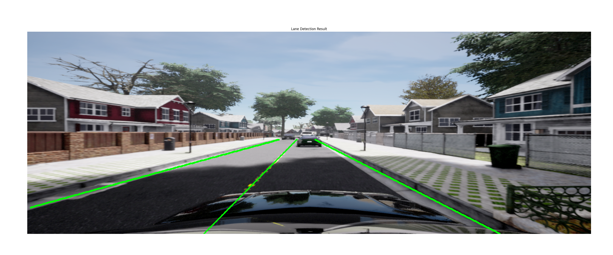

# CLRerNet Lane Detection by Hirotomusiker  

**Version:** Tested in November 2024 (CLRerNet v0.2.0)  
**Repository:** [https://github.com/hirotomusiker/CLRerNet](https://github.com/hirotomusiker/CLRerNet)  

---

## Overview  

CLRerNet is a highly effective lane detection model which reliably identifies lanes even when they are partially visible or obstructed by vehicles. The model implemented in this project demonstrates strong performance and accuracy.  

A key feature of CLRerNet is the use of **LaneIoU** for target assignment cost calculation and loss functions, which improves the quality of confidence scores.  

---

## Challenges

Despite its strong performance, the model comes with certain limitations:  

1. **High GPU Memory Usage**:  
   CLRerNet consumes up to **1.5 GB of GPU memory**, which makes it difficult to run alongside other vision nodes.  

2. **Dependency on PyTorch 1.12**:  
   The model requires **PyTorch version 1.12**, necessitating a downgrade. While the Ultralytics YOLO models used in our project only require **PyTorch >1.8**, this dependency is suboptimal.  

---

## Decision  

Due to the current limitations, we have decided to use the **YOLOP lane detection** in combination with a **linear regression model** for now. While this solution offers slightly lower performance, it integrates more efficiently with our existing system.  

Should the need arise in the future for a higher-performing lane detection model, CLRerNet remains a viable option.  

---
