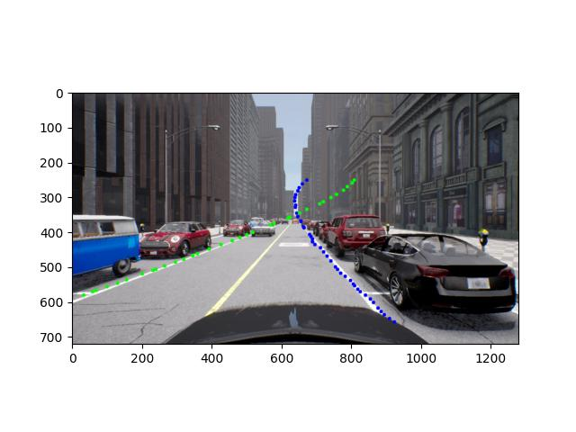
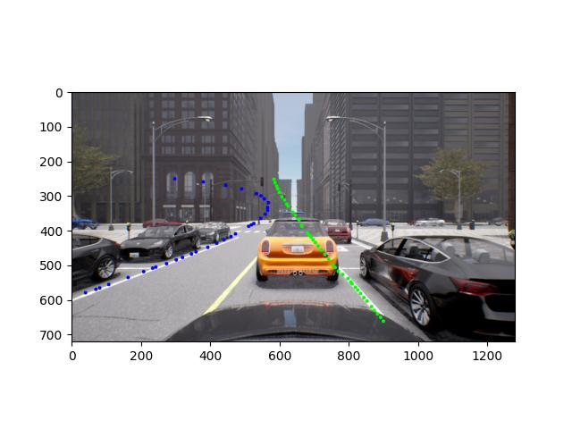
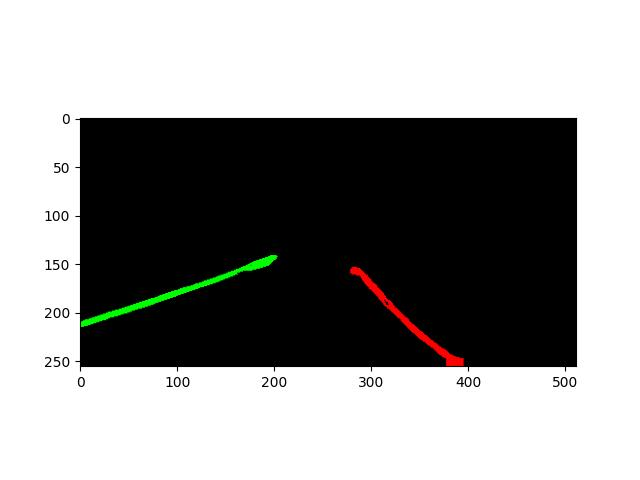
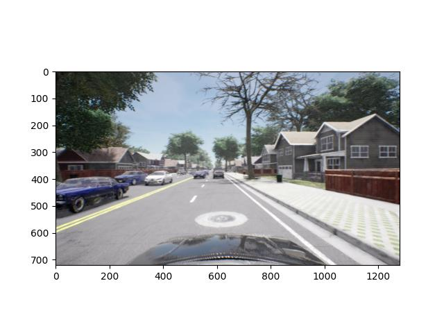
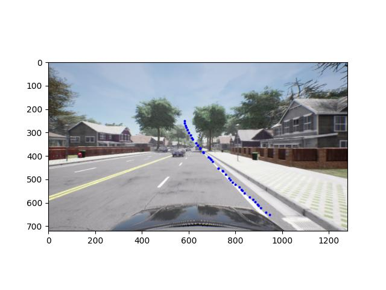
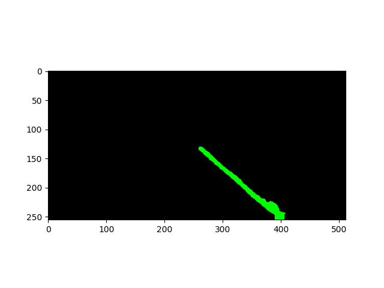

# LaneNet Evaluation

To see whether [LaneNet](https://github.com/MaybeShewill-CV/lanenet-lane-detection) from [Pylot](https://github.com/erdos-project/pylot) can be used for our purposes in Carla, a small evaluation s- imilar to the object detection experiment - was conducted.

## Installation

1. Create a `venv` with Python 3.7 (not newer!)
2. Run `pip install -r requirements.txt`
3. Set your `PYTHONPATH` like this:

```shell
export PYTHONPATH="${PYTHONPATH}:/PATH/TO/PROJECT/lanenet-lane-detection/lanenet_model"
```

## Inference

To use the model on a certain image for demo purposes, the following command can be used:

```shell
python tools/test_lanenet.py --weights_path /PATH/TO/YOUR/CKPT_FILE_PATH 
--image_path ./data/tusimple_test_image/0.jpg
```

This generates a set of plots, two of which are the original image with the recognized lanes drawn on top, as well as a mask of detected lanes (which are not similar).

## Results

As visible below, the masks show a better and less distorted result than the drawn image.
For usage in our agent, the mask would probably be used anyway, so that is not a serious concern.

The middle line is ignored everywhere and on the third and partly also on the fourth sample picture, the recognition of the lanes failed.

Image             |  Mask
:-------------------------:|:-------------------------:
  |  
  |  
  |  
  |  
