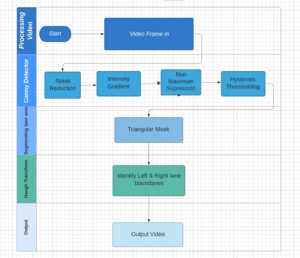
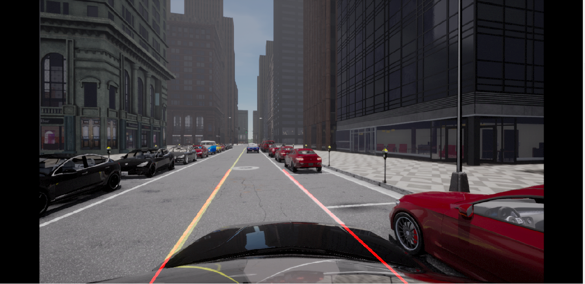

# Lane Detection

**Summary:** This page gives an overview over the implementation of the lane detection.

- [Input](#input)
- [Detection](#detection)
  - [OpenCV Model](#opencv-model)
    - [Model](#model)
    - [Outputs](#outputs)

## Input

The input is the image of the "center" camera, which is used to detect the lanes.

## Detection

### OpenCV Model

#### Model

The lane detection algorithm involves preprocessing the input image to enhance lane visibility, converting it to grayscale, and applying edge detection (Canny edge detection).
Next, it isolates the region of interest, by masking the lane area using a trapezoidal shape.
The algorithm then uses the Hough Line Transform to detect lines corresponding to the lanes and filters them based on their slopes and positions. Finally, it overlays the detected lanes on the original image.

#### Outputs

The mask contains the left and right line of the lane. The mask is an array of type uint8

This model also outputs an image with already drawn in lines

