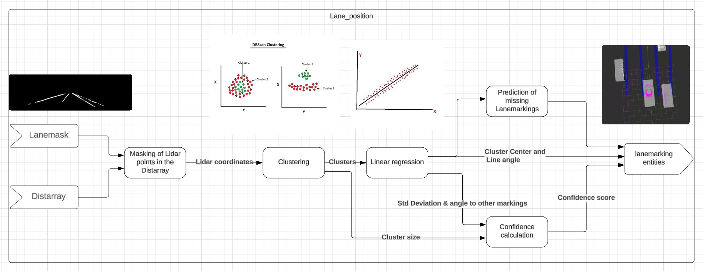

# Overview of the lane_position Node

This Document gives a briev overview over the lane_position Node.
The lane_position Node processes the lanemask given by the Lanedetection Node and uses it to create Lanemarking entities for the Intermediate layer

---

## Lane_position Node System Diagram

The following Chart displays the procedure and applied algorithms used to convert the lanemask to lanemarking entities.

(link to lucid chart: [lucid chart](https://lucid.app/lucidchart/34e9aa95-5fb3-4d83-b53f-6d6a3f4748c2/edit?viewport_loc=5190%2C-3952%2C1690%2C703%2C0_0&invitationId=inv_83e27eed-e730-4607-836b-0e863cd2b511))

## Inputs

- Lanemask: Lanemask provided by Lanedetection Node
- Distarray: Depth Image generated from Lidar sensor

## Processing steps

1. Remove horizontal lines:
    remove horizontal lines (e.g. parking lines) since they falsify the clustering results

2. Masking of Lidar points in the distarray:
    The lidar points in the depth image are masked by the lanemask. The points that are not at the height of the road are then filtered out.

3. Clustering of remaining Lidar points:
    The filtered lidar points are then categorised into clusters using a clustering algorithm in order to determine which points belong together to a lane marking. Algorithm used: DBSCAN

4. Linear regression for all clusters:
    A straight line is fitted to the points of each cluster using linear regression. The centre point and the gradient of this straight line are then determined.

5. Determine confidence:
    A specially developed algrotihmus calculates the confidence of the lanemarkings. It takes into account the size of the clusters, the standard deviation of the linear regression and the angle to the other straight lines.

    ***Score = normalized_angle x angle_weight + normalized_std_dev x std_dev_weight + normalized_clustersize x clustersize_weight***

    - **Explanation of Variables**:
        - **normalized_angle**: The normalized angle.
        - **angle_weight**: The weight of the angle.
        - **normalized_std_dev**: The normalized standard deviation.
        - **std_dev_weight**: The weight of the standard deviation.
        - **normalized_clustersize**: The normalized cluster size.
        - **clustersize_weight**: The weight of the cluster size.

6. Prediction of Lanemarkings (currently disabled):
    - use angle deviations to predict a lanemarking that better fits the orientation of the other found lanemarkings
    - if there is a lanemarking close to the car and no corresponding lanemarking on the other side of the car a marking with the same distance and orientation is predicted

7. Create Lanemarking entities:
    The found Lanemarkings are converted to Entities and stored in a map. The map is then published.
    The Dataintegration Node from the intermediate layer merges the map with the data from other sources.

## Outputs

- Map with lanemarking entities
- Preprocessed lanemask for visualization purpose
