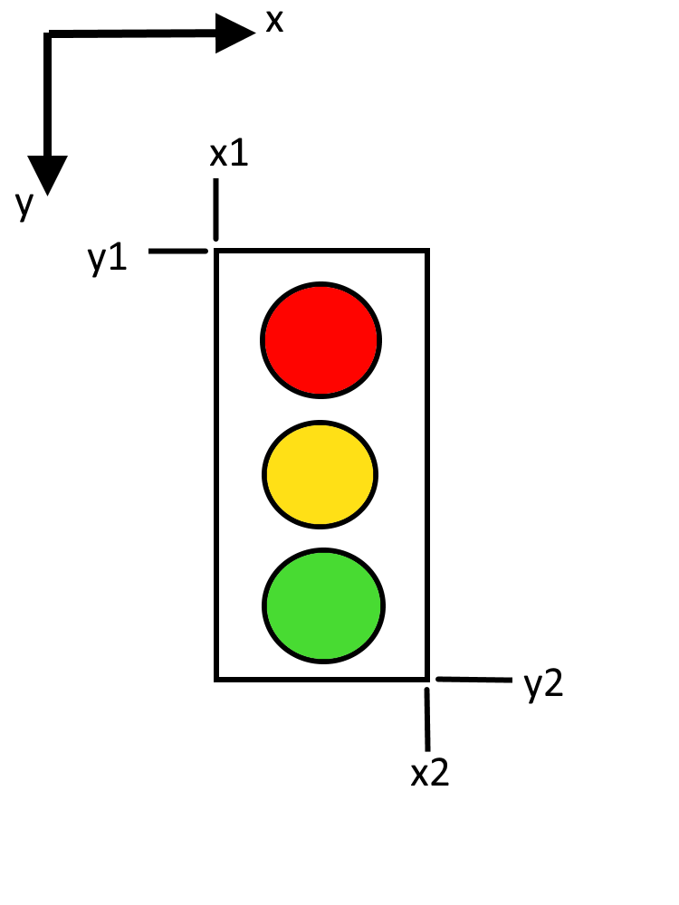

# Traffic Light Detection

**Summary:** This page explains how traffic lights are detected and interpreted.

- [Vision Node](#vision-node)
- [TrafficLightNode](#trafficlightnode)
  - [Attributes](#attributes)
  - [Methods](#methods)
  - [Functions](#functions)
  - [Usage](#usage)
- [Filtering of images](#filtering-of-images)
  - [1. Vision Node](#1-vision-node)
  - [2. Traffic Light Node](#2-traffic-light-node)

## Vision Node

Every incoming image of the "Center" camera gets processed by the ultralytics model.
Every identified object receives a framing box with its categorization class attached.
After that an iteration over all found boxes is done. For ones that include an ID of 9, which identifies them as traffic lights, `process_traffic_light()` is called.
The function begins by building an array of indices including only the found traffic lights. This then get formatted depending on whether only one box or multiple got submitted.
The function continues by iterating over said indices to receive the corresponding boxes from the prediction.
These box arrays contain the coordinates of two corners, the confidence of the prediction and the classificaiton ID again as followed:

| index | content |
| :---: | :-----: |
| 0 | x1 |
| 1 | y1 |
| 2 | x2 |
| 3 | y2 |
| 4 | confidence |
| 5 | class |

The coordinates characterize the upper left and lower right corner as depicted as followed:

With this values some exclusion criteria are now getting checked. The conditions can be altered via dynamic reconfiguration in rqt during runtime. The process only goes on, when:

- the confidence is greater than `min_prob` (probability)(currently at 0.3)
- the height is at least 1.5x of the width
- the lowest point of the traffic light is lower than `max_y` (currently at 360) [*]
- the most left point of the traffic light is greater than `min_x` (currently 485)
- the most right point of the traffic light is smaller than `max_x` (currently 780)

[*] Note that origin of the coordinate system is in the upper left corner of the image.

Through this can be ensured, that only relevant traffic lights will be further processed. If all criteria are met the image of the traffic light gets cropped from the frame in which it occured. It then gets published onto the topic `/paf/hero/Center/segmented_traffic_light`.

## TrafficLightNode

The `traffic_light_node.py` file handles traffic light detection itself, meaning that it does the actual recognition. It contains a class `TrafficLightNode` that extends from `CompatibleNode`.

This class is responsible for setting up the traffic light detection system and handling the incoming cropped traffic light images.

### Attributes

- `bridge`: An instance of CvBridge for converting between ROS image messages and OpenCV images.
- `role_name`: The role name of the node, default is "hero".
- `side`: The side of the node, default is "Center".
- `classifier`: An instance of TrafficLightInference for traffic light detection (CNN module).
- `last_info_time`: The time of the last information received.
- `last_state`: The last state of the traffic light.
- `traffic_light_publisher`: A publisher for traffic light state messages.

### Methods

- `__init__(self, name, **kwargs)`: Initializes the node, sets up publishers and subscribers, and starts a thread for auto invalidation of traffic light state.
- `setup_camera_subscriptions(self)`: Sets up a subscription to the segmented traffic light image topic.
- `setup_traffic_light_publishers(self)`: Sets up publishers for traffic light state and the debug marker for visualization in the intermediate layer.
- `auto_invalidate_state(self)`: Runs in a separate thread and invalidates the traffic light state if no new information has been received for 2 seconds.
- `handle_camera_image(self, image)`: Callback for the image subscription. Converts the image to RGB, infers the traffic light state, and publishes the state if it has changed.
- `run(self)`: Spins the node to handle callbacks.

### Functions

- `traffic_light_visualization(self, state)`: Creates are marker in the shape of text that contains the current value of state. This marker than gets published to be visualized in the intermediate layer.
- `get_light_mask(image)`: Returns a binary mask where the pixels within the hue, saturation, and value bounds for red, yellow, and green are white, and all other pixels are black.
- `is_front(image)`: Returns `True` if the largest contour in the light mask has an aspect ratio within the range of a square (therefore a circle), and `False` otherwise.

### Usage

This script is intended to be used as a ROS node in the Carla ROS system.

## Filtering of images

### 1. Vision Node

Objects, which are detected as traffic light by the YOLO11 model (or others), must fulfill the following criterias to be published:

- At least a 30% (0.30) certainty/probablity of the classification model.
- More than 1.5x as tall (height) as it is wide (width).
- Above 360px (upper half of the 1280x720 image).
- Between the horizontal pixels 485 and 780.

### 2. Traffic Light Node

Objects, which are published by the Vision Node, are further filtered by the following criterias:

- Classification probabilities of "Unknown" and "Side" are either both below 1e-10 or one of both are below 1e-15.
- "Side" is treated as "Unknown".
- Valid states (Red, Green, Yellow) must be present at least twice in a row to be actually published.
- A state decays (state=0; "Unknown") after 2 seconds if there is no new info in the meantime.
- Filter out side-facing traffic lights by analysing their light shape (oval vs. round) using HSV + contour analysis.
