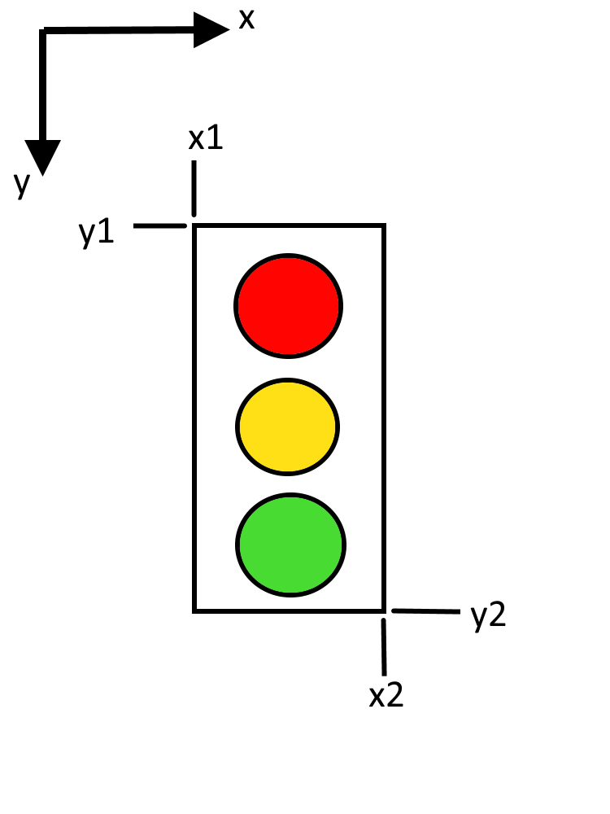

# Traffic Light Detection

**Summary:** This page explains how traffic lights are detected and interpreted.

- [Vision Node](#vision-node)
- [TrafficLightNode](#trafficlightnode)
  - [Attributes](#attributes)
  - [Methods](#methods)
  - [Functions](#functions)
  - [Usage](#usage)
- [Filtering of images](#filtering-of-images)
  - [1. Vision Node](#1-vision-node)
  - [2. Traffic Light Node](#2-traffic-light-node)
  - [3. Traffic Light Inference](#3-traffic-light-inference)

## Vision Node

Every incoming image of the "Center" camera gets processed by the ultralytics model.
Every identified object receives a framing box with its categorization class attached.
After that an iteration over all found boxes is done. For ones that include an ID of 9, which identifies them as traffic lights, `process_traffic_light()` is called.
The function begins by building an array of indices including only the found traffic lights. This then get formatted depending on whether only one box or multiple got submitted.
The function continues by iterating over said indices to receive the corresponding boxes from the prediction.
These box arrays contain the coordinates of two corners, the confidence of the prediction and the classificaiton ID again as followed:

| index | content |
| :---: | :-----: |
| 0 | x1 |
| 1 | y1 |
| 2 | x2 |
| 3 | y2 |
| 4 | confidence |
| 5 | class |

The coordinates characterize the upper left and lower right corner as depicted as followed:

With this values some exclusion criteria are now getting checked. The conditions can be altered via dynamic reconfiguration in rqt during runtime. The process only goes on, when:

- the confidence is greater than `min_prob` (probability)(currently at 0.3)
- the height is at least 1.5x of the width
- the lowest point of the traffic light is lower than `max_y` (currently at 360) [*]
- the most left point of the traffic light is greater than `min_x` (currently 485)
- the most right point of the traffic light is smaller than `max_x` (currently 780)

[*] Note that origin of the coordinate system is in the upper left corner of the image.

Through this can be ensured, that only relevant traffic lights will be
further processed. If all criteria are met, the traffic light image is
cropped from the section of the frame in which it was captured. This
process is performed for every traffic light detected in each frame. The
traffic lights collected from a frame are then published under the topic
`/paf/hero/Center/segmented_traffic_light`.

## TrafficLightNode

The `traffic_light_node.py` file handles traffic light detection itself, meaning that it does the actual recognition. It contains a class `TrafficLightNode` that extends from `CompatibleNode`.

This class is responsible for setting up the traffic light detection system and handling the incoming cropped traffic light images.

### Attributes

- `bridge`: An instance of CvBridge for converting between ROS image messages and OpenCV images.
- `role_name`: The role name of the node, default is "hero".
- `side`: The side of the node, default is "Center".
- `classifier`: An instance of TrafficLightInference for traffic light detection (CNN module).
- `last_info_time`: The time of the last information received.
- `state_buffer`: A buffer that stores intermediate states.  
- `last_state`: The last state of the traffic light.
- `last_interim_state`: An intermediate state used to identify meaningful subsequent intermediate states
- `interim_state`: Intermediate state that is buffered in order to determine a more accurate final state
- `traffic_light_publisher`: A publisher for traffic light state messages.

### Methods

- `__init__(self, name, **kwargs)`: Initializes the node, sets up publishers and subscribers, and starts a thread for auto invalidation of traffic light state.
- `setup_camera_subscriptions(self)`: Sets up a subscription to the segmented traffic light image topic.
- `setup_traffic_light_publishers(self)`: Sets up publishers for traffic light state and the debug marker for visualization in the intermediate layer.
- `auto_invalidate_state(self)`: Runs in a separate thread and invalidates the traffic light state if no new information has been received for 2 seconds.
- `handle_camera_image(self, image)`: Callback for the image subscription. Converts the image to RGB, infers the traffic light state, and publishes the state if it has changed.
- `run(self)`: Spins the node to handle callbacks.
- `loop(self)`: Check whether the last state was received more than 2 seconds ago. If so, reset `state`, `last_state`, `last_interim_state`, and `state_buffer`, and publish state 0.

### Functions

- `traffic_light_visualization(self, state)`: Creates are marker in the shape of text that contains the current value of state. This marker than gets published to be visualized in the intermediate layer.
- `meaningful_state(self, new_state)`: Checks whether the potential state makes sense, e.g., green cannot be followed directly by red. Returns a Boolean value.
- `filter_turn_lights(self, image)`: Traffic lights that are detected when
  turning are ignored. A higher resolution of the traffic light photo means
  more circles. The closer the traffic lights are to us, the higher the
  resolution. If a turn traffic light is detected, `False` is returned,
  otherwise, `True` is returned.

### Usage

This script is intended to be used as a ROS node in the Carla ROS system.

## Filtering of images

### 1. Vision Node

Objects, which are detected as traffic light by the YOLO11 model (or others), must fulfill the following criterias to be published:

- At least a 30% (0.30) certainty/probablity of the classification model.
- More than 1.5x as tall (height) as it is wide (width).
- Above 360px (upper half of the 1280x720 image).
- Between the horizontal pixels 485 and 780.

### 2. Traffic Light Node

Objects, which are published by the Vision Node, are further filtered by the following criterias:

- Invalid states (e.g., green -> red) are discarded.
- We also ignore traffic lights that we detect while turning.
- If more than one state (red, green, yellow) is classified in a single frame, the entire frame is discarded.
- Final states must occur frequently enough in the buffer to be actually published. The frequency depends on the state. If no state reaches the required number of occurrences, the last state is reused.
- A state expires (state=0; “Unknown”) after 2 seconds if no new information is available in the meantime

### 3. Traffic Light Inference

Objects that need to be classified in the Traffic Light node must meet the following criteria to ensure reliable results:

- The `dominance` (the sum of the second-largest to the smallest values) is subtracted from the largest value. The `dominance` factor must be high enough (currently `min_dominance` = 0.99). This is intended to ensure that classifications are ambiguous and certain.
