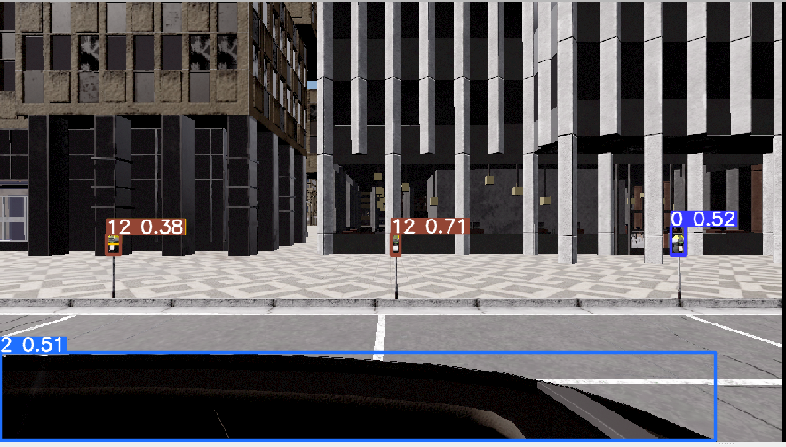
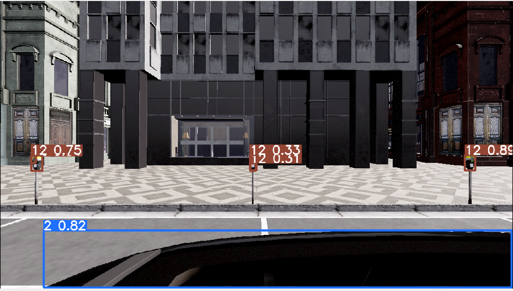
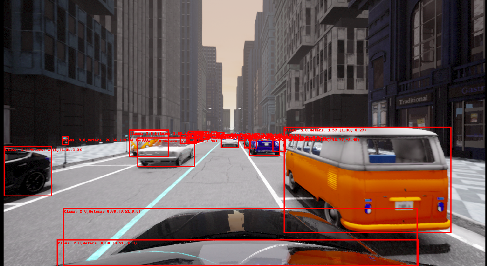

# Vision Node

The Visison Node provides an adaptive interface that is able to perform object-detection and/or image-segmentation on multiple cameras at the same time.
It can also subscribe to the lidar_distance publisher and calculate distances of objects inside the detected bounding boxes.

## Model overview

The Vision-Node implements an interface for a lot of different models which can be specified in the perception launch file.

| Model                                 | Type         | Distance Calculation |
|---------------------------------------|--------------|--------|
| fasterrcnn_resnet50_fpn_v2            | detection    | no     |
| fasterrcnn_mobilenet_v3_large_320_fpn | detection    | no     |
| yolov8n                               | detection    | yes    |
| yolov8s                               | detection    | yes    |
| yolov8m                               | detection    | yes    |
| yolov8l                               | detection    | yes    |
| yolov8x                               | detection    | yes    |
| yolo_nas_l                            | detection    | yes    |
| yolo_nas_m                            | detection    | yes    |
| yolo_nas_s                            | detection    | yes    |
| rtdetr-l                              | detection    | yes    |
| rtdetr-x                              | detection    | yes    |
| sam_l                                 | detection    | yes    |
| FastSAM-x                             | detection    | yes    |
| deeplabv3_resnet101                   | segmentation | no     |
| yolov8x-seg                           | segmentation | yes    |

Next to that the Vision-Node implements 4 Camera-Angles which can also be set in the launch file.

```xml
<node pkg="perception" type="vision_node.py" name="VisionNode" output="screen">
    <param name="role_name" value="$(arg role_name)" />
    <param name="side" value="Center" />
    <param name="center" value="True" />
    <param name="back" value="False" />
    <param name="left" value="False" />
    <param name="right" value="False" />

      <!--Object-Detection: 
      - fasterrcnn_resnet50_fpn_v2 
      - fasterrcnn_mobilenet_v3_large_320_fpn
      - yolov8n
      - yolov8s
      - yolov8m
      - yolov8l
      - yolov8x
      - yolo_nas_l
      - yolo_nas_m
      - yolo_nas_s
      - rtdetr-l
      - rtdetr-x
      - sam_l
      - FastSAM-x

      Image-Segmentation:
      - deeplabv3_resnet101
      - yolov8x-seg 
      -->

    <param name="model" value="rtdetr-l" />
  </node>
```

## How it works

The Vision-Node basically operates in three stages.

1. Object-Detection
2. Distance-Calculation
3. Publishing of Ouptuts

### 1. Object-Detection

The object-detection can be run both ultralytics and pyTorch models. Depending on the model type the images from the cameras are preprocessed and than predicted by the model.

The object-detection can publish images to RViz under their specified camera angle and topic.


Please refer to the [model evaluation](../perception/experiments/object-detection-model_evaluation/README.md) for more detailed information about the performance of each model.

**Center Camera**


**Back Camera**


**Left Camera**


**Right Camera**


## 2. Distance-Calculation

The Vision-Node reveives depth-images from the [lidar distance node](distance_to_objects.md) for the specified camera angle. It can than find the min x and min abs y distance within each bounding box that has been predicted by a model. This feature is implemented only for utralytics models.

The depth images have the same dimension as the camera image and contain x, y and z coordinates of the lidar coordinates system in the three RGB-Channels.


Read more about the calculation of Depth Image [here](distance_to_objects.md)

## 3. Publishing of Outputs

In order to provide valuble information for the [planning](../planning/README.md), the Vision-Node collects a set of information for each object and publishes a list of objects on the "distance_of_objects" Topic.

- Class_Index
- Min_X
- Min_Abs_Y

When no Lidar-Points are found inside a bounding box, the distances will both be set to np.inf.
Check also [here](distance_to_objects.md) to learn more about this list.

In order to provide good visual feedback of what is calculated in the Vision-Node, each camera angle publishes images with bounding boxes and the corresponding distance values found for the object.


