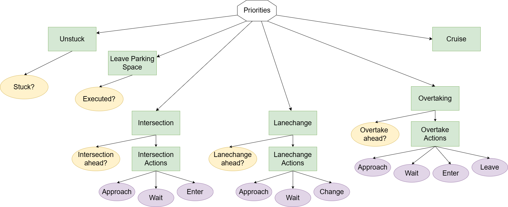

# Behavior Tree

**Summary:** This page contains a simple explanation for the behavior tree. For more technical insights have a look at the [code](../../code/planning/src/behavior_agent/behaviours) itself.

**Disclaimer**: As we mainly built our decision tree on the previous projects [psaf2](https://github.com/ll7/psaf2) and [paf22](https://github.com/ll7/paf22) , most part of the documentation was added here and adjusted to the changes we made.

- [About](#about)
- [Our behaviour tree](#our-behaviour-tree)
  - [Behavior](#behavior)
    - [Selector](#selector)
    - [Sequence](#sequence)
    - [Condition](#condition)
    - [Subtree](#subtree)
  - [Intersection](#intersection)
    - [Legend](#legend)
  - [Other Behaviors](#other-behaviors)
- [Developing guide](#developing-guide)
  - [Tree Definition](#tree-definition)
  - [Behaviours](#behaviours)
    - [Blackboard](#blackboard)
  - [Guidelines](#guidelines)
    - [Non-Blocking](#non-blocking)
    - [Functions](#functions)
      - [`__init__()`](#__init__)
      - [`setup()`](#setup)
      - [`initialise()`](#initialise)
      - [`update()`](#update)
      - [`terminate()`](#terminate)

## About

This Package implements a behaviour agent for our autonomous car using **Behaviour Trees**. It uses the [py_trees](./py_trees.md) Framework, that works well with ROS.
For visualization at runtime you might want to also install this [rqt-Plugin](https://wiki.ros.org/rqt_py_trees).

## Our behaviour tree

The following section describes the behaviour tree we use for normal driving using all functionality provided by the agent. In the actual implementation this is part of a bigger tree, that handles things like writing topics to the blackboard, starting and finishing the decision tree.
The following tree is a simplification. The draw.io xml file to update this diagram can be found inside /assets/planning/.



### Behavior

Represent an action the decision tree should execute. It has three return values representing the state of the behavior:

- `SUCCESS`: The action has been performed successfully.
- `RUNNING`: The action is still being executed.
- `FAILURE`: The action couldn't be executed.

#### Selector

Tries to execute each of its child behaviors in turn. It has a priority hierarchy from left (high priority) to right (low priority).

#### Sequence

Executes all of its child behaviors sequentially after one another until all behaviors have returned `SUCCESS` or one behavior returned `FAILURE`. In that case, the sequence is aborted.

#### Condition

Is always the first child of a sequence. It decides if the sequence should be executed or aborted.

#### Subtree

Represents a specific task/scenario which is handled by the decision tree.

### Intersection

#### Legend


If there is an intersection coming up, the agent executes the following sequence of behaviours:

- Approach Intersection

    Slows down and stops at line if a yellow or red traffic light is detected

- Wait at Intersection

    Waits for traffic lights or higher priority traffic

- Enter Intersection

    Enters the intersection and follows it predetermined path through the intersection

- Leave Intersection

    Leaves the intersection in the right direction

### Other Behaviors

Lane Change and Overtake are built just like Intersection. So there is always an Approach, Wait, Enter and Leave part.

## Developing guide

### Tree Definition

The tree is defined in the `grow_a_tree()`-function inside `code/planning/src/behavior_agent/behavior_tree.py`, which is also the main node. It can be visualized using an [rqt-Plugin](https://wiki.ros.org/rqt_py_trees). This is also the place to change the execution rate of the tree:

``` python
...
behaviour_tree.tick_tock(500)
...
```

### Behaviours

`Behaviours` are implemented in the `code/planning/src/behavior_agent/behaviours/` directory. All the behaviors used in the current version of the tree are contained as skeletons.

#### Blackboard

To deal with the asynchronicity of ROS, all the topics this tree subscribes to, should be written to the Blackboard at the beginning of each tick. A node is available, that automates this task. Just add your node to the list in `code/planning/src/behavior_agent/behaviours/topics2blackboard.py`:

``` python
...
topics =[
    {'name':f"/carla/{role_name}/Speed", 'msg':CarlaSpeedoMeter, 'clearing-policy': py_trees.common.ClearingPolicy.NEVER},
    ...
    ]
...
```

After that you can access them from everywhere in your Behaviour-Code using:

``` python
...
self.blackboard = py_trees.blackboard.Blackboard()
...
speed = self.blackboard.get("/carla/hero/Speed")
...
```

Note that you still need to resolve the data-fields of the message (i.e. `blackboardmessage.data` for a `Float64`).

### Guidelines

When implementing new behaviours you should adhere to the following guidelines:

#### Non-Blocking

You should avoid doing complicated calculations inside the behaviours. Use asynchronous Callbacks instead, and return ```RUNNING``` while another node does the computing.

Generally conditions should never return ```RUNNING``` and Action-Behaviours should only return ```FAILURE``` in special cases.

#### Functions

Behaviours generally provide five functions (you can define more of course). Short explanation when they get called and how to use them:

##### `__init__()`

You should probably never use this.

##### `setup()`

Gets called whenever the tree gets set up for the first time. Use this to setup local variables that don't need to change, like ```self.blackboard = py_trees.blackboard.Blackboard()``` or middleware like ROS-Publishers (Subscribers should be setup using the method mentioned above).

##### `initialise()`

Gets called every time the behaviour is entered for a new execution. Add code that only needs to be called once at the beginning of a behaviour (i.e. publishing a new target speed).

##### `update()`

Main function of a behaviour, that gets called everytime the behaviour is ticked. Here you need to return ```SUCCESS```, ```RUNNING``` or ```FAILURE```.

##### `terminate()`

This gets called, whenever a behaviour is cancelled by a higher priority branch. Use to terminate middleware connections or asynchronous Calculations, whose results are not needed anymore.
