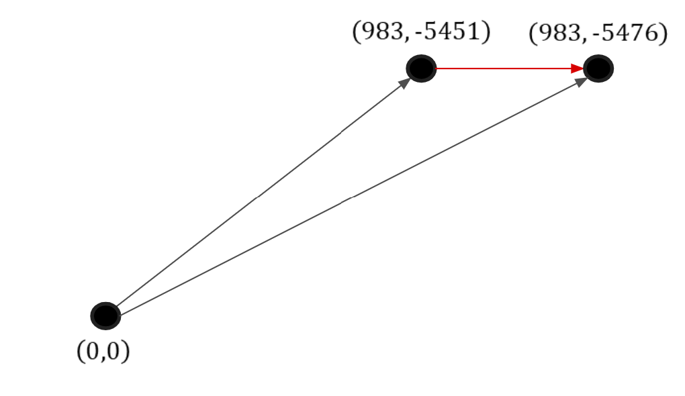

# Local Planning

**Summary:** This page contains the conceptual and theoretical explanations for the Local Planning component. For more technical documentation have a look at the other linked documentation files.

- [Overview](#overview)
  - [Apply filters](#apply-filters)
  - [Calculate Speed](#calculate-speed)
  - [Check for collision](#check-for-collision)
  - [ACC](#acc)
- [Motion Planning](#motion-planning)
  - [Cornering Speed](#cornering-speed)
  - [Selecting the target velocity](#selecting-the-target-velocity)
  - [Moving the trajectory](#moving-the-trajectory)
- [Sources](#sources)

## Overview

The Local Planning component is responsible for evaluating short term decisions in the local environment of the ego vehicle. Some examples can be collision avoidance, reducing speed or emergency brakes.

The Local Planning in this project is divided in three components. Collision Check, Adaptive Cruise Control (ACC) and Motion Planning. The architecture can be seen below:


The theoretical concepts of each Local Planning component are explained below.

### Apply filters

The following input is recieved by the perception: $[class, min⁡(𝑎𝑏𝑠(𝑦)), min⁡(𝑥)]$ in a $(nx3)$-matrix
Filtering steps:


We filter for the following traffic objects: Pedestrians, bicycles, bikes, cars, busses and trucks. To filter oncoming traffic the $y$-distance is used as a deviation from the cars's middle axis (+ left, - right).

### Calculate Speed

As we are not able to use the radar sensor, we need to approximate the objects's speed to determine a collision. For this we simply save the last to distances recieved and calculate the speed difference between our ego vehicle and a possible collision object.

Lets have a look at the following example: $d_1 = 20, d_2 = 19, \Delta t = 0.5s, v_{ego} = 10 \frac{m}{s}$

- We saved the last to distances and the time difference between them. So now we can calculate the speed difference: $\Delta v = \frac{d_2 - d_1}{0,5} = -2 \frac{m}{s}$
- To calculate the absolute speed we can add the difference to our own speed: $v_{approx} = v_{ego} + \Delta v = 8 \frac{m}{s}$

### Check for collision

How to determine if a collision is ahead? --> Simple decision: If our speed > object speed we will collide sooner or later.

**If our speed > object speed**: First check for emergency brake!

Calculate emergency brake distance with simple thumb rule (see sources for more):

$$d_{emergency} = t_{reaction} \cdot v[\frac{m}{s}] + \frac{(\frac{v[\frac{km}{h}]}{10})^2}{2}$$

The emergency distance is composed of reaction distance determined by the reaction time of 1s and the braking distance which is approximated by converting our speed in km/h. As we check for a emergency brake our braking distance can be divided by 2, because we brake extra fast.

**If our current distance < emergency distance**: Publish emergency brake signal!

Nevertheless publish the collision information (object distance and speed) to ACC and Decision Making to trigger possible reactions.

### [ACC](./ACC.md)

The ACC is responsible for evaluating the target speed based on the current traffic situation. It recieves the speed limits from the global planner and the collisions from the Collision Check.
The ACC permanently evaluates in an infinite loop if a collision is recieved and calculates a new target speed accordingly.

**If a collision is recieved**: Caluclate the distance to stop at the current speed without the emergency brake as safety distance that should be kept.

$$ d_{safety} = t_{reaction} \cdot v[\frac{m}{s}] + (\frac{v[\frac{km}{h}]}{10})^2 $$

**If distance to object < braking distance**: Calculate new target speed.

$$ v_{target} = v_{ego} \cdot \frac{d_{current}}{d_{safety}}$$

With this formula we can ensure that the target speeds shrinks in relation on how big the difference between current distance to object and desired safety distance is.

**If distance to object $\geq$ braking distance**: Keep current speed

**If no collision recieved**: Drive with speed limit.

The target speed is published to Motion Planning that evaluates what speed should be driven also with respect to the current behavior.

## Motion Planning

The Motion Planning is the central control of the Local Planning. Controlling the target velocity and the trajectory to be executed in the acting. Following features are implemented:

### Cornering Speed


The cornering speed gets calculated at the beginning of the scenario, when the full trajectory is received:

- Calculate the angle of three points in the trajectory with atan2
- Find indices with a difference of 1°
- Get speed according to the length of the corner

Lane changes are special, because you can drive the with normal speed eventhough they have a curve change (visible in the picture on the straights). They can get their own speed, because every lane change is way smaller than the smallest corner.

### Selecting the target velocity

The target velocity is a combination of the acc speed, the behavior speed and the cornering speed. Almost everytime the minimal speed is choosen. Exceptions are overtaking and the parking maneuver.


In the first scenario on the left side the green ego vehicle chooses the acc speed to not cause a collision with the red car.
In the second scenario the car is waiting at the intersection and chooses the behavior speed (wait at intersection), while the acc would say speedlimit.
In the last scenario the car chooses the cornering speed to smoothly perform a 90° right turn.

### Moving the trajectory


The trajectory gets moved a fixed amount of meters to the left if an overtake is triggered.

A problem here is the side where we want to move our trajecotry points. As the car moves independently troughout the underlying coordiantes (see figure below) we need to find the direction where to move the waypoints.

For this we use our current heading around the z-axis of our car to determine the direction where we are looking. To move the points to the left we need to add another 90 degrees to our rotation.

```python
rotation_adjusted = Rotation.from_euler('z', self.current_heading +
                                                math.radians(90))
```

After generating our target roatation we generate a offset vector with the number of meters to move our points as x-value. Then we rotate this vector and add it to the desired waypoint (see red vector in figure below)



```python
offset = np.array([offset_meters, 0, 0])
offset_front = rotation_adjusted.apply(offset)
waypoint_off = waypoint + offset_front
```

## Sources

<https://www.adac.de/verkehr/rund-um-den-fuehrerschein/erwerb/anhalteweg-berechnen/>
