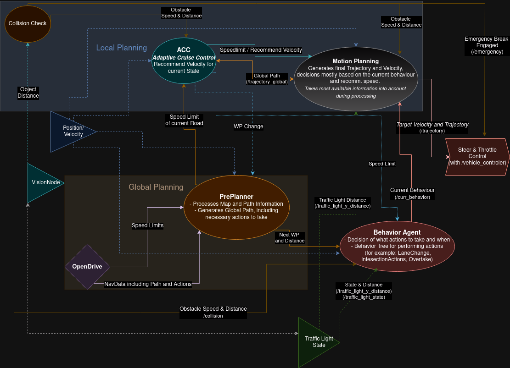
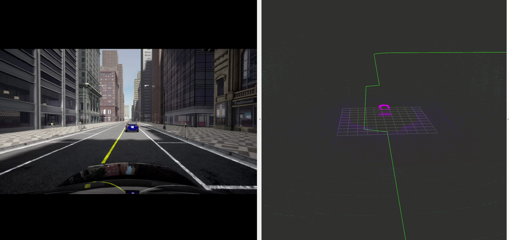

# Planning Wiki

## Overview

### [OpenDrive Converter (preplanning_trajectory.py)](./Preplanning.md)

This module focuses on creating a trajectory out of
an OpenDrive map (ASAM OpenDrive). As input it receives an xodr file (OpenDrive format) and the target points
from the leaderboard with the belonging actions. For example action number 3 means, drive through the intersection.

### [Global Planning (PrePlanner)](./Global_Planner.md)

The global planner is responsible for collecting and preparing all data from the leaderboard and other internal
components that is needed for the preplanning component.
After finishing that this node initiates the calculation of a trajectory based on the OpenDriveConverter
from preplanning_trajectory.py. In the end the computed trajectory and prevailing speed limits are published.

### [Decision making](./Behavior_tree.md)

The decision making collects most of the available information of the other components and makes decisions based on
the information. All possible traffic scenarios are covered in this component. The decision making uses a so called
decision tree, which is easy to adapt and to expand.

### [Local Planning](./Local_Planning.md)

This module includes the Nodes: ACC, CollisionCheck, MotionPlanner

The Local Planning package is responsible for evaluating short term decisions in the local environment of the ego vehicle. It containes components responsible for detecting collisions and reacting e. g. lowering speed.
The local planning also executes behaviors e.g. changes the trajectory for an overtake.

