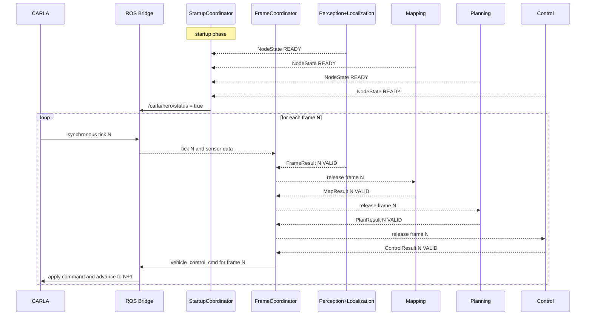

# Deterministic Simulation Synchronization

## Task

Design a deterministic replacement for the current sleep-based CARLA and ROS synchronization approach so the project can prove that the command sent to the simulator was computed from up-to-date data.

## Sources inspected

- `code/control/control/vehicle_controller.py`
- `code/control/control/velocity_controller.py`
- `code/control/control/pure_pursuit_controller.py`
- `code/control/launch/control.xml`
- `code/agent/agent/data_management_node.py`
- `code/mapping/mapping/data_integration.py`
- `code/planning/planning/behavior_agent/behavior_tree.py`
- `code/agent/launch/agent.dev.xml`
- `code/agent/launch/agent.dev.persistent.xml`
- `code/leaderboard_launcher/launch/ros_bridge.dev.xml`
- `doc/control/vehicle_controller.md`
- `doc/control/architecture_documentation.md`
- `doc/research/overhaul25/improvements/README.md`
- `https://github.com/una-auxme/paf/issues/471`
- `https://github.com/una-auxme/paf/issues/701`

## Current diagnosis

The current system has two different timing problems.

### 1. Startup readiness is not deterministic

`DataManagement` publishes `/carla/<role>/status` every 0.5 seconds on system time. That means the simulation is started by a periodic heartbeat, not by a proof that the required node graph is ready.

### 2. Runtime stepping is not deterministic

The critical runtime path mixes multiple timing models:

- `vehicle_controller` subscribes to `/clock` and publishes `vehicle_control_cmd` immediately from the clock callback,
- `vehicle_controller` then sleeps with `loop_sleep_time` as a hotfix,
- `velocity_controller`, `pure_pursuit_controller`, `behavior_tree`, `mapping/data_integration`, and several localization and perception nodes use `create_timer(...)`,
- the ROS bridge is configured with `synchronous_mode_wait_for_vehicle_control_command=False` in the checked launch file.

This means there is no single proof that "frame N is complete" before the next command is sent.

The practical consequence is that planning and control can act on a mix of fresh and stale inputs from different ticks.

## Design principle

Do **not** try to prove that every node in the workspace ran exactly once.

That is the wrong contract.

The correct contract is:

1. identify the critical path that produces the control command,
2. define which outputs on that path must be valid for frame `N`,
3. send the command for frame `N` only after those outputs are complete,
4. keep visualization, logging, and other non-critical helpers outside the barrier.

## Proposed architecture

Split the problem into two planes.

### A. Startup readiness plane

Introduce a dedicated `StartupCoordinator`.

Responsibilities:

- collect readiness from required nodes,
- verify required static data has arrived,
- publish `/carla/<role>/status` only after the required set is ready,
- stop using the periodic status timer as the readiness contract.

Each required node should publish a transient-local `NodeState` message with at least:

- `node_name`
- `stage`
- `state`: `BOOTING | READY | DEGRADED | ERROR`
- `reason`
- `required_inputs_ready`
- `last_completed_frame`

For startup, `READY` should mean:

- subscriptions are created,
- required services are available,
- required static inputs have arrived,
- the node can participate in the first synchronous frame.

Examples:

- `DataManagement` is ready only after OpenDRIVE and global plan were received and the services were created.
- `mapping` is ready only after hero pose and the required perception sources are present.
- `planning` is ready only after the map and persistent route data are available.

### B. Runtime frame synchronization plane

Introduce a dedicated `FrameCoordinator` for the synchronous control path.

Responsibilities:

- derive a monotonic `frame_id` from the CARLA tick,
- track which stages have completed for the current frame,
- enforce freshness rules,
- publish the final `vehicle_control_cmd`,
- emit metrics and faults when the graph misses deadlines.

The coordinator should be the **only** component allowed to release the final control command that advances the simulation.

## Critical path

The critical synchronous path should be treated as staged.

Suggested stages:

1. `FrameSource`
   CARLA tick plus sensor data and ego state for frame `N`.
2. `Perception + Localization`
   Produce frame-tagged outputs for frame `N`.
3. `Mapping`
   Publish map `N` once all required inputs for `N` are available.
4. `Planning`
   Produce behavior, target velocity, and local trajectory for `N`.
5. `Control`
   Produce steering, throttle, brake, reverse for `N`.
6. `FrameCoordinator`
   Validate completeness and freshness, then publish `vehicle_control_cmd` for `N`.

## Freshness and validity contract

Every stage output on the critical path should declare provenance.

This can be done either by extending messages directly or by publishing a side-channel `FrameResult` topic per stage during migration.

Minimum fields:

- `stage`
- `frame_id`
- `input_frame_ids`
- `valid`
- `degraded`
- `reason`
- `processing_latency_ms`

The coordinator should reject or downgrade outputs that violate the contract.

Examples:

- planning output for frame `N` must not be accepted if it was computed from map `N-1` unless that lag is explicitly allowed,
- map `N` may optionally allow some slower inputs with a configured max age in frames,
- control `N` must be based on planning `N` and ego state `N`.

Recommended validity states:

- `VALID`
- `STALE`
- `MISSING`
- `DEGRADED`
- `ERROR`

## Failure policy

The system must stay deterministic even when a node is slow or broken.

That means the policy must be explicit.

Recommended policy:

1. missing optional data: allow degraded continuation,
2. missing required data for one frame: publish a safe fallback command and flag the frame,
3. repeated failure over threshold: abort the route or switch into a controlled safe-stop state.

Do not let failure handling be implicit in sleep times.

## Recommended control of CARLA stepping

After the final command barrier exists, enable the bridge option that waits for the control command before the next synchronous step.

That means the desired end state is:

- `synchronous_mode_wait_for_vehicle_control_command=True`
- no `loop_sleep_time` in the control contract
- `vehicle_controller` no longer publishes the final CARLA command directly from the `/clock` callback

`vehicle_controller` should become a compute node or command assembler, not the simulation step trigger.

## Sequence diagram

## What should stay asynchronous

Keep these out of the strict barrier unless they directly affect the command:

- visualization
- RViz marker publishing
- debug topics
- logging and telemetry export
- developer-only instrumentation

This prevents the barrier from becoming fragile or too broad.

## Minimal migration plan

### Slice 1. Fix startup determinism

- add `NodeState` and `StartupCoordinator`,
- stop using the periodic `/carla/<role>/status` timer as the readiness proof,
- document the required startup set.

### Slice 2. Make runtime freshness observable

- add `frame_id` and `FrameResult` side-channel topics for the critical stages,
- log when any stage publishes stale or mismatched data,
- keep the old timers temporarily.

### Slice 3. Introduce final command barrier

- add `FrameCoordinator`,
- move publication of the final `vehicle_control_cmd` behind the barrier,
- enable bridge waiting for vehicle control command.

### Slice 4. Remove timer-driven critical loops

- convert critical timer loops into frame-triggered computations,
- keep timers only where background work is truly independent of the synchronous path,
- remove `loop_sleep_time` from the control contract.

### Slice 5. Tighten validation

- add latency and stale-data tests,
- add route-level checks that verify one command per completed frame,
- record degraded or fallback frames during evaluation.

## Recommended first implementation target

The smallest high-value slice is not the full barrier.

It is:

1. make startup readiness explicit,
2. add `frame_id` plus `FrameResult` observability for the critical stages,
3. move the final control publish behind a coordinator.

That gives a deterministic contract without rewriting every node immediately.

## Validation strategy

Proof should include both correctness and observability.

Recommended checks:

- unit tests for `StartupCoordinator` readiness aggregation,
- unit tests for `FrameCoordinator` freshness and timeout rules,
- integration test that delays one critical stage and verifies no stale command is sent,
- route-level run that confirms exactly one control release per completed frame,
- explicit logs or metrics for stale, degraded, and fallback frames.

## Main conclusion

The project should move from a timer-shaped graph to a contract-shaped graph.

The contract should not be "all nodes slept long enough" and it should not be "every node ran once".

The contract should be:

"The command for frame `N` is only sent after the required stages produced a valid output for frame `N`, and startup only begins after the required graph is ready."
