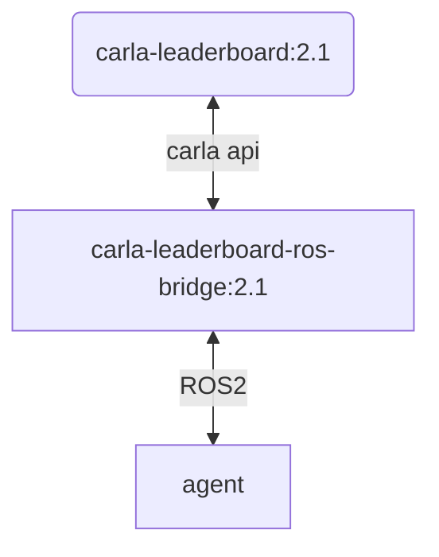

# ROS2 porting

**Summary:** Required steps for porting the project to ROS 2

The project currently uses ROS 1 noetic as its backbone. It is EOL in May 2025.

- [Steps](#steps)
  - [1. Build a basic ROS 2 Dockerfile](#1-build-a-basic-ros-2-dockerfile)
    - [Steps (Dockerfile)](#steps-dockerfile)
    - [Problems (Dockerfile)](#problems-dockerfile)
    - [**Major issue: Carla API**](#major-issue-carla-api)
      - [**Carla Solution**](#carla-solution)
    - [Status (Dockerfile)](#status-dockerfile)
  - [2. ROS package dependencies](#2-ros-package-dependencies)
  - [3. Take measurements with the ROS1 codebase](#3-take-measurements-with-the-ros1-codebase)
    - [~~Quality indicators~~](#quality-indicators)
    - [Performance indicators](#performance-indicators)
    - [Benchmark results](#benchmark-results)
      - [Build time](#build-time)
      - [Startup time](#startup-time)
  - [4. Main porting effort: Migrate ROS packages](#4-main-porting-effort-migrate-ros-packages)
    - [Migrate package base files to colcon](#migrate-package-base-files-to-colcon)
      - [package.xml](#packagexml)
      - [CMakeLists.txt](#cmakeliststxt)
      - [launch files](#launch-files)
      - [Interfaces (msg, src, action)](#interfaces-msg-src-action)
      - [Dynamic reconfigure](#dynamic-reconfigure)
    - [Migrate Python packages/code to ROS2](#migrate-python-packagescode-to-ros2)
  - [5. Compare measurements to identify problems](#5-compare-measurements-to-identify-problems)
  - [6. Update documentation](#6-update-documentation)
- [CI plan](#ci-plan)
- [Risks and Mitigation](#risks-and-mitigation)
  - [Risk: Python version conflicts](#risk-python-version-conflicts)
  - [Mitigation](#mitigation)
- [Sources](#sources)

## Steps

### 1. Build a basic ROS 2 Dockerfile

This should make sure that the issues described [here](https://github.com/una-auxme/paf/issues/253) are fixable.

The preferred ROS 2 Distribution is [Jazzy Jalisco](https://docs.ros.org/en/rolling/Releases/Release-Jazzy-Jalisco.html) which is supported until 2029.
The main reason for using jazzy is the longer support window than Humble Hawksbill (EOL 2027).
Should issues arise specifically related to jazzy, a fallback to humble is relatively easy by switching the ROS distribution in the Dockerfile.
A fallback [Foxy Fitzroy](https://docs.ros.org/en/rolling/Releases/Release-Foxy-Fitzroy.html) was also considered, because [of issues with the Carla API](#major-issue-carla-api).

The base docker image is Ubuntu 24.04 based.
Normal ubuntu packages are used where possible. Additional repositories:

- Official ROS jazzy repository
- For AMD: Updated driver repository

~~To simplify GPU dependencies a GPU-vendor image is used (Nvidia-CUDA/AMD-ROCM).
This removes a lot of complex steps from the Dockerfile. (Manual ROS installation is a lot easier than manual CUDA installation)~~
The Nvidia vendor images had problems with Vulkan GPU passthrough.

Further possible improvements to the docker/build system can be found [here](../improvements/docker.md).
Some of them will be implemented directly as part of the ROS2 porting effort.

#### Steps (Dockerfile)

1. [DONE] Create a Dockerfile including the leaderboard, scenario runner and bridge and successfully build it
2. [DONE: Only carla-ros-bridge] Install the required python dependencies
3. [DONE] Proper entrypoint and user permission handling
4. [DONE] Make sure the leaderboard is able to start, send sensor data and control the simulation
   - The [ros_2_publisher.py](../../../../code/ros_2_publisher.py) was used for testing and the simulation ran at \~2X speed (12700KF, Nvidia RTX 3080).
  
#### Problems (Dockerfile)

- [FIXED] The carla<->[ros_bridge](https://carla.readthedocs.io/projects/ros-bridge/en/latest/ros_installation_ros2/) officially only supports ROS 2 Foxy (already EOL)  
  Users were apparently able to get the bridge working with ROS 2 Humble: <https://github.com/carla-simulator/ros-bridge/issues/737>  
  But it requires patched build files.
  - The [first try to port to ROS2](https://github.com/una-auxme/paf/issues/253) failed because of this issue
- [FIXED] Ubuntu 24.04 ships with Python 3.12 (Upgrade from 3.8). Some dependencies have to be upgraded. More info below and [here](./python_porting.md#necessary-dependency-upgrades)
- [[FIXED](#carla-solution)] The Carla API for the leaderboard officially only supports python3.8. Humble uses at least python3.10 and Jazzy 3.12
  - Importing the Carla PythonAPI from the leaderboard segfaults with python3.10 AND 3.12 (humble and jazzy)
  - Usage of an older python interpreter is not possible since ROS requires the use of the system interpreter, because rclpy is compiled against it
  - ~~**Current strategy**: Try to use the Carla 0.9.15 (non leaderboard) version, because its changelog mentions a segfault fix for python 3.10~~
- [[FIXED](#carla-solution)] The locked python dependencies of the leaderboard, scenario runner and bridge cannot be used with Python 3.12 and need to be updated.
  - This may lead to unforeseen errors.
  - The current setup also does not use these exact versions...
  - Affected packages:
    - cmake_format==0.6.11
    - opencv-python==4.2.0.32 -> Current: 4.9.0.80
    - py-trees==0.8.3 -> **Current: 0.7.6 with ros1**
    - numpy==1.18.4 -> Current: 1.23.5
    - networkx==2.2 -> Current: 3.1
    - Shapely==1.7.1 -> Current: 2.0.6
    - xmlschema==1.0.18
    - antlr4-python3-runtime==4.10
  - Other packages have no locked version but might still break because of major upgrades: [Merged requirements list](../../../../build/docker/agent/setup-scripts/requirements_carla.txt)

#### **Major issue: Carla API**

The Carla API from the leaderboard release officially only supports up to Python 3.8.

- It segfaults with 3.10 (ubuntu 22.04) and 3.12 (ubuntu 24.04)
- The API from the 0.9.15 release also segfaults with these versions
- Using a nightly release from the [ue4-dev](https://github.com/carla-simulator/carla/tree/ue4-dev) branch:
  - In 3.10, it crashes with `undefined symbol: _PyTraceMalloc_NewReference`
  - In 3.12, it crashes because the `imp` module does not exist anymore in 3.12
- [General issue for the segfaults](https://github.com/carla-simulator/carla/issues/8662)

The Carla API has to run with the same python version as ROS 2 since the leaderboard and carla-ros-bridge use both simultaneously

Possible Solutions:

- Use ROS 2 Foxy. Ships with python 3.8 but is **EOL**
- Try to compile Carla from source. Is a lot of effort and might still not work. Also breaks compatibility with the official leaderboard. Not recommended.
- Try to use an older python version with ROS 2 humble/jazzy. Might work, but requires building ROS from source. Investigation pending...
- Wait for [a new Carla leaderboard release](https://github.com/carla-simulator/carla/tree/ue4/0.9.16)
- **[Chosen solution](#carla-solution): Use Ubuntu 24.04, but compile ROS2 jazzy together with python 3.8 from source**

##### **Carla Solution**

It is possible compile ROS2 jazzy together with python 3.8 from source. This makes it possible to import both the Carla API and rclpy in the same python environment.

This setup increases the Dockerfile complexity by a lot. ➡ The following docker setup was chosen to decouple the carla-ros-bridge from the PAF agent:

- Container A: *carla-leaderboard:2.1*: Contains the Carla simulator
- Container B: *carla-leaderboard-ros-bridge:2.1*: Contains the ROS2 jazzy + Python3.8 fusion and the leaderboard, scenario_runner and ros_bridge. It starts the leaderboard, but no part of the PAF agent.
- Container C: *agent(-dev)*: The image containing the PAF agent. Launches the PAF agent launch files via `ros2 launch`. The container is a normal ROS2 jazzy setup based on Ubuntu 24.04 with apt packages and Python3.12. It also includes the Carla ros_bridge only for the message types.

Pros:

- Carla and PAF dependencies are decoupled ➡ way simpler dependency management and more flexibility for choosing python packages
- The agent Dockerfile is reasonably simple
- PAF codebase works on a modern ROS version with modern Python
- The PAF agent runs completely decoupled from the leaderboard: Possibility for rapid development, because the agent can be restarted without restarting the leaderboard

Cons:

- The fusion of ROS2 jazzy and Python3.8 is not officially supported.
  - Some ros2 tools are actually broken in the *carla-leaderboard-ros-bridge* container (e.g. `ros2 topic ...`). But these tools work in the agent container.
  - The ros_bridge packages and the leaderboard do not seem to be affected by these broken tools
- The PAF agent runs completely decoupled from the leaderboard: Scenario changes in the pipeline do not restart the agent (TODO: Solution possible!?)
- This setup is not submittable to the leaderboard, because it uses 2 docker containers

Merging the *carla-leaderboard-ros-bridge* and *agent* container would be technically possible for submission to the leaderboard, but quite cumbersome.

#### Status (Dockerfile)

- *agent(-dev)*:
  - A basic [Dockerfile](../../../../build/docker/agent-ros2/Dockerfile) exists.
  - It successfully communicates with the *carla-leaderboard-ros-bridge:2.1*
  - The [ros_2_publisher.py](../../../../code/ros_2_publisher.py) was used for testing and the simulation ran at \~2X speed (12700KF, Nvidia RTX 3080).
- Combined [Dockerfile](../../../../build/docker/carla/Dockerfile) for
  - *carla-leaderboard:2.1*
  - *carla-leaderboard-ros-bridge:2.1*
  - These images only have to be built once with the [build_carla](../../../../build/docker/carla/build_carla.sh) script.

➡ Basic docker setup is complete

### 2. ROS package dependencies

Make sure all ROS package dependencies are met / replacements are found

The following explicitly installed ROS1 packages are not available in ROS2:

- ros-noetic-carla-msgs ➡ When building the ros_bridge for ROS2, this is not required anymore. **Might require changing topic types**
- ros-noetic-ros-numpy ➡ Used for ros msg -> numpy conversions. **Might require changing topic types**
- ros-noetic-robot-pose-ekf ➡ unknown if this is still required. Does not appear to be used in the localization package.
  Validation: Try to run ros1 without this package
- ros-noetic-rqt-py-trees ➡ did not search for a replacement, the py-trees python package also works without rqt
- ros-noetic-ros-pytest ➡ replaced with ros-jazzy-ament-cmake-pytest. **The unit test integration for the mapping_common package has to be updated.** The unit tests themselves won't change since both packages use py_test under the hood.
- ros-noetic-rviz ➡ ros-jazzy-rviz2

Status: All ROS dependencies can be installed or built. API changes might require some minor topic or message adjustments.

### 3. Take measurements with the ROS1 codebase

After discussion the project managers, the focus for the benchmarks has been shifted towards providing a good and responsive development infrastructure/workflow for future students.

This means that the *build times* and *startup times*
are really important, but the driving scores and runtime performance are less relevant.

#### ~~Quality indicators~~

Measure the individual scores/metrics averaged over multiple drive actions:

- num_infractions
- collisions_layout
- collisions_pedestrian
- collisions_vehicle
- red_light
- stop_infraction
- outside_route_lanes
- min_speed_infractions
- yield_emergency_vehicle_infractions
- score_route (Route completion)

Consideration: Use the leaderboard 2.1 for the measurements. It should provide more stable composed scores and the integration is really simple.

CI: The drive action should be improved to better output these values. Automatic averaging across multiple runs is not feasible in the CI.

#### Performance indicators

- Examine simulation performance from the drive action results:
  - ~~duration_game/duration_system~~

More potential benchmarks [➡ here](../improvements/README.md#add-performance-benchmarks).  
The relevant ones for comparing ros1➡ros2 are:

- [Measure project startup time](../improvements/README.md#measure-project-startup-time)
- [Measure docker build times](../improvements/README.md#measure-docker-build-times)
- ~~[Measure callback performance manually inside the nodes](../improvements/README.md#measure-callback-performance-manually-inside-the-nodes)~~
- ~~[Measure topic publish rates](../improvements/README.md#measure-topic-publish-rates)~~

#### Benchmark results

Only *build times* and *startup times* were measured.

##### Build time

TODO

##### Startup time

TODO

### 4. Main porting effort: Migrate ROS packages

#### Migrate package base files to colcon

##### package.xml

The format is quite similar, but a lot of details and names have changed.

<https://docs.ros.org/en/jazzy/How-To-Guides/Migrating-from-ROS1/Migrating-Package-XML.html>

##### CMakeLists.txt

Not required for pure python packages anymore. Only use setup.py in this case.

Otherwise: Different naming for certain instructions

##### launch files

ROS2 now supports xml, yaml and python based launch files.

 ➡ The existing launch files can be used. No major changes needed.

Necessary adjustments:

- Node types: the python installation now works differently ➡ different type names
- Maybe more complex setups like in the localization package require bigger changes

<https://docs.ros.org/en/jazzy/How-To-Guides/Migrating-from-ROS1/Migrating-Launch-Files.html>

**For each node, the `use_sim_time` parameter has to be set.** This can be done globally in the main launch file with `<set_parameter name="use_sim_time" value="true" />`

<https://robotics.stackexchange.com/questions/97957/ros2-set-parameters-from-file-and-directly?answer=369015#post-id-369015>

##### Interfaces (msg, src, action)

- The configuration for building in the package.xml is different from ROS1.
- Some types are different/have been renamed (Mainly: time,duration -> builtin_interfaces)

<https://docs.ros.org/en/jazzy/How-To-Guides/Migrating-from-ROS1/Migrating-Interfaces.html>

##### Dynamic reconfigure

TODO

#### Migrate Python packages/code to ROS2

The planned process for porting individual python packages and nodes is described [here](./python_porting.md).

### 5. Compare measurements to identify problems

### 6. Update documentation

This is a rough overview of necessary documentation updates if the ROS2 port is successful

- Node creation template
- Introduction to rclpy? Remove all references to rospy.
- docker-compose usage&build instructions
- setup instructions and scripts
- Update any broken links inside the existing docs

## CI plan

Linter and format actions have been reactivated for the ros2-dev branch.
But for some reason, flake8 seems to behave differently with VS Code and Python3.12 and shows a lot of warnings in combination with black.
A switch to [ruff](https://docs.astral.sh/ruff/) for both linting and formatting might make sense.

Required steps:

- Ruff as formatter/linter for python files?
- Update the build actions to build the new Dockerfiles
- Push new carla images to the github registry

## Risks and Mitigation

### Risk: Python version conflicts

Python version conflicts between leaderboard, scenario-runner, carla ros_bridge and the newer versions shipped by python 3.12
proved to be [a major problem](#major-issue-carla-api).

### Mitigation

[By splitting up the agent into `carla-leaderboard-ros-bridge` and `agent(-dev)` containers](#carla-solution), the python versions of the leaderboard and the PAF codebase are mostly separated.
(Excluding the carla-ros-bridge message types).

As long as the `carla-leaderboard-ros-bridge` properly supplies data to our container and receives the vehicle control commands, the PAF codebase works independently.  
➡ The Risk of further major road-blocks is pretty low since the PAF code base can be adjusted as needed.

## Sources

<https://docs.ros.org/en/jazzy/How-To-Guides/Migrating-from-ROS1.html>
