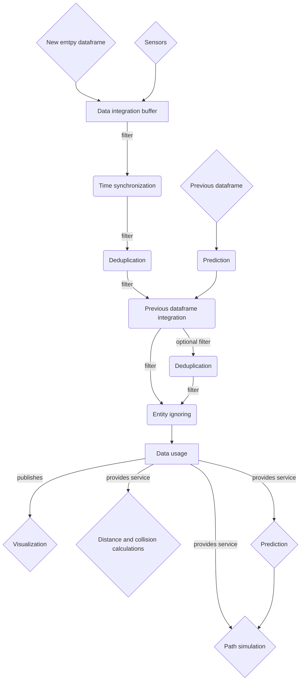

# Title of wiki page

**Summary:** This page describes an experimental intermediate map layer after perception

- [ROS Possibilities / General thoughts](#ros-possibilities--general-thoughts)
  - [OccupancyGrid](#occupancygrid)
  - [tf2](#tf2)
    - [Message interface](#message-interface)
    - [Message types](#message-types)
  - [ethzasl\_sensor\_fusion](#ethzasl_sensor_fusion)
  - [Custom 2d transformation matrices](#custom-2d-transformation-matrices)
  - [*Shapely*](#shapely)
- [Overall map representation](#overall-map-representation)
- [Data transmission](#data-transmission)
  - [~~tf2???~~](#tf2-1)
  - [ROS topics](#ros-topics)
  - [~~ROS services~~](#ros-services)
- [Global parameters](#global-parameters)
- [Data flow](#data-flow)
- [Perception data integration](#perception-data-integration)
  - [Point handling](#point-handling)
- [Data processing and filtering](#data-processing-and-filtering)
  - [Time synchronization](#time-synchronization)
  - [Deduplication](#deduplication)
    - [Deduplication parameters](#deduplication-parameters)
  - [Previous dataframe integration](#previous-dataframe-integration)
  - [Entity ignoring](#entity-ignoring)
- [Data usage](#data-usage)
  - [Visualization](#visualization)
  - [Collisions](#collisions)
  - [Distance calculations](#distance-calculations)
    - [Lane distance](#lane-distance)
    - [Collision distance](#collision-distance)
  - [Prediction](#prediction)
  - [Path simulation](#path-simulation)
  - [Entity functions](#entity-functions)
- [Sources](#sources)

## ROS Possibilities / General thoughts

Overview over existing ROS systems that might be used in the mapping (not complete, please extend).

### [OccupancyGrid](https://docs.ros.org/en/lunar/api/nav_msgs/html/msg/OccupancyGrid.html)

Defines a map via 2-dimensional grid cells. Only shows if a grid cell is occupied or not. Too limited for our approach.

### [tf2](http://wiki.ros.org/tf2)

ROS transform library.

#### Message interface

tf2 provides an ROS-independent message-only interface for transmitting timestamped data.

#### Message types

tf2 provides several message types related to transformations, most notably [Transform](http://docs.ros.org/en/jade/api/geometry_msgs/html/msg/Transform.html)
This transform is defined by a vector for translation and a quaternion for rotation.

Problems with the transform:

- Using a transformation matrix might be more suitable/intuitive for our approach, because we often have to transform points between multiple coordinate systems.
- A 2-dimensional transform might be preferred to reduce complexity and bugs

The message types are also available in a stamped version that include a timestamp and data frame id

Since the entity definition found below is much more complex, a custom datatype has to be implemented if we want to use tf2.
Using custom datatypes seems to be [possible](http://wiki.ros.org/tf2/Tutorials/Transforming%20your%20own%20datatypes), but it still has to use the tf2 Transforms

### [ethzasl_sensor_fusion](http://wiki.ros.org/ethzasl_sensor_fusion)

Making sure all sensor inputs are properly aligned is required for the map's function.

- The library provides a way to estimate the transformations between sensors that might be used for alignment
- The library can estimate the vehicle velocity

### Custom 2d transformation matrices

Transformations might be implemented via homogeneous transformation matrices.

A simple example implementation can be found [here](https://alexsm.com/homogeneous-transforms/)

Positive:

- Arbitrary chains of rotations and translations can be saved within one 3x3 matrix
- Simple to implement

Negative:

- Custom implementation necessary, is there a library for python providing this data structure? None found yet.

### [*Shapely*](https://shapely.readthedocs.io/en/stable/index.html)

## Overall map representation

- The map is based on the local car position and is only built using sensor data. No global positioning via GPS or similar is used.
  - The map (0/0) should be the turning axis of the car. (Above rear axle?)
  - All transformations to entities are relative to the car's coordinate system (position/heading)
  - the map's x-axis is aligned with the heading of the car
  - Coordinate system is a right-hand system like tf2 (can be visualized in RViz)
  - The linear motion direction is relative to their own coordinate system. The direction vector length is equal to the entity's tachometer. Globally static entities have zero velocity (wall)
- 2D top-down map. The height(z) dimension is mostly useless for collision detection and path planning
- A map dataframe includes the car's speeds at the time the map was created. The heading/direction are the same as the x-axis

  Solution: Add the hero car as the first entity of the map
- A map dataframe should have a timestamp when it was created. The creation time is the time when all data for the map of the current step has been collected
  Entities also have timestamps of their own → see attributes
- The map consists out of entities. Entities have the following attributes:
  - One shape:
    - Rectangle: possibly defined by:
      - x_size and y_size | middle and rotation defined by the entity's transform
      - points in the local coordinates of the entity
    - Circle?: diameter
    - Line?: Rectangles might be used as lines
    - Shape offset to the center of the entity
  - ~~Optional: height and distance to ground, only for visualization~~
  - Timestamp:

    When adding the entity its timestamp is the timestamp of the associated sensor data (might slightly differ to the timestamp of the map dataframe)

    In the filtering steps the entity will be predicted to the map creation timestamp. All entities of the output map have the same timestamp as the map.
    See [Time synchronization](#time-synchronization).
  - Confidence: [0.0; 1.0] The sensor's confidence that this entity is correct and actually exists.
    - [ObjectHypothesis](https://github.com/ros-perception/vision_msgs/blob/ros2/vision_msgs/msg/ObjectHypothesis.msg) might be used for this and Priority, but it includes a class_id which would be redundant
  - Priority: [0.0; 1.0] This entity's priority over others
  - Transform2d: Vector2 translation and rotation in radians.
    - This might be modelled as a 2-dimensional transformation matrix
    - TODO: tf2?
  - Motion: Optional. When unset algorithms will use some default to make it standing still:
    - linear speed: vector2 based on the direction is the x-axis/heading of the entity based on its local transform.
    - angular speed: Rotation around the middle of the entity. Might be necessary at interceptions because the car might otherwise think entities will drive into its lane
    - speeds are global (not relative to hero car)
  - Map unique id: unique id of the entity in the map, set by the map
  - Sensor Unique id: Optional, set from the sensor. Prefixed with the sensor node name to make sure ids stay unique between sensors.
    Used for [Previous dataframe integration](#previous-dataframe-integration)
    - An array of several unique ids associated with the entity might also make sense, because we have different camera angles that produce different tracked detections
      ([yolov11](https://docs.ultralytics.com/guides/instance-segmentation-and-tracking/#what-is-the-difference-between-instance-segmentation-and-object-tracking-in-ultralytics-yolo11))
      that refer to the same entity.
  - EntityType (evtl. Class): for example Car, Pedestrian, Background, Lanemark, (TrafficLight), (StopSign) etc...

    Should not be used to filter entities in the data usage algorithms

    TrafficLight and StopSign add only their stop line to the map. They set the *stopmark* flag only if the car has to stop there.
  - Flags (evtl. attribute) can be used to filter entities in the algorithms:
    - collider
    - tracked: If the entity should be tracked across individual dataframes. See [Previous dataframe integration](#previous-dataframe-integration)
    - stopmark: If the car should not drive over or around the entity
    - lanemark: entity is a lane marking
    - ~~global_static (is this necessary?, time might make more sense): If the entity is globally static (NOT relative to the car). The flag can be unset when adding the entity and later calculated in [Data processing and filtering](#data-processing-and-filtering)~~
      ~~If set, the speed and direction of the entity should roughly match the inverse speed and direction of the car. The map should emit a warning if this is not the case.~~
    - ignore: The entity should be ignored in [Data usage](#data-usage). Usually unset when adding the entity and calculated in [Entity ignoring](#entity-ignoring)
    - (hero: Only set for the hero car)
  - Only relevant for tracked entities (member attributes of the tracked flag):
    - Visibility time: How long the entity has been visible for. Never gets reset
    - Invisibility time: How long the entity has been uninterruptedly not visible. Reset when the entity is visible again
    - Visibility frame count: In how many dataframes the entity was visible. Never gets reset
    - Invisibility frame count: In how many consecutive dataframes the entity was not visible. Reset when the entity is visible again
    - (Moving time / Standing time): How long an entity was moving/stood still continuously. Alternative to the global_static flag.
    - (Moving time sum / Standing time sum): Sums of all the time the entity was moving/stood still.
    - Min_linear_speed
    - Max_linear_speed
  - EntityType specific attributes:
    - Car: indicator and brake lights
    - TrafficLight: State red, yellow, green
    - Lanemark:
      - type: dotted, solid, invisible
      - flags: road_edge, lane_edge?, parking?
      - index?: Lane index from right to left?

## Data transmission

How should the map dataframes be transmitted between nodes? Possible approaches below:

### ~~tf2???~~

Reason for not using:

- 2d transformations are easier
- Custom data is difficult to transmit

### ROS topics

Every node basically gets their own map dataframe → might be a performance problem and node might have outdated data

Usage reasons:

- A lot of clients require the map data
- Importable python module will be provided for map functions

### ~~ROS services~~

A single service node provides the algorithms defined in [Data usage](#data-usage).

The service definition is similar to topics, it only consists of a request and response definition.

Positive:

- Only a single node holds the dataframe
- The data is always up-to-date
- Performance with persistent connections might be better than with topics
- The service can track how old the current dataframe is and return an error to all clients if it is too old

Between filter nodes, the dataframes might still be transmitted via topics. The service node then subscribes to one of the filter nodes to receive its dataframe. All other nodes only get access to the service but not to the underlying dataframe.

Reason for not using:

- For every api call there needs to be a separate service
- Too many clients that need regular updates

## Global parameters

- Max dataframe age: Time after which a dataframe is considered too old to be used. Nodes that have no newer dataframe should switch into an emergency state until they have fresh data.
- Global standing speed threshold: The threshold under which an entity is considered not moving
  
## Data flow

The filters can be rearranged, and the *Data usage* can be applied at any point in the graph.

## Perception data integration

The first approach for the data integration will be to dump all sensor data into the map.
This includes some filtering to remove obvious unwanted data points and noise.

The map relies on the sensor data to be **sufficiently aligned with each other**. (rule of thumb: ~30 cm)

### Point handling

Points from lidar and radar sensors will be filtered by height to exclude any road points the car cannot collide with.

There should also be a filter to remove outliers / lower the confidence of outliers. This could be done by measuring the point-density around the point and to only add it if the density is high enough.

Flags for all points: collider

*global_static* is not set for any points, because we cannot know if they are static or not. Lidar points only have no motion set.

Radar points have their linear speed and direction to/from the car set.

The shape is a circle with a universal diameter.

The priority of radar points should be higher than lidar points.

Optional Upgrade: Group points into bigger cube entities via the point density. This is allowed to lead to duplicates, since they will be removed later.

## Data processing and filtering

The system uses several filtering steps to bring the map into a usable state for the algorithms in [Data usage](#data-usage)
All filters should be separate nodes that subscribe to and republish the map.

### Time synchronization

Entities will be predicted to the map creation timestamp based on their own (older) timestamp

### Deduplication

Overlapping entities are identified via their transforms and bounds.

The entity with higher priority usually takes precedence and the other is merged into it or removed(simpler).
If the entity has a higher priority but an extremely low confidence, the other entity might take precedence.

In the case of merging, the entity keeps its flags, class, etc., but some attributes might be merged based on confidence (percentage wise). This includes motion and maybe even the bounds/transforms.
It is also possible to adjust the entity's confidence value based on how many other entities have been merged into it.

#### Deduplication parameters

- Merging size / transform difference thresholds
- low confidence threshold: Confidence under witch the priority is ignored

### Previous dataframe integration

Depends on [Prediction](#prediction).
The last frame is predicted to the current timestamp. Entities can then be checked for similarities.
Similar entities are merged based on the deduplication merging algorithm.

If set, their unique ids are also considered. (This might just set higher merging thresholds)

After that their motion is recalculated based on the two available points in time, their (*current\** and) previous motion and optionally some interpolation.

The visibility/invisibility time/count attributes also have to be updated.

*ignored* and *!tracked* entities will not be processed in this step.

After this step, another deduplication step might be necessary.

(*current\** motion might be set on a tracked entity when a radar point was merged into it.)

### Entity ignoring

Sets the *ignore* flag based on:

- the confidence of the entity
- if *tracked*: based on the amount of visibility/invisibility time/count
- invisibility time based

## Data usage

### Visualization

Generate [Marker](http://docs.ros.org/en/noetic/api/visualization_msgs/html/msg/Marker.html) messages based on the dataframe.
These messages can then be observed with RViz. Possible DisplayTypes [here](http://wiki.ros.org/rviz/DisplayTypes).

### Collisions

Uses entity shapes

If there currently are collisions between the car and other entities.
Collisions should contain the involved entities, their positions and the collision point.

### Distance calculations

Distance calculations might be able to use similar algorithms

#### Lane distance

Sideways left/right distances to the nearest lane marking.
Only uses entities with the *lanemark* flag set. Lanemarks can be filtered further via the lanemark-specific type and flags.

#### Collision distance

### Prediction

Generate a predicted dataframe based on the current frame that is *n* seconds into the future.

### Path simulation

Generate multiple predictions into the future with a fixed timestep.

The car's motion in the virtual map is adjusted to follow a given path.

Collisions are reported in the order they occur.

### Entity functions

- `is_static -> bool`: if the entity is considered static (will never move) by the mapping layer.
  This may be calculated based on the Moving/Standing times (sums) and the min/max speeds of the entity.

## Sources
