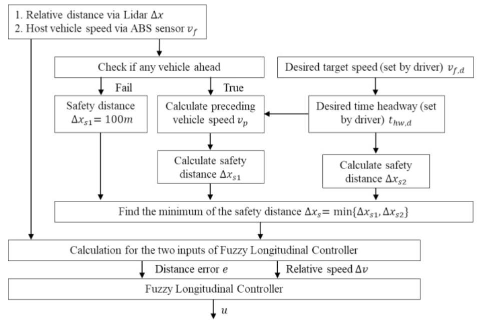

# ACC

This file gives a general overview on possible ACC implementations and reflects the current state of the ACC.

## General

The main goal of an ACC (Adaptive Cruise Control) is to follow a car driving in front while keeping a safe distance to it. This can be achieved by adjusting the speed to the speed of the car in front.
In general, classic ACC systems are designed for higher velocity (e.g. > 40 km/h). Apart from that, there are Stop & Go systems that support lower velocites (e.g. < 40 km/h). In our case, both systems might be needed and it might be reasonable to develop two different systems for ACC and Stop & Go.
The threshold to distinguish between the two systems has to be chosen reasonably.
There are basically three different techniques that can be used to implement an ACC: PID Control, Model Predictive Control and Fuzzy Logic Control. Another option is CACC (Cooperative Adaptive Cruise Control) but this is not relevant for our project since it requires communication between the vehicles.

### PID Control

The PID Controller consists of three terms: the proportional term, the integral term and the derivative term. One possible simple controller model looks as follows:

$$ v_f(t) = v_f(t - t_s) + k_p e(t-t_s) + k_i \int_{0}^{t} e(\tau) d\tau + k_d \dot{e}(t - t_s) $$
$$ e(t-t_s) = \Delta x(t - t_s) - t_{hw,d} v_f (t - t_s) $$

- $v_f$: follower vehicle velocity (transmitted to the acting component)
- $t_s$: sampling time
- $k_p$ and $k_i$ and $k_d$: coefficients for proportional, integral and derivative terms
- $e$: distance error (difference between actual distance $\Delta x$ and desired distance $\Delta x_d$)
- $t_{hw,d}$: desired time headway (duration between the arrival of the first car at a certain waypoint and the arrival of the following car at the same waypoint)  

### Model Predictive Control (MPC)

It calculates the current control action by solving an online, iterative and finite-horizon optimization of the model.
Procedure:

1. Prediction of future system states based on current states
2. Computation of the cost function for a finite time horizon in the future
3. Implementation of the first step of the solved control sequence
4. Application of the feedback control loop to compensate for the predictive error and model inaccuracy
5. Sampling of new current states and repitition of the process

### Fuzzy Logic Control (FLC)

Provides a unified control framework to offer both functions: ACC and Stop & Go.

## ACC in our project

### Current implementation

- General behaviour:
    checks for obstacle distance < safety distance
  
    calculates new speed based on obstacle distance
  
    else keep current speed
  
- publishes speed to acc_velocity
- safe distance calculation is currently not correct, uses speed +  (speed * 0.36)² which results in wrong distances
- if car in front of us ignores speed limits we ignore them as well
- some parts of unstuck routine are in ACC and need to be refactored
- same goes for publishing of current waypoint, this should not be in ACC

In summary, the current implementation is not sufficient and needs major refactoring.

### Concept for new implementation

The new concept for the ACC is to take the trajectory, look at all or a limited subset of the next points and add a target velocity and the current behaviour to each point.
This way the Acting has more knowledge about what the car is doing and can adjust accordingly in a local manner.
For this a new trajectory message type was implemented in #511.

Since behaviour is passed as an ID a new enum for behaviours was implemented in utils.py as well.

The general idea for speeds above the 40 km/h mark is to calculate a proper safety distance, a general target velocity and velocity targets based on PID. For speeds lower than that a stop and go system can be discussed if it is really needed.

For safety distance we would like to calculate it like FLC but that most likely needs some adjustments as setting the distance to 100m when there is no vehicle ahead seems unreasonable.
We can just directly set the velocity to the speed limit in that case.

For a general speed target we either take the speed of the car in front or the speed limit, whichever is lower. In cases where the car in front is substantially slower than the speed limit ACC could inititate overtaking.

Since we want to calculate the desired speed at each point of the trajectory, the way PID calculates velocity seems reasonable since we can treat the trajectory points as different points in time for the sampling time.
For example let's say we sample every fifth point and calculate the velocity for that, then we can just interpolate every other point inbetween.

$v_f(t - t_s)$ would then simply be the velocity of the fifth point before the current one. Theoretically this allows us to dynamically adjust the sampling time as well if needed.

For the distance error we can use the safety distance as the desired distance. The distance at time t needs to be predicted based on the (predicted) distance at the prior sample point and the calculated speed at the prior sample point.

We calculate velocities like that up to the point where the actual distance is within 5% of the optimal safety distance. For points further than that we simply use the desired general speed.

### Possible next steps

A seperate file for the new ACC should be created to not disturb the system.

The parts that might get cut from ACC like current waypoint and unstuck routine need to be evaluated for necessity and if need be moved to somewhere more fitting.

Implement publisher for new message type.

Start implementing safety distance and general target speed logic. Subscriber logic could be taken from old implementation.

Implement PID logic

### Requirements

- obstacle speed
- obstacle distance

## Discussion

- How to test adaptations of the ACC? (Suggestion: Create test scenarios which represent different situations like driving straight forward behing a leading vehicle, no leading vehicle, sudden breaking, etc.)
- Which output should be transfered to the Acting component? (Suggestion: The desired speed is published in the new trajectory. No acceleration data is needed, the acceleration is handled by the acting component.)
- Which input do we get from the Perception component? (Suggestion: The distance and velocity of the car in front would be really helpful.)

## Sources

He, Yinglong et al. (2019). Adaptive Cruise Control Strategies Implemented on Experimental Vehicles: A Review. IFAC-PapersOnLine. 52. 21-27. 10.1016/j.ifacol.2019.09.004.
[Link](https://www.researchgate.net/publication/335934496_Adaptive_Cruise_Control_Strategies_Implemented_on_Experimental_Vehicles_A_Review)
