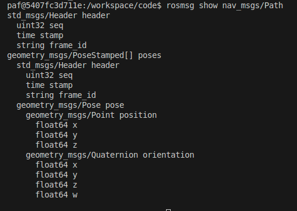

# Relation between planning and acting

This diagram shows the basics of the communication between the planning (green) and acting (blue) components. The information is gained using the rqt-graph. There are three main topics which represent the communication: 
* `/paf/hero/trajectory`
* `/paf/hero/emergency`
* `/paf/hero/curr_behavior`

## Useful commands
* The types of the messages published on the mentioned topics can be found out with the command `rostopic type <topic>`. 
* To have a deeper look on the message types, you can use the command `rosmsg show <messageType>`. 
* `rostopic echo <topic>` shows all the messages published on the specified topic.

## Messages
The topic `/paf/hero/trajectory` uses the message type `nav_msgs/Path`. This type looks as follows:

Every message that is published consists of several parts of this structure. One concrete example of a part of such a message can be seen here:

The topic `/paf/hero/emergency` uses the message type `std_msgs/Bool`, so the emergency case can either be true or false.

The topic `/paf/hero/curr_behavior` uses the message type `std_msgs/String`. Examples of these messages can be seen here:

